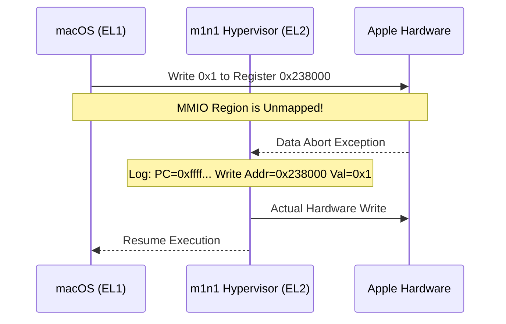
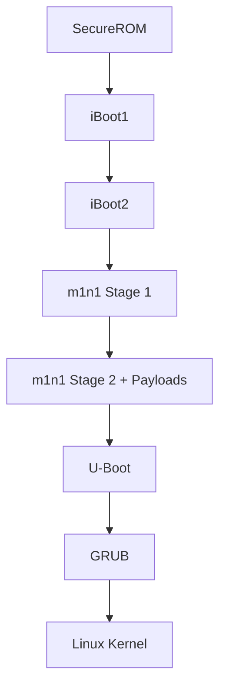

# Asahi Linux m1n1: The Hardware Puppeteer

### Executive Summary

The transition to Apple Silicon presented a monumental challenge for the Linux community: a completely undocumented, proprietary hardware ecosystem. The Asahi Linux team's solution wasn't just to guess, but to build a sophisticated observation deck. **m1n1** is a lightweight hypervisor that acts as a "man-in-the-middle" between macOS and the hardware, allowing researchers to trace every single register access in real-time.

By trapping Memory-Mapped I/O (MMIO) accesses, the team can observe exactly how macOS drivers interact with the hardware, effectively turning the proprietary OS into a live documentation source.

---

## The Problem: The Black Box of Apple Silicon

Traditional reverse engineering often involves disassembling binary drivers—a tedious, error-prone process that can run into legal gray areas. Apple's hardware is particularly complex, with thousands of undocumented registers controlling everything from the GPU to the power management controller.

Without documentation, writing a Linux driver is like trying to fly a plane where every button is unlabeled and some buttons might cause the engine to explode if pressed in the wrong order.

---

## The Solution: The m1n1 Hypervisor

The m1n1 hypervisor runs at **Exception Level 2 (EL2)**, the highest privilege level on ARM64. It boots macOS as a guest at EL1. 

### The MMIO Trap Mechanism

The core "magic" of m1n1 lies in its manipulation of the Stage 2 translation tables. 
1. **Direct Mapping**: Normal RAM is mapped 1:1, allowing macOS to run at near-native speed.
2. **The Trap**: MMIO regions (where hardware registers live) are deliberately left unmapped or marked as "faulting" in the page tables.
3. **The Abort**: When macOS tries to read or write to a hardware register, the CPU triggers a **Data Abort**.
4. **The Trace**: m1n1 intercepts this abort, logs the access (Address, Value, PC), performs the operation on behalf of the guest, and resumes execution.



---

## Implementation: Python-Based Puppeteering

What sets m1n1 apart is its **Python integration**. The hypervisor can be controlled via a USB connection from a host machine. This allows for "live" reverse engineering.

### The Proxy Client

The `proxyclient` is a Python library that communicates with m1n1 over a serial port (UART over USB). It allows researchers to:
- **Read/Write Memory**: Inspect and modify RAM and registers live.
- **Trace MMIO**: Set up traps for specific address ranges.
- **Chainload**: Load new versions of m1n1 or Linux kernels without rebooting.

```python
# Example of a m1n1 Python script tracing a specific device
from m1n1.proxy import Proxy

p = Proxy()
# Trace all accesses to the UART controller
p.trace_mmio(0x235e0000, 0x1000, "UART")

# We can even intercept and modify values on the fly!
def on_mmio_write(addr, val):
    print(f"macOS tried to write {hex(val)} to {hex(addr)}")
    return val # Or return a modified value to see what happens

p.set_mmio_handler(0x235e0000, on_mmio_write)
```

---

## The Boot Chain: Bridging Two Worlds

Apple Silicon Macs boot in a way that is closer to an iPhone than a PC. m1n1 acts as the bridge between Apple's proprietary `iBoot` and the standard Linux world.



---

## Feasibility and Impact

m1n1 has been the cornerstone of Asahi Linux's success. It allowed for the rapid development of drivers for the M1/M2/M3 GPUs, display controllers, and audio systems. 

### Hardware Targets
* **Apple M1/M2/M3 Series**: Full support for tracing and debugging.
* **Host Machine**: Any Linux/macOS machine with a USB-C connection to the target Mac.

### Conclusion

m1n1 proves that when hardware is a black box, the best tool isn't a static analyzer, but a dynamic one. By becoming the "ground truth" between the OS and the silicon, m1n1 has enabled a new era of hardware freedom on the most advanced consumer silicon available today.
