---
category: deep-dive
simulation: BrainMimetic
---

# The BrainMimetic Intelligence Report
## Engineering Test-Time Plasticity with Titans Architecture

### Executive Summary

The pursuit of Artificial General Intelligence (AGI) has long been bifurcated into two distinct computational paradigms: the static, massive-scale pattern matching of **Transformers**, and the dynamic, state-dependent processing of **Recurrent Neural Networks (RNNs)**. While Transformers have dominated the last decade of progress, they suffer from a fundamental flaw analogous to anterograde amnesia—once trained, they cannot learn from their immediate experiences beyond the fleeting capacity of their context window.

This report presents a comprehensive architectural blueprint and implementation guide for a **"BrainMimetic LLM,"** a system designed to bridge this divide by integrating Google’s Titans architecture.

The core innovation explored herein is the transition from **passive context retrieval** to **active test-time memorization**. By leveraging the Titans framework, specifically the *Neural Memory* module and the *Surprise* metric, we engineer a system that does not merely attend to history but physically encodes it into the parameters of an internal neural network during inference. This mimics the synaptic plasticity of the biological brain, where "surprise"—the deviation of reality from expectation—drives the strengthening or weakening of neural connections.

---

## Part I: The Stagnation of Static Intelligence

### 1.1 The Context-Compute Trade-off

To understand the necessity of the BrainMimetic architecture, one must first dissect the limitations of the incumbent Transformer paradigm. The Transformer's attention mechanism, specifically Self-Attention, calculates the pairwise importance of every token in a sequence relative to every other token. While this allows for unparalleled modeling of short-term dependencies, it imposes a quadratic computational cost ($O(N^2)$) with respect to sequence length $N$.

As sequence lengths grow to accommodate entire books, codebases, or genomic sequences, the Key-Value (KV) cache required to store past states expands linearly in memory but the compute required to attend to them explodes. Techniques like sliding windows, sparse attention, and linear attention have attempted to mitigate this, but they invariably introduce a "lossy" compression of the past.

### 1.2 The Biological Imperative: Plasticity and Surprise

The human brain operates on fundamentally different principles. It does not maintain a perfect, lossless buffer of the last hour of audio or visual input. Instead, it continuously updates its internal model of the world based on **prediction error**.

The BrainMimetic LLM seeks to operationalize this biological mechanism. By defining "Surprise" as the gradient of a loss function with respect to the input, we can create a model that only "remembers" (updates its weights) when it encounters something efficiently novel. This allows the system to compress vast amounts of routine data while preserving high-fidelity representations of significant anomalies.

### 1.3 Test-Time Training (TTT): The New Paradigm

The mechanism enabling this behavior is termed **Test-Time Training (TTT)**. In traditional machine learning, training and inference are distinct phases. In the TTT framework, the distinction blurs. The "hidden state" of the sequence model is no longer a vector of numbers, but the **parameters of a neural network itself**.

```mermaid
graph TD
    subgraph Static["Standard Transformer (Read-Only)"]
        S_In[Input Sequence] -->|Fill Buffer| S_Cache[KV Cache]
        S_Cache -->|Attention| S_Out[Output]
        S_Cache -.-x|No Updates| S_Weights[Model Weights]
        style S_Cache fill:#1e1e2e,stroke:#64748b,stroke-dasharray: 5 5
    end

    subgraph Plastic["BrainMimetic / Titans (Read-Write)"]
        P_In[Input Sequence] -->|Forward| P_Mem[Neural Memory]
        P_Mem -->|Calculated Surprise| P_Grad[Gradient Update]
        P_Grad -->|Rewire Synapses| P_Mem
        P_Mem -->|Query| P_Out[Output]
        style P_Mem fill:#312e81,stroke:#818cf8
        style P_Grad fill:#064e3b,stroke:#10b981
    end
```



Consider a standard RNN update:

```python
h_t = f(h_{t-1}, x_t)
# Here, h_t is a vector.
```

Now consider the Titans Neural Memory update:

```python
M_t = M_{t-1} - LearningRate * Gradient(Loss(M_{t-1}, x_t))
# Here, M_t represents the weights of a neural network.
```

The "update rule" is literally one step of Gradient Descent.

---

## Part II: The Titans Architecture Analysis

### 2.1 The Core Components

The Titans architecture rests on two pillars:
1.  **The Core Branch**: Uses standard attention to process the current "chunk" of data. Acts as the **Short-Term Memory**.
2.  **The Neural Memory**: Consumes the data stream token-by-token and updates its internal weights. Acts as the **Long-Term Memory**.

### 2.2 Selection: Memory as Context (MAC)

For our BrainMimetic implementation, we select **Memory as Context (MAC)**.
*   **Mechanism**: `Input_Attn = [Memory(History); Input_Current]`
*   **Rationale**: This allows the attention mechanism to actively query the Neural Memory, providing the richest interaction between the two systems. It aligns best with the concept of a "conscious" workspace (Attention) accessing a "subconscious" store (Neural Memory).

---

## Part III: The Surprise Metric

The "Surprise" metric is the engine of plasticity in the Titans architecture. It is defined as the gradient of the loss function.

### The Mathematics of Surprise

If the memory $M$ can already perfectly predict the value $v_t$ from key $k_t$, the loss is zero, the gradient is zero, and the "Surprise" is zero.

$$
Surprise = \nabla Loss(M, x_t)
$$

### The Synaptic Loop

This diagram illustrates the cycle of prediction, error, and physical rewiring that occurs for every token processed by the Neural Memory.

```mermaid
sequenceDiagram
    participant X as Input Token
    participant M as Neural Memory
    participant S as Surprise Metric
    
    Note over M: State: M(t-1)
    
    X->>M: 1. Inference (Predict)
    M-->>X: Prediction (v_pred)
    
    rect rgb(20, 20, 30)
        Note right of X: Plasticity Phase
        X->>S: 2. Calculate Error
        S->>M: 3. Compute Gradient (Surprise)
        M->>M: 4. Update Weights (M = M - θ∇)
    end
    
    Note over M: New State: M(t)
```



### Momentum and Smoothing

Biological systems do not rewire themselves based on a single instantaneous error. Titans implements **Momentum** to smooth this process. We define a "Surprise State" $S_t$ which accumulates the gradients.

This formulation effectively creates a **"Memory of Surprise."** The model remembers that it was surprised recently, even if the current token is mundane.

---

## Part IV: Engineering the BrainMimetic LLM

In this section, we translate the theory into a concrete PyTorch implementation.

### 4.1 The Neural Memory Module (The Brain)

This module implements the gradient descent logic inside the forward pass.

```python
class NeuralMemory(nn.Module):
    """
    Implements the Titans Neural Memory with Surprise-based updates.
    """
    def __init__(self, dim, memory_dim, dropout=0.1):
        super().__init__()
        self.dim = dim
        self.memory_dim = memory_dim
        
        # Projections
        self.w_q = nn.Linear(dim, memory_dim, bias=False)
        self.w_k = nn.Linear(dim, memory_dim, bias=False)
        self.w_v = nn.Linear(dim, memory_dim, bias=False)
        self.w_out = nn.Linear(memory_dim, dim, bias=False)
        
        # Adaptive Gating Mechanisms (Data-dependent)
        self.gate_alpha = nn.Linear(dim, 1) # Forgetting gate
        self.gate_eta = nn.Linear(dim, 1)   # Momentum decay gate
        self.gate_theta = nn.Linear(dim, 1) # Surprise gate (Learning Rate)

    def forward(self, x, state=None):
        batch_size, seq_len, _ = x.shape
        
        if state is None:
            # Memory M: The "weights" we are learning on the fly
            M = torch.zeros(batch_size, self.memory_dim, self.memory_dim, device=x.device)
            # Momentum S: The accumulated surprise
            S = torch.zeros(batch_size, self.memory_dim, self.memory_dim, device=x.device)
        else:
            M, S = state

        outputs = []
        
        # ... (Projections Q, K, V omitted for brevity) ...

        # Sequential Processing Loop (Recurrence)
        for t in range(seq_len):
            # 1. READ OPERATION
            # Retrieve information from the current memory state M_{t-1}
            mem_out = torch.bmm(M, q_t).squeeze(2)
            outputs.append(mem_out)
            
            # 2. SURPRISE CALCULATION
            # Predict value: v_pred = M * k_t
            v_pred = torch.bmm(M, k_t)
            error = v_pred - v_t 
            
            # Gradient w.r.t Memory M (The Surprise)
            grad = torch.bmm(error, k_t.transpose(1, 2))
            
            # 3. MOMENTUM & MEMORY UPDATE (Plasticity)
            # S = eta * S - theta * grad
            # M = (1 - alpha) * M + S
            
        return torch.stack(outputs, dim=1), (M, S)
```

### 4.2 The BrainMimetic Model

The top level model stacks these blocks.

```python
class BrainMimeticModel(nn.Module):
    def __init__(self, vocab_size, dim, depth, heads, memory_dim):
        super().__init__()
        self.embedding = nn.Embedding(vocab_size, dim)
        self.layers = nn.ModuleList([
            TitansMACBlock(dim, heads, memory_dim) for _ in range(depth)
        ])
        self.lm_head = nn.Linear(dim, vocab_size)

    def forward(self, input_ids, memory_states=None):
        x = self.embedding(input_ids)
        # ... Pass through layers ...
        return self.lm_head(x), new_states
```

---

## Part V: Feasibility Analysis

### 5.1 The Compute Bottleneck

The primary implementation challenge is the sequential dependency in the memory update loop. This loop cannot be trivially parallelized like the Attention mechanism.

**Solution: Chunkwise Parallelism.** For production, the sequence is divided into chunks. Inside the chunk, we use a parallelized version of the update (Dual Form).

### 5.2 Hardware Targets

#### NVIDIA RTX 3090
*   **Strength**: Raw Compute (Tensor Cores).
*   **Optimization**: Requires fusing the Python loop into a single CUDA kernel using **Triton**.
*   **Result**: 20x speedup over CPU training.

#### Apple Silicon (M2 Max)
*   **Strength**: Unified Memory (128GB RAM allows massive models).
*   **Strategy**: Use larger batch sizes to amortize MPS dispatch overhead.

---

## Conclusion

The BrainMimetic LLM, powered by the Titans architecture, represents a pivotal step toward AGI. By acknowledging that intelligence is not static retrieval but **dynamic adaptation**, we move from the library metaphor of AI (looking up books) to the biological metaphor (rewiring synapses).

> "The system does not just read history; it physically becomes it."