# DeepSeek mHC: The Signal Survival Protocol
## Manifold Constrained Hyper-Connections

### Abstract

As we build deeper neural networks (100+ layers), a fundamental physics problem emerges: **Signal Survival**. In standard architectures, information acts like a game of "Telephone"—it gets distorted, amplified to infinity (exploding gradients), or silenced to zero (vanishing gradients) as it passes through the layers.

DeepSeek's recent Multi-Head Latent Attention (MLA) and Manifold Constrained Hyper-Connections (mHC) papers propose a geometric solution. By forcing the weight matrices to exist on a specific mathematical manifold, we can ensure the signal survives intact, no matter how deep the network goes.

---

## 1. The "Thinking Highway" Problem

Imagine a neural network as a 100-story skyscraper. Data enters the ground floor and must take an elevator to the roof.
*   **The Wild Mode (Standard):** The elevator cables are made of rubber. Sometimes they stretch (amplify), sometimes they slack (vanish). By floor 50, the passenger is either crushed by G-force or floating in zero-G.
*   **The mHC Mode (DeepSeek):** The elevator uses a rigid track. The speed is mathematically constrained to be constant.

### Visualizing Signal Decay

```mermaid
graph LR
    subgraph "Standard Network (Wild Mode)"
        A1[Input Signal] -->|Variable Weights| B1(Layer 10)
        B1 -->|Explosion| C1(Layer 50: NaN)
        B1 -->|Vanishing| D1(Layer 50: 0.00)
        style C1 fill:#450a0a,stroke:#ef4444
        style D1 fill:#172554,stroke:#3b82f6
    end
    
    subgraph "DeepSeek mHC Protocol"
        A2[Input Signal] -->|Doubly Stochastic| B2(Layer 10)
        B2 -->|Conserved Energy| C2(Layer 50: Stable)
        C2 -->|Conserved Energy| D2(Layer 100: Stable)
        style B2 fill:#052e16,stroke:#10b981
        style C2 fill:#052e16,stroke:#10b981
        style D2 fill:#052e16,stroke:#10b981
    end
```



### The Mathematics of Stability

In a standard Dense layer, the output $y$ is:
$$ y = Wx $$
If the eigenvalues of $W$ are $> 1$, $y$ grows exponentially. If $< 1$, it shrinks.

DeepSeek proposes constraining $W$ to be **Doubly Stochastic**. This means:
1.  Every row sums to exactly 1.0
2.  Every column sums to exactly 1.0

This ensures that the total "energy" of the signal is conserved. It is neither created nor destroyed, only routed.

---

## 2. The Algorithm: Sinkhorn-Knopp

How do we force a random matrix of weights to obey these strict rules? We use an iterative normalization process called the **Sinkhorn-Knopp Algorithm**.

```mermaid
graph TD
    Start[Random Weight Matrix W] --> Loop{Sinkhorn Iteration}
    Loop -->|Step 1| RowNorm[Normalize Rows]
    RowNorm -->|Sum = 1.0| ColNorm[Normalize Cols]
    ColNorm -->|Sum = 1.0| Check[Check Convergence]
    Check -->|Not Stable| Loop
    Check -->|Stable| End[Doubly Stochastic Matrix]
    
    style Start fill:#1e1e2e,stroke:#6366f1
    style End fill:#064e3b,stroke:#10b981
```



```python
def make_doubly_stochastic(matrix, iterations=5):
    for _ in range(iterations):
        # 1. Normalize Rows
        matrix = matrix / matrix.sum(dim=1, keepdim=True)
        # 2. Normalize Columns
        matrix = matrix / matrix.sum(dim=0, keepdim=True)
    return matrix
```

This simple traffic control rule allows DeepSeek to train networks that are significantly deeper and wider than previous architectures without instability.

---

## 3. Scaling Laws & Efficiency

This constraint doesn't just help stability; it changes the scaling laws. Because the signal doesn't degrade, smaller models using mHC can punch above their weight class, reasoning with the depth of a much larger model.

> "By forcing the matrix to be Doubly Stochastic, DeepSeek ensures that information is never lost and never amplified uncontrollably."
