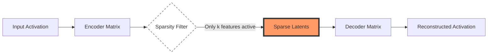

# The Rosetta Stone of Neural Networks

Large Language Models (LLMs) are notoriously opaque. While they can reason about quantum physics or write poetry, if you look at their individual neurons, you find a mess. A single neuron might fire for "The Golden Gate Bridge," "DNA sequences," and "legal disclaimers" all at once. This phenomenon is known as **Polysemanticity**.

Sparse Autoencoders (SAEs) act as a "Rosetta Stone." By training these smaller, wider helper models on the internal activations of a giant LLM, we can disentangle these overlapping signals into discrete, **monosemantic features**—single dimensions that correspond to specific, human-understandable concepts.

## The Problem: Superposition
Why are LLM neurons messy? The **Superposition Hypothesis** suggests that models try to represent more features than they have dimensions. If a model has 4,096 neurons in a layer but needs to understand 100,000 concepts, it packs them together using "interference-tolerant" codes. 

To us, this looks like noise. To the model, it's efficient storage.

## The Solution: Sparse Autoencoders
An SAE is a simple unsupervised model trained to reconstruct the activations of the LLM. It consists of:
1.  **An Encoder**: Projects the dense activations into a much higher-dimensional space (often 16x to 64x wider).
2.  **A Sparsity Constraint**: A "bottleneck" that forces only a handful of these millions of features to be active at any one time (using L1 regularization or Top-K activation).
3.  **A Decoder**: Attempts to reconstruct the original dense activation from this sparse set.

### Architecture Flow


## Implementation: The SAE Core logic
In modern research (like OpenAI's June 2024 paper), Top-K SAEs are preferred because they allow direct control over the number of active features, preventing "dead latents."

```python
import torch
import torch.nn as nn
import torch.nn.functional as F

class TopKSAE(nn.Module):
    def __init__(self, d_model, d_sae, k=32):
        super().__init__()
        self.k = k
        self.encoder = nn.Linear(d_model, d_sae)
        self.decoder = nn.Linear(d_sae, d_model)
        self.b_dec = nn.Parameter(torch.zeros(d_model))

    def forward(self, x):
        # 1. Encode to high-dimensional space
        latents_pre = self.encoder(x - self.b_dec)
        
        # 2. Top-K Sparsity: Only keep the top k activations
        topk_values, topk_indices = torch.topk(latents_pre, self.k, dim=-1)
        latents = torch.zeros_like(latents_pre)
        latents.scatter_(-1, topk_indices, F.relu(topk_values))
        
        # 3. Reconstruct original activations
        reconstruction = self.decoder(latents) + self.b_dec
        return reconstruction, latents

# Usage: d_model=4096 (LLM), d_sae=131072 (32x expansion)
```

## Why This Matters: Model Steering
Once we have the SAE, we can "reach inside" the model. By manually boosting a specific feature—say, the "Honesty" feature—we can actually steer the model's behavior in real-time. Anthropic famously demonstrated this by boosting a "Golden Gate Bridge" feature in Claude, causing the model to mention the bridge in every single response, regardless of the prompt.

## Feasibility & Hardware
Training SAEs is computationally expensive because they are massive (often having more parameters than the layer they are interpreting). However, once trained, they are highly efficient "observers."

*   **Target**: Middle-layer residual streams.
*   **Scaling**: OpenAI recently scaled SAEs to 16 million features on GPT-4.
*   **Impact**: Essential for auditing "Black Box" models for hidden biases or dangerous capabilities.
