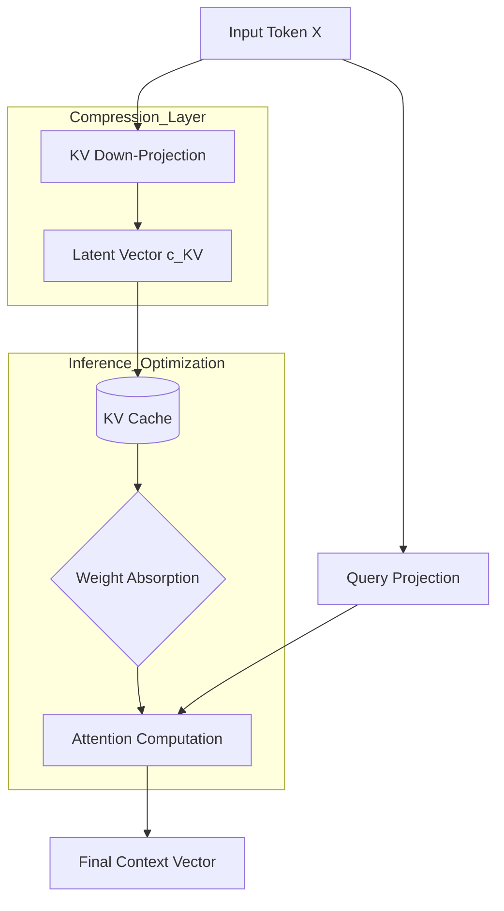

# Executive Summary

As Large Language Models (LLMs) scale to hundreds of billions of parameters and 100k+ context windows, the **Key-Value (KV) cache** has become the primary bottleneck for inference. Traditional Multi-Head Attention (MHA) and even Grouped-Query Attention (GQA) struggle with memory bandwidth limits. 

**Multi-Head Latent Attention (MLA)**, introduced in the DeepSeek-V2 paper, solves this by compressing KV pairs into a low-rank latent vector. Unlike previous compression methods that trade quality for speed, MLA maintains MHA-level performance while reducing the KV cache footprint to roughly **1/57th** of standard MHA.

# The Problem: The KV Cache Wall

In autoregressive generation, we store the Keys and Values of all previous tokens to avoid recomputing them. 
- **Memory Consumption**: For a model like Llama-3-70B, the KV cache can consume dozens of gigabytes for long sequences.
- **Bandwidth Bottleneck**: Modern GPUs are so fast that they spend most of their time waiting to fetch KV vectors from VRAM to the processor.

# The Solution: Latent Compression & Weight Absorption

MLA introduces three key innovations:

### 1. Low-Rank KV Compression
Instead of storing full-dimensional $K$ and $V$ matrices, MLA projects them into a compressed latent vector $c_{KV}$.
$$c_{KV} = W_{DKV} x_t$$
where $W_{DKV}$ is a down-projection matrix. This $c_{KV}$ is all that is stored in the cache.

### 2. Weight Absorption
During inference, the up-projection matrices used to reconstruct $K$ and $V$ from the latent space can be **mathematically "absorbed"** into the Query projection ($W_Q$) and Output projection ($W_O$). 

This is the "magic trick" of MLA:
$$ Attention(Q, K, V) = Softmax(\frac{Q(W_{UK}c_{KV})^T}{\sqrt{d}}) (W_{UV}c_{KV}) $$
Because matrix multiplication is associative, we can pre-multiply $W_Q$ with $W_{UK}$ (the up-projection for Keys). This means the model **never actually needs to expand the compressed KV cache back to full size in memory**. It computes attention directly against the compressed latent.

### 3. Decoupled RoPE
Rotary Positional Embeddings (RoPE) are sensitive to linear transformations. To allow weight absorption, MLA splits the attention into:
- **Content Pathway**: Compressed via low-rank latent.
- **Position Pathway**: A small, separate vector that handles RoPE, ensuring positional information isn't lost during compression.

# Visualizing the MLA Architecture



# Implementation (PyTorch)

Here is a simplified version of the MLA logic focusing on the latent compression and weight absorption mechanism.

```python
import torch
import torch.nn as nn
import torch.nn.functional as F

class MultiHeadLatentAttention(nn.Module):
    def __init__(self, d_model, n_heads, d_latent, d_head):
        super().__init__()
        self.n_heads = n_heads
        self.d_head = d_head
        
        # KV Compression
        self.kv_down_proj = nn.Linear(d_model, d_latent)
        self.kv_up_proj = nn.Linear(d_latent, n_heads * d_head * 2) # Keys and Values
        
        # Query Projection
        self.q_proj = nn.Linear(d_model, n_heads * d_head)

    def forward(self, x, cache=None):
        batch, seq, _ = x.shape
        
        # Compress KV
        latent_kv = self.kv_down_proj(x) # [B, S, d_latent]
        
        # In a real MLA implementation, we store latent_kv in the cache
        # and only up-project during the attention step.
        kv = self.kv_up_proj(latent_kv)
        k, v = torch.split(kv, self.n_heads * self.d_head, dim=-1)
        
        q = self.q_proj(x)
        
        # Reshape for multi-head
        q = q.view(batch, seq, self.n_heads, self.d_head).transpose(1, 2)
        k = k.view(batch, seq, self.n_heads, self.d_head).transpose(1, 2)
        v = v.view(batch, seq, self.n_heads, self.d_head).transpose(1, 2)
        
        # Standard Attention logic on the reconstructed/absorbed heads
        attn = (q @ k.transpose(-2, -1)) * (self.d_head ** -0.5)
        attn = F.softmax(attn, dim=-1)
        out = (attn @ v).transpose(1, 2).reshape(batch, seq, -1)
        
        return out
```

# Feasibility Analysis

MLA is currently the gold standard for high-throughput, long-context models. DeepSeek-V3 utilizes it to handle 128k context windows on standard H100 hardware where MHA-based models would OOM (Out of Memory) at 32k. The main constraint is the complexity of implementation; traditional kernels (like FlashAttention) require specific modifications to support the "weight absorption" trick efficiently.
