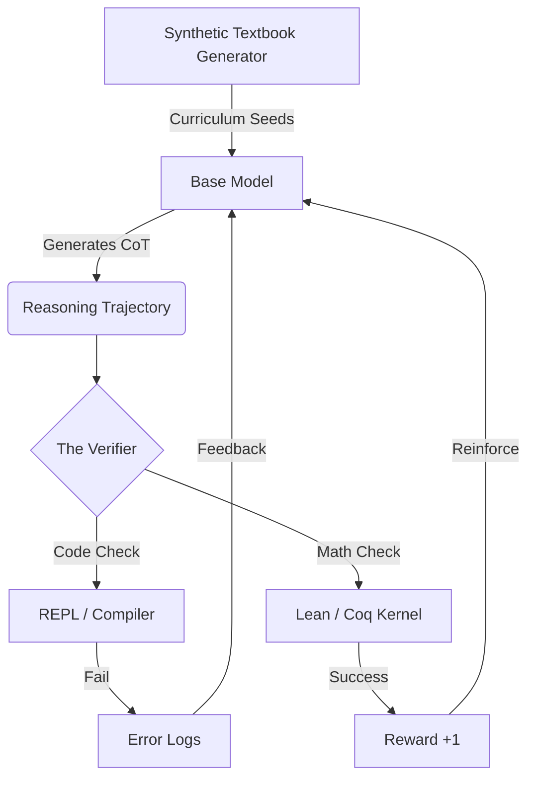

# Executive Summary

The "vibes-based" era of AI alignment is ending. For years, Reinforcement Learning from Human Feedback (RLHF) has been the gold standard, but it suffers from a fatal flaw: humans are inconsistent, expensive, and easily "hacked" by pleasing-but-wrong answers. 

The industry is pivoting toward **Reinforcement Learning from Verifiable Rewards (RLVR)**. In this paradigm, models are trained in environments that provide absolute truth. If a model writes code, it is executed; if it solves math, it is checked by a formal verifier like **Lean** or **Coq**. Coupled with **Synthetic Data Curriculums**, where reasoning models generate error-free "textbooks," we are building a recursive loop of intelligence that no longer depends on the limited supply of high-quality human text.

# The Problem: The Human Feedback Bottleneck

Traditional LLM training relies on two primary data sources:
1. **The Public Web**: We have largely "exhausted" the high-quality human text available.
2. **Human Labelers**: Humans are slow and struggle to verify complex reasoning (e.g., verifying a 50-step mathematical proof).

When models are trained on human preferences, they often learn **sycophancy**—telling the user what they want to hear rather than what is factually correct. To reach "System 2" thinking (deliberative reasoning), models need a hard "No" when they are wrong.

# The Solution: Objective Verification & RLVR

### 1. The RLVR Paradigm
RLVR (Reinforcement Learning from Verifiable Rewards) replaces the neural Reward Model (which predicts what a human would like) with a **Programmatic Verifier**. 

- **Code Execution**: The model writes Python/SQL; the trainer runs the code against unit tests. Success = Reward (1), Failure = Penalty (0).
- **Formal Math**: The model writes proofs in Lean 4. The Lean compiler checks the logic. If the proof is "Closed," the model is reinforced.
- **Rule-Based Formatting**: Models like DeepSeek-R1 are rewarded for correctly using `<think>` tags, ensuring the reasoning process remains transparent.

### 2. Synthetic Data Curriculums
Microsoft’s **Phi-4** and **DeepSeek-Prover** represent the new frontier: using "Teacher" models to create "Synthetic Textbooks."
- **Recursive Decomposition**: A large model breaks a complex problem into 100 small, verifiable steps.
- **Error-Free Synthesis**: Only paths that pass the Verifier are kept, creating a "perfect" dataset of reasoning trajectories.
- **Curriculum Learning**: Training starts with "Grade 1" synthetic problems and scales in complexity as the model converges.

### 3. The "Aha Moment" and Self-Correction
One of the most fascinating emergent behaviors observed in DeepSeek-R1 is **self-correction**. Because the model is only rewarded for the *final* correct answer, it learns to treat its own output as a scratchpad.

During training, the model might output:
> "The integral of x^2 is 2x... wait, no, that's the derivative. Let me backtrack. The integral should be x^3/3."

This "Aha moment" isn't explicitly programmed. It emerges naturally because the RL policy discovers that catching and fixing errors leads to higher rewards than blindly guessing. This mimics human "System 2" thinking—slow, deliberative, and self-critical.

# Visualizing the Verifier Loop



## Implementation: A Simple RLVR Trainer (Pseudocode)
Below is a conceptual implementation of a Group Relative Policy Optimization (GRPO) loop using a Code Execution Verifier.

```python
import torch
from code_executor import PythonREPL

def compute_verifiable_reward(prompt, completion):
    """
    Objective reward function: 
    1. Check format (<think> tags)
    2. Execute code and check output
    """
    reward = 0.0
    
    # 1. Format Reward
    if "<think>" in completion and "</think>" in completion:
        reward += 0.2
        
    # 2. Functional Reward (Code Execution)
    code_block = extract_code(completion)
    result = PythonREPL.run(code_block, timeout=5)
    
    if result.is_correct:
        reward += 0.8
    elif result.has_error:
        reward -= 0.5 # Penalty for syntax errors
        
    return reward

# GRPO Training Step (Simplified)
def grpo_step(model, prompts):
    # Sample a group of outputs for each prompt
    outputs = model.generate(prompts, num_samples=8)
    
    # Get rewards for the group
    rewards = [compute_verifiable_reward(p, o) for p, o in zip(prompts, outputs)]
    
    # Normalize rewards within the group (The 'Group Relative' part)
    mean_reward = torch.mean(rewards)
    std_reward = torch.std(rewards)
    advantages = (rewards - mean_reward) / (std_reward + 1e-8)
    
    # Update model policy to favor high-advantage paths
    loss = compute_grpo_loss(model, outputs, advantages)
    loss.backward()
    optimizer.step()
```

## Feasibility & Analysis

| Method | Verification Difficulty | Target Hardwares | Scaling Potential |
| :--- | :--- | :--- | :--- |
| Code (Python) | Low (Unit Tests) | H100/A100 Clusters | Infinite (Self-Play) |
| Math (Lean4) | High (Formalization) | L40S / H100 | Massive (Mathlib growth) |
| Logic (Truth) | Medium (Consistency) | Edge (Phi-4) | High (Synthetic Textbooks) |

The transition to objective verification is the key to unlocking "Expert-Level" AI. By moving away from human imitation, we allow models to explore reasoning paths that humans might never have considered, as long as they arrive at the provably correct answer.
