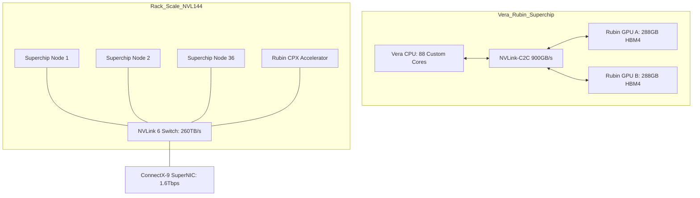

# The Rubin Revolution: Engineering for the Trillion-Parameter Era

With the transition from Blackwell to the **Rubin Architecture**, NVIDIA is moving beyond the "GPU-first" mindset into a holistic "Data Center-as-a-Chip" philosophy. Rubin isn't just a spec bump; it is a fundamental reconfiguration of compute density and memory bandwidth designed specifically for agentic AI and million-token reasoning.

## 1. Executive Summary
The Rubin platform (Production 2H 2026) is not just a GPU; it is a unified AI supercomputer built on **six key chips** designed for extreme co-design. Centered on the **Vera Rubin Superchip**, it combines the custom **Vera CPU** (Arm-based "Olympus" cores) with the **Rubin GPU**. Key breakthroughs include the adoption of **HBM4** (delivering 22 TB/s bandwidth), the **NVLink 6** interconnect (3.6 TB/s per GPU), and a specialized **Rubin CPX** accelerator for massive-context inference.

## 2. The Problem: The "Memory Wall" and Attention Bottlenecks
Current architectures (Hopper/Blackwell) struggle with two primary constraints:
1. **Memory Bandwidth:** LLMs are often IO-bound. Even HBM3e cannot feed the sheer FLOPs available in modern SMs (Streaming Multiprocessors).
2. **Context Fragmentation:** Processing million-token contexts requires massive KV-cache storage, often forcing disaggregated inference which introduces latency.

## 3. The Solution: The "Six Key Chips" Architecture

NVIDIA's strict co-design philosophy unites six specialized components into a single logical entity:

### 1. Vera CPU: The "Olympus" Cores
The **Vera CPU** features **88 custom Arm cores** (codenamed "Olympus"), fully compatible with Armv9.2.
- **Role**: OS management, agentic logic, and data preprocessing.
- **Throughput**: Optimized for AI factories with high power efficiency.
- **Interconnect**: NVLink-C2C provides cohesive CPU-GPU memory addressing.

### 2. Rubin GPU: The Engine
The **Rubin GPU** is the heavy lifter for training and generation.
- **Specs**: ~336 billion transistors on TSMC 3nm.
- **Memory**: **288GB HBM4** delivering a staggering **22 TB/s** bandwidth.
- **Compute**: **50 PFLOPS** of NVFP4 tensor performance.
- **Features**: 3rd Gen Transformer Engine with adaptive hardware compression.

### 3. NVLink 6 Switch
The backbone of the rack, enabling 3.6 TB/s of bidirectional bandwidth per GPU. It allows 72 GPUs to function as a single 20.7TB HBM4 memory domain.

### 4. ConnectX-9 SuperNIC
Provides ultra-high throughput network endpoints for scale-out, critical for multi-rack training runs.

### 5. BlueField-4 DPU
A dual-die package (combining a Grace CPU core) that handles security offload and powers the **Inference Context Memory Storage** platform, enabling efficient KV-cache reuse.

### 6. Spectrum-6 Ethernet Switch
The first switch to integrate **Co-Packaged Optics (CPO)**, significantly reducing power and latency for east-west cluster traffic.

### Rubin CPX: The Specialized Accelerator
Distinct from the main Rubin GPU, the **Rubin CPX** is a cost-optimized, monolithic die featuring **128GB of GDDR7**.
- **Purpose**: "Prefill" / Context Phase. GDDR7 offers massive capacity at lower cost/bandwidth than HBM4, perfect for storing million-token contexts before the compute-heavy decode phase.
- **Performance**: 30 PFLOPS (NVFP4) and 3x faster attention mechanisms than prior generations.

## 4. Visual Architecture
The following diagram illustrates the Vera Rubin NVL144 node topology:



## 5. Implementation: Disaggregated Attention Logic
Rubin architecture encourages "Disaggregated Inference," where the Context Phase (prefill) is handled by CPX units, and the Generation Phase (decode) is handled by standard Rubin GPUs.

```python
# Conceptual Python logic for Rubin Disaggregated Inference
class RubinInferenceEngine:
    def __init__(self):
        self.cpx_cluster = "Context_Processing_Extension" # Optimized for Prefill
        self.rubin_cluster = "Standard_Rubin_GPU"        # Optimized for Decoding

    def run_inference(self, prompt_tokens):
        # Phase 1: Context Prefill on CPX
        # CPX utilizes 3x faster attention hardware
        kv_cache = self.cpx_cluster.prefill(prompt_tokens)
        
        # Phase 2: Handover via NVLink 6
        # 3.6 TB/s transfer speed minimizes handover latency
        self.rubin_cluster.receive_cache(kv_cache)
        
        # Phase 3: Token Generation
        return self.rubin_cluster.generate_tokens()

# Rubin NVL144 achieves 3.6 EFLOPS of FP4 performance
```

## 6. Feasibility & Future Scaling
*   **Power**: The Rubin Ultra (2027) will push rack density to 600kW, requiring total liquid immersion (zero fans).
*   **Thermal**: Vera Rubin systems use 40°C inlet water cooling to manage the 2000W+ TGP of the combined Superchip.
*   **Roadmap**: Rubin (2026) -> Rubin Ultra (2027) -> Feynman (2028).
