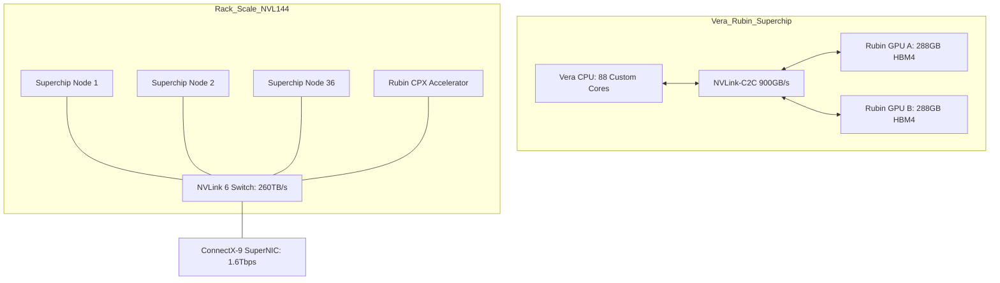

# The Rubin Revolution: Engineering for the Trillion-Parameter Era

With the transition from Blackwell to the **Rubin Architecture**, NVIDIA is moving beyond the "GPU-first" mindset into a holistic "Data Center-as-a-Chip" philosophy. Rubin isn't just a spec bump; it is a fundamental reconfiguration of compute density and memory bandwidth designed specifically for agentic AI and million-token reasoning.

## 1. Executive Summary
The Rubin platform (expected 2H 2026) centers on the **Vera Rubin Superchip**, combining the custom **Vera CPU** (Arm-based) with the **Rubin GPU**. Key breakthroughs include the adoption of **HBM4** (delivering 13 TB/s bandwidth), the **NVLink 6** interconnect (3.6 TB/s per GPU), and a new specialized class of silicon called **Rubin CPX** for massive-context processing.

## 2. The Problem: The "Memory Wall" and Attention Bottlenecks
Current architectures (Hopper/Blackwell) struggle with two primary constraints:
1. **Memory Bandwidth:** LLMs are often IO-bound. Even HBM3e cannot feed the sheer FLOPs available in modern SMs (Streaming Multiprocessors).
2. **Context Fragmentation:** Processing million-token contexts requires massive KV-cache storage, often forcing disaggregated inference which introduces latency.

## 3. The Solution: The Vera-Rubin Stack

### Vera CPU: The "Olympus" Cores
Moving away from off-the-shelf Neoverse designs, the Vera CPU features **88 custom Arm cores** (internally dubbed "Olympus"). 
- **Throughput:** Supports SMT (Simultaneous Multithreading) for 176 logical threads.
- **Performance:** Delivers 2x the performance of the Grace CPU.
- **Interconnect:** Uses NVLink-C2C to provide 900 GB/s of bidirectional bandwidth to the GPUs.

> **Note:** It is crucial to distinguish between **Vera** (the CPU) and **Rubin** (the GPU). They are packaged together on the same board (the "Superchip") but serve different roles. Vera handles the OS, data preprocessing, and agentic logic, while Rubin handles the massive matrix multiplications required for inference.

### Rubin GPU & HBM4
The Rubin GPU utilizes a **dual-reticle die** design manufactured on TSMC’s **3nm (N3P)** process.
- **Memory:** 8 stacks of **HBM4** providing **288GB** of VRAM per package.
- **Bandwidth:** Hits **13 TB/s**, a 60% increase over Blackwell Ultra.
- **Precision:** Native support for **NVFP4**, allowing for 50 PFLOPS of inference performance per GPU.

### Rubin CPX: The Context Processing Extension
A revolutionary addition is the **Rubin CPX GPU**. Unlike standard GPUs, CPX is a monolithic die optimized for the **Attention Phase** of inference. It features 128GB of GDDR7 and provides **3x faster attention** mechanisms, allowing models to reason across millions of tokens without linear latency scaling.

## 4. Visual Architecture
The following diagram illustrates the Vera Rubin NVL144 node topology:



## 5. Implementation: Disaggregated Attention Logic
Rubin architecture encourages "Disaggregated Inference," where the Context Phase (prefill) is handled by CPX units, and the Generation Phase (decode) is handled by standard Rubin GPUs.

```python
# Conceptual Python logic for Rubin Disaggregated Inference
class RubinInferenceEngine:
    def __init__(self):
        self.cpx_cluster = "Context_Processing_Extension" # Optimized for Prefill
        self.rubin_cluster = "Standard_Rubin_GPU"        # Optimized for Decoding

    def run_inference(self, prompt_tokens):
        # Phase 1: Context Prefill on CPX
        # CPX utilizes 3x faster attention hardware
        kv_cache = self.cpx_cluster.prefill(prompt_tokens)
        
        # Phase 2: Handover via NVLink 6
        # 3.6 TB/s transfer speed minimizes handover latency
        self.rubin_cluster.receive_cache(kv_cache)
        
        # Phase 3: Token Generation
        return self.rubin_cluster.generate_tokens()

# Rubin NVL144 achieves 3.6 EFLOPS of FP4 performance
```

## 6. Feasibility & Future Scaling
*   **Power**: The Rubin Ultra (2027) will push rack density to 600kW, requiring total liquid immersion (zero fans).
*   **Thermal**: Vera Rubin systems use 40°C inlet water cooling to manage the 2000W+ TGP of the combined Superchip.
*   **Roadmap**: Rubin (2026) -> Rubin Ultra (2027) -> Feynman (2028).
