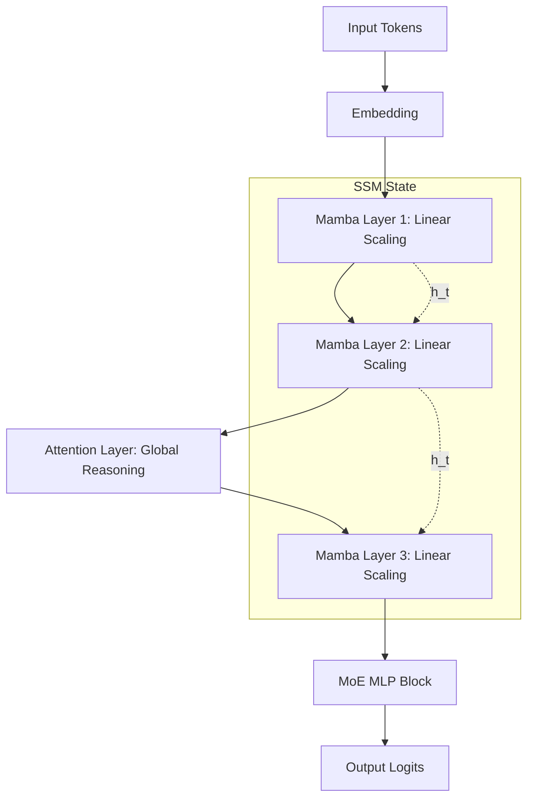

# Executive Summary
For years, the Transformer’s self-attention mechanism was the gold standard, but it carried a hidden tax: computational and memory costs that grow quadratically ($O(N^2)$) with text length. In 2026, we are witnessing a paradigm shift. Sub-quadratic architectures—led by State Space Models (SSMs) and Hybrid designs—are delivering linear scaling ($O(N)$), enabling 256K+ token contexts on consumer hardware without the massive KV-cache overhead.

# The Problem: The Quadratic Tax
In a standard Transformer, every token must attend to every other token. This creates an $N \times N$ attention matrix.
- **Computation**: Doubling the sequence length quadruples the operations.
- **Memory**: The Key-Value (KV) cache grows linearly, eventually swallowing all available VRAM, leading to the "context ceiling."

# The Solution: Selective State Space Models (SSMs)
The breakthrough came with **Mamba** and its evolution, **Mamba-2**. Unlike traditional RNNs that lose information over time, Mamba uses a **Selective Scan** mechanism. It allows the model to "choose" what to remember and what to forget based on the input, effectively mimicking the reasoning of attention but through a recurrent linear state.

### The Hybrid Era: Jamba
The current "production" favorite isn't pure SSM, but the **Jamba-style hybrid**. 
- **Transformer Layers**: Retained for high-quality associative recall and complex reasoning (e.g., 1 out of every 8 layers).
- **SSM Layers (Mamba)**: Used for the bulk of processing to keep memory usage flat.
- **MoE (Mixture of Experts)**: Layers are further expanded via MoE to increase capacity without increasing active parameter counts.

# Visualizing the Architecture
Below is the data flow for a Jamba-style hybrid block, alternating between dense attention and selective state transitions.



## Implementation: Selective State Logic
The core of sub-quadratic scaling lies in the discretization of the continuous state space. In PyTorch-like logic:

```python
import torch
import torch.nn as nn

class SelectiveSSM(nn.Module):
    def __init__(self, d_model, d_state=16):
        super().__init__()
        self.A = nn.Parameter(torch.randn(d_model, d_state))
        self.B_proj = nn.Linear(d_model, d_state) # Input dependent
        self.C_proj = nn.Linear(d_model, d_state) # Input dependent
        self.dt_proj = nn.Linear(d_model, 1)       # Input dependent step size

    def forward(self, x):
        # x: [batch, seq_len, d_model]
        # Calculate input-dependent parameters (The "Selection")
        B = self.B_proj(x)
        C = self.C_proj(x)
        dt = torch.exp(self.dt_proj(x))
        
        # Discretization (Simplified)
        # h_t = (A * dt)h_{t-1} + (B * dt)x_t
        # This can be computed in O(N) using a parallel scan algorithm
        return self.parallel_scan(x, dt, self.A, B, C)
```

## Feasibility & 2026 Hardware Targets
*   **Inference**: SSMs achieve 5x higher throughput than Transformers for long sequences.
*   **VRAM**: A Jamba-style model can handle a 256K context with 10x less KV-cache memory compared to a Llama-3 variant.
*   **Target**: NVIDIA RTX 50-series and specialized edge NPU architectures are now optimized for the "Scan" primitive, making these models faster than Transformers even at short sequence lengths.
