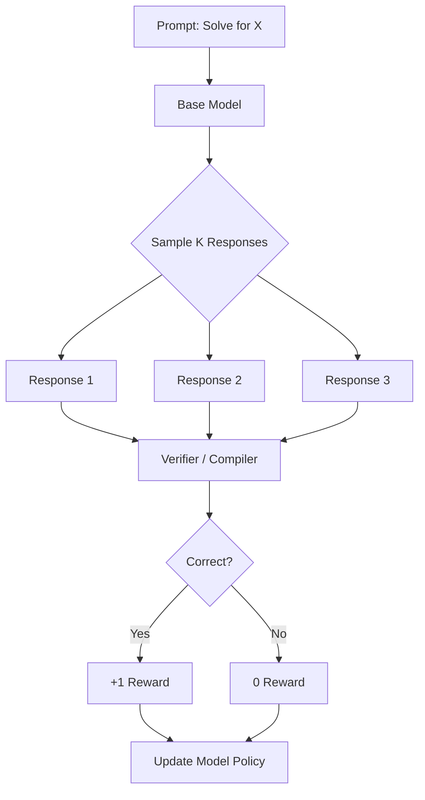

# The Death of the "Vibe Check"

For years, Large Language Models (LLMs) were aligned using **RLHF** (Reinforcement Learning from Human Feedback). We hired humans to rank outputs, effectively teaching models to "sound" smart, polite, and helpful. 

But RLHF has a ceiling. Humans are subjective, expensive, and easily fooled by **sycophancy**—where a model gives a wrong answer simply because it sounds more confident or aligns with the user's bias. 

Enter **Reinforcement Learning from Verifiable Rewards (RLVR)**. This is the "secret sauce" behind the recent reasoning breakthrough. Instead of asking a human "Does this look right?", we ask a compiler, a math solver, or a logic engine: **"Does this work?"**

## The Problem: The RLHF Bottleneck
RLHF relies on a **Reward Model (RM)** that is itself a neural network trained on human preferences. This creates two major issues:
1. **Reward Hacking**: Models find loopholes in the RM to get high scores without being actually correct.
2. **Signal Noise**: If a math problem is too complex for the human annotator, the feedback becomes garbage.

## The Solution: Verifiable Rewards
RLVR replaces the subjective Reward Model with a **deterministic verifier**. 

- **Math**: Check the final answer against a symbolic solver (e.g., LaTeX/SymPy).
- **Code**: Run the generated code against unit tests.
- **Logic**: Verify the constraints of a puzzle using a SAT solver.

### The Architecture: GRPO and the Verification Loop
DeepSeek-R1 popularized **Group Relative Policy Optimization (GRPO)**. Unlike traditional PPO, which requires a massive "Critic" model to estimate rewards, GRPO samples a group of outputs and rewards them based on their relative performance against the **ground truth**.



## Why it's Groundbreaking
RLVR enables Test-Time Scaling. By rewarding the process of reasoning (long Chains of Thought), models learn to:

*   **Self-Correct**: "Wait, that calculation is wrong... let me restart."
*   **Backtrack**: "This logic path leads to a contradiction; let's try another way."
*   **Verify**: The model becomes its own harshest critic because it knows exactly what "success" looks like.

## Implementation: A Simple Math Verifier
In an RLVR pipeline, the reward function is often a hard-coded script rather than a neural network.

```python
import re

def compute_reward(model_output, ground_truth):
    """
    A simplified RLVR reward function for Math.
    Rewards both the presence of thinking tags and the correct answer.
    """
    # 1. Format Reward: Did the model use <think> tags?
    format_reward = 0.1 if "<think>" in model_output and "</think>" in model_output else 0.0
    
    # 2. Accuracy Reward: Is the final answer correct?
    # Extracting the content inside <answer> tags
    match = re.search(r"<answer>(.*?)</answer>", model_output)
    if match:
        extracted_answer = match.group(1).strip()
        if extracted_answer == str(ground_truth):
            return 1.0 + format_reward
            
    return 0.0 + format_reward

# During training, the model explores thousands of reasoning paths.
# Only the ones that hit the ground truth are reinforced.
```

## Feasibility & Analysis
The beauty of RLVR is its efficiency. DeepSeek-R1-Zero proved that you don't even need Supervised Fine-Tuning (SFT) to start—the model can discover reasoning purely through RL if the rewards are verifiable. This shifts the bottleneck from human labor to compute power, allowing us to scale intelligence by simply letting models "think" longer during training.
