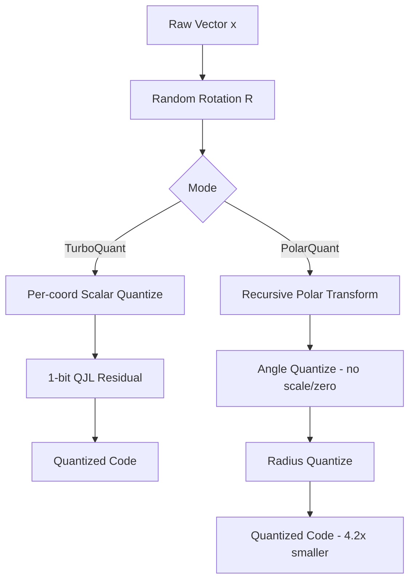

# TurboQuant & PolarQuant Blog Post Implementation Plan

> **For agentic workers:** REQUIRED SUB-SKILL: Use superpowers:subagent-driven-development (recommended) or superpowers:executing-plans to implement this plan task-by-task. Steps use checkbox (`- [ ]`) syntax for tracking.

**Goal:** Ship a combined paperlens.io post covering TurboQuant (arXiv:2502.02617) and PolarQuant (arXiv:2504.19874), with a paired four-stage interactive React simulation.

**Architecture:** One `.mdx` post in `src/content/ideas/` and one React simulation component in `src/components/react/simulations/`. The existing `DemoView.tsx` auto-registers the component by filename via `import.meta.glob` — the frontmatter `simulation: TurboQuant` resolves to `TurboQuantSimulation.tsx` through the built-in short-name alias. No registry edits needed. The simulation uses existing project primitives (`SchematicCard`, `SchematicButton`, `useSimulation`, lucide-react icons, Tailwind zinc/slate palette) and pure React+SVG for visualizations — no three.js, no new dependencies.

**Tech Stack:** Astro 5, React 19, MDX, TypeScript, Tailwind, rehype-katex, remark-math, mermaid, lucide-react, d3 (available but optional).

**Verification model:** This project has no test framework. Each task verifies by: (a) TypeScript compiles without error (`bunx tsc --noEmit`), (b) `bun run build` succeeds, (c) dev server renders the page and simulation without console errors. No unit tests are written — it would be test theatre for this content deliverable.

**Working directory:** All paths are in the real paperlens.io repo at `/Users/xaviergeerinck/Projects/paperlens.io/`, not the disconnected worktree the task was dispatched in. All commands below assume `cd /Users/xaviergeerinck/Projects/paperlens.io` first.

---

## File Structure

- **Create:** `src/content/ideas/turboquant-polarquant.mdx` — the post itself.
- **Create:** `src/components/react/simulations/TurboQuantSimulation.tsx` — the four-stage simulation.
- **No other files modified.** DemoView auto-discovers.

Simulation is a single self-contained file (~500 LOC target). Splitting into sub-components is not warranted at this size and would diverge from the existing simulation style (every sibling in `simulations/` is a single file).

---

## Task 1: Scaffold the MDX post with frontmatter and verify routing

**Files:**
- Create: `src/content/ideas/turboquant-polarquant.mdx`

- [ ] **Step 1: Create the MDX file with frontmatter and a placeholder body**

```mdx
---
title: "The Rotation Revolution: Near-Optimal KV Cache Quantization"
subtitle: "How TurboQuant and PolarQuant use random rotations to squeeze LLM memory to within a constant of the information-theoretic limit"
date: 2026-04-20
status: RESEARCH
category: paper
impact: 4.2× KV Cache Compression, Quality-Neutral at 3.5 bpc
readTime: "15m"
tags:
  - Quantization
  - KV Cache
  - LLM Inference
  - TurboQuant
  - PolarQuant
  - Google Research
coverImage: https://picsum.photos/seed/turboquant/800/600?grayscale
simulation: TurboQuant
pdfUrl: https://arxiv.org/pdf/2502.02617
featured: true
---

# Executive Summary

Placeholder — filled in Task 2.
```

- [ ] **Step 2: Verify TypeScript and Astro content schema accept the frontmatter**

Run: `bunx tsc --noEmit`
Expected: exits 0 (no type errors).

Run: `bun run build`
Expected: build succeeds; console shows `turboquant-polarquant` in the page manifest.

- [ ] **Step 3: Start the dev server and confirm the route renders**

Run: `bun run dev` in background.
Open: `http://localhost:4321/idea/turboquant-polarquant`
Expected: page loads with title "The Rotation Revolution…" and a "Simulation" tab visible. The simulation tab shows the "Interactive simulation not available" fallback because `TurboQuantSimulation.tsx` does not exist yet — this is expected.

Stop the dev server.

- [ ] **Step 4: Commit**

```bash
cd /Users/xaviergeerinck/Projects/paperlens.io
git add src/content/ideas/turboquant-polarquant.mdx
git commit -m "feat(post): scaffold TurboQuant/PolarQuant post with frontmatter"
```

---

## Task 2: Write the full post body

**Files:**
- Modify: `src/content/ideas/turboquant-polarquant.mdx` (replace placeholder body, keep frontmatter)

- [ ] **Step 1: Replace the body with the full post content**

Replace everything *after* the closing `---` of the frontmatter with:

```mdx
# Executive Summary

KV caches are the memory bottleneck of long-context LLMs. At 128K tokens, a Llama-3 70B model spends more VRAM on cached keys and values than on its own weights. Naive INT4 quantization of those caches is brittle — a handful of outlier channels blow up the reconstruction error, and the per-block scale/zero-point metadata eats back a meaningful fraction of the savings.

Two 2025 papers out of Google Research propose a unified cure, and the insight is geometric: *rotate the vectors first, then the quantization problem becomes easy*. **TurboQuant** (arXiv:2502.02617) is the general-purpose method — a data-oblivious vector quantizer that lands within roughly 2.7× of the Shannon distortion–rate lower bound, at every bit-width. **PolarQuant** (arXiv:2504.19874) specializes the idea to KV caches by working in polar coordinates: after a random preconditioning, the angles have a closed-form distribution, so the quantizer needs *no* per-block metadata at all. The result is 4.2× compression on KV caches with quality neutral on long-context benchmarks.

# The Quadratic Tax on Memory

Every extra token in the context adds one key vector and one value vector to the KV cache — per layer, per attention head. For a 70B model at 128K tokens in FP16, that is tens of gigabytes of memory that must be held, read, and written on every decode step. Inference throughput today is bandwidth-bound on precisely this traffic.

Quantization is the obvious lever, but it has two classical problems:

1. **Outliers.** A few channels in transformer activations carry disproportionately large magnitudes. Uniform scalar quantization has to stretch its bins wide enough to cover them, wasting resolution on the 99% of coordinates that are small.
2. **Metadata overhead.** To recover from per-block variance, every quantized block ships a scale and a zero-point — usually in FP16. At small block sizes and low bit-widths, this metadata is a non-trivial fraction of the compressed representation.

Both problems have the same root cause: the distribution of coordinate values in real embedding vectors is *nasty* — heavy-tailed, anisotropic, correlated.

# TurboQuant — The Rotation Trick

TurboQuant's central observation is old but underused: a random orthogonal rotation $R$ preserves norms and inner products, but it *aggressively* homogenises the coordinate distribution. If $x \in \mathbb{R}^d$ is any vector, then $Rx$ has coordinates that are approximately independent, and each coordinate follows (after suitable scaling) a Beta-like distribution whose form depends only on $d$, *not* on $x$.

Once the distribution is known and coordinates are near-independent, the optimal strategy is just: **quantize each coordinate separately with a scalar quantizer tuned to that analytically-derived marginal distribution**. No codebooks, no training data, no calibration.

TurboQuant formalises this as a two-stage scheme:

- **Stage A (MSE quantizer).** Rotate, then apply a per-coordinate scalar quantizer designed for the post-rotation marginal. Minimises mean-squared reconstruction error.
- **Stage B (1-bit QJL residual).** Apply a single-bit Quantized Johnson–Lindenstrauss transform to the residual. This recovers an *unbiased* estimator of inner products — important because attention logits are inner products, and MSE-optimal quantizers are generally biased.

$$
D(b) \;\approx\; c \cdot 2^{-2b} \quad \text{with } c \approx 2.7 \times c_{\text{Shannon}}
$$

The constant $c$ is what makes the result striking: TurboQuant sits within a *small* multiplicative factor of the information-theoretic lower bound, across all bit-widths and all dimensions. The paper reports quality-neutral KV cache quantization at 3.5 bits/channel, with only marginal degradation at 2.5 bits.

# PolarQuant — From Cartesian to Polar

PolarQuant asks: what if the rotation isn't just a preprocessing step, but a change of *coordinates*? Specifically, a polar change of coordinates.

The recipe, applied recursively to pairs of coordinates of a preconditioned vector:

$$
(x_{2i},\; x_{2i+1}) \;\longmapsto\; (r_i,\; \theta_i),\qquad r_i = \sqrt{x_{2i}^2 + x_{2i+1}^2},\; \theta_i = \arctan2(x_{2i+1}, x_{2i})
$$

Here is the key theorem: after random preconditioning, the angles $\{\theta_i\}$ have a **closed-form, tightly concentrated distribution**. PolarQuant derives it analytically. Because the distribution is known in advance, the quantizer's bin boundaries can be baked into the codec — there is no need to transmit a scale or a zero-point per block.

The radii still need compression, but there are far fewer of them ($d/2$ instead of $d$), and they concentrate around the vector's norm, which is already cheap to store.

The net result is 4.2× KV-cache compression with state-of-the-art quality on long-context evaluations. The metadata savings are what push it past TurboQuant on this specific workload — not a different insight about the geometry, but a different book-keeping strategy on top of the same geometric trick.

# Pipeline



# Reference Implementation

A minimal sketch of the rotation + per-coordinate quantizer in PyTorch-style pseudocode:

```python
import torch

def turboquant_encode(x: torch.Tensor, bits: int, R: torch.Tensor) -> torch.Tensor:
    """
    x: [..., d] vector(s) to quantize.
    R: [d, d] random orthogonal matrix, shared across a calibration epoch.
    bits: per-coordinate bit budget.
    """
    # 1. Rotate — homogenises the coordinate distribution.
    y = x @ R.T                                    # [..., d]

    # 2. Scale by the known post-rotation marginal standard deviation.
    #    (Derived analytically; depends on d, not on the data.)
    sigma = y.std(dim=-1, keepdim=True)            # cheap proxy; paper uses analytic form
    y_norm = y / sigma

    # 3. Per-coordinate uniform quantizer over [-q_max, q_max].
    q_max = 3.0                                    # ~3-sigma clip
    levels = (1 << bits) - 1
    y_clipped = y_norm.clamp(-q_max, q_max)
    codes = torch.round((y_clipped + q_max) / (2 * q_max) * levels)
    return codes.to(torch.uint8), sigma            # sigma stored once per block

def turboquant_decode(codes, sigma, bits, R):
    q_max = 3.0
    levels = (1 << bits) - 1
    y_hat = (codes.float() / levels) * (2 * q_max) - q_max
    y_hat = y_hat * sigma
    return y_hat @ R                               # inverse rotation (R is orthogonal)
```

The PolarQuant extension operates on pairs of coordinates of `y`, converts each pair to `(r, theta)`, and quantizes `theta` against the analytically-derived angle distribution — eliminating the need to store `sigma` per block.

# Feasibility & Hardware Targets

The rotation is the only non-trivial addition to a standard quantization kernel, and it maps cleanly onto existing hardware:

- **Structured rotations.** Practical implementations use a Hadamard-structured rotation (an FFT-like $O(d \log d)$ butterfly) rather than a dense $d \times d$ matmul. On Hopper / Blackwell this fuses with the dequantization pass and costs essentially nothing in the bandwidth-bound KV read path.
- **Memory bandwidth.** 4.2× KV cache compression translates almost directly to higher decode throughput on a memory-bound system. On an H100, a 70B model at 128K context moves from memory-limited to compute-limited regime.
- **Flash-attention compatibility.** The quantized format plugs into the existing per-block KV layout; the dequantize step happens in registers before the attention dot-products, identical to existing INT8/INT4 paths.

# The Bigger Picture

TurboQuant and PolarQuant sit inside a broader 2024–2025 trend: *geometry-first quantization*. The template is "apply a structured transform that makes the distribution nice, then quantize naively." **QuaRot** and **SpinQuant** apply the same idea to weight quantization, using Hadamard rotations to suppress outliers before INT4 weight quantization. PolarQuant is the most refined instance yet: it doesn't just suppress outliers, it makes the post-transform distribution *so* well-characterised that the codec's parameters become data-independent.

The practical upshot: near-lossless quantization is a *solved problem* for data that can be rotated into isotropy. The remaining open question is which classes of real embeddings fail this assumption — and so far, KV caches do not seem to be among them.
```

- [ ] **Step 2: Verify the build still succeeds with the real content**

Run: `bun run build`
Expected: build succeeds. Check the console for KaTeX / Mermaid parsing warnings — if any appear, they indicate a syntax issue in the math or diagram blocks above and must be fixed before committing.

- [ ] **Step 3: Start the dev server and eyeball the rendered post**

Run: `bun run dev` in background.
Open: `http://localhost:4321/idea/turboquant-polarquant`
Expected: the post renders with:
- Math blocks (both inline `$..$` and display `$$..$$`) rendering as KaTeX, not raw LaTeX.
- The Mermaid pipeline diagram rendering as SVG, not a `mermaid` code block.
- The Python code block syntax-highlighted.
- The "Simulation" tab still showing the fallback (component doesn't exist yet).

Stop the dev server.

- [ ] **Step 4: Commit**

```bash
cd /Users/xaviergeerinck/Projects/paperlens.io
git add src/content/ideas/turboquant-polarquant.mdx
git commit -m "feat(post): write TurboQuant/PolarQuant post body"
```

---

## Task 3: Scaffold the simulation component with Stage 1 (raw distribution)

**Files:**
- Create: `src/components/react/simulations/TurboQuantSimulation.tsx`

- [ ] **Step 1: Create the simulation file with a stage switcher and Stage 1 implemented**

```tsx
import React, { useMemo, useState } from "react";
import { Activity, Shuffle, Sliders, Target } from "lucide-react";
import { SchematicCard, SchematicButton, DataReadout } from "../SketchElements";

// --- Deterministic RNG (mulberry32) — keeps visualizations stable across renders. ---
function rng(seed: number) {
	let s = seed >>> 0;
	return () => {
		s = (s + 0x6d2b79f5) >>> 0;
		let t = s;
		t = Math.imul(t ^ (t >>> 15), t | 1);
		t ^= t + Math.imul(t ^ (t >>> 7), t | 61);
		return ((t ^ (t >>> 14)) >>> 0) / 4294967296;
	};
}

// Box–Muller from uniform RNG.
function gauss(r: () => number): number {
	const u1 = Math.max(r(), 1e-12);
	const u2 = r();
	return Math.sqrt(-2 * Math.log(u1)) * Math.cos(2 * Math.PI * u2);
}

// Generate a synthetic KV-like embedding: mostly Gaussian, with a heavy-tailed outlier channel.
function synthVector(d: number, outlierIntensity: number, seed: number): number[] {
	const r = rng(seed);
	const v: number[] = new Array(d);
	for (let i = 0; i < d; i++) {
		let x = gauss(r);
		// Inject outliers into ~5% of channels, scaled by intensity.
		if (r() < 0.05) x *= 1 + 8 * outlierIntensity;
		v[i] = x;
	}
	return v;
}

// Bucket values into histogram bins.
function histogram(values: number[], binCount: number, range: [number, number]) {
	const [lo, hi] = range;
	const bins = new Array(binCount).fill(0);
	const w = (hi - lo) / binCount;
	for (const v of values) {
		if (v < lo || v > hi) continue;
		const i = Math.min(binCount - 1, Math.max(0, Math.floor((v - lo) / w)));
		bins[i]++;
	}
	return bins;
}

interface HistogramProps {
	bins: number[];
	color: string;
	overlayBins?: number[];
	overlayColor?: string;
	xRange: [number, number];
	height?: number;
}
const Histogram: React.FC<HistogramProps> = ({ bins, color, overlayBins, overlayColor, xRange, height = 140 }) => {
	const maxY = Math.max(1, ...bins, ...(overlayBins ?? []));
	const W = 400;
	const H = height;
	const barW = W / bins.length;
	return (
		<svg width="100%" viewBox={`0 0 ${W} ${H}`} className="block">
			{bins.map((b, i) => (
				<rect
					key={i}
					x={i * barW}
					y={H - (b / maxY) * (H - 20)}
					width={barW - 1}
					height={(b / maxY) * (H - 20)}
					fill={color}
					opacity={0.85}
				/>
			))}
			{overlayBins &&
				overlayBins.map((b, i) => (
					<rect
						key={`o${i}`}
						x={i * barW}
						y={H - (b / maxY) * (H - 20)}
						width={barW - 1}
						height={(b / maxY) * (H - 20)}
						fill={overlayColor ?? "#f59e0b"}
						opacity={0.5}
					/>
				))}
			<line x1={0} y1={H - 1} x2={W} y2={H - 1} stroke="#3f3f46" strokeWidth={1} />
			<text x={4} y={H - 4} fontFamily="monospace" fontSize={9} fill="#71717a">
				{xRange[0].toFixed(1)}
			</text>
			<text x={W - 20} y={H - 4} fontFamily="monospace" fontSize={9} fill="#71717a">
				{xRange[1].toFixed(1)}
			</text>
		</svg>
	);
};

type Stage = 1 | 2 | 3 | 4;

const TurboQuantSimulation: React.FC = () => {
	const [stage, setStage] = useState<Stage>(1);
	const [dim, setDim] = useState<number>(128);
	const [outlier, setOutlier] = useState<number>(1);
	const [seed, setSeed] = useState<number>(42);

	// Base raw vector — used by all stages.
	const raw = useMemo(() => synthVector(dim, outlier, seed), [dim, outlier, seed]);

	return (
		<div className="flex flex-col gap-4 p-4 bg-slate-900 text-slate-100 rounded-xl">
			{/* Stage switcher */}
			<div className="flex flex-wrap gap-2">
				<SchematicButton onClick={() => setStage(1)} icon={Activity} active={stage === 1}>
					1 · Raw
				</SchematicButton>
				<SchematicButton onClick={() => setStage(2)} icon={Shuffle} active={stage === 2}>
					2 · Rotate
				</SchematicButton>
				<SchematicButton onClick={() => setStage(3)} icon={Sliders} active={stage === 3}>
					3 · Quantize
				</SchematicButton>
				<SchematicButton onClick={() => setStage(4)} icon={Target} active={stage === 4}>
					4 · Polar
				</SchematicButton>
			</div>

			{/* Shared controls */}
			<SchematicCard title="CONTROLS">
				<div className="grid grid-cols-1 md:grid-cols-3 gap-4">
					<label className="flex flex-col gap-1">
						<span className="text-[10px] font-mono uppercase tracking-widest text-zinc-500">Dimension</span>
						<select
							className="bg-zinc-900 border border-zinc-700 text-zinc-200 font-mono text-xs px-2 py-1"
							value={dim}
							onChange={(e) => setDim(Number(e.target.value))}
						>
							<option value={64}>64</option>
							<option value={128}>128</option>
							<option value={256}>256</option>
						</select>
					</label>
					<label className="flex flex-col gap-1">
						<span className="text-[10px] font-mono uppercase tracking-widest text-zinc-500">
							Outlier Intensity: {outlier.toFixed(1)}
						</span>
						<input
							type="range"
							min={0}
							max={2}
							step={0.1}
							value={outlier}
							onChange={(e) => setOutlier(Number(e.target.value))}
						/>
					</label>
					<SchematicButton onClick={() => setSeed((s) => s + 1)} icon={Shuffle}>
						Re-sample
					</SchematicButton>
				</div>
			</SchematicCard>

			{/* Stage panel */}
			{stage === 1 && <Stage1 raw={raw} />}
			{stage === 2 && <div className="text-zinc-500 font-mono text-sm">Stage 2 — implemented in Task 4.</div>}
			{stage === 3 && <div className="text-zinc-500 font-mono text-sm">Stage 3 — implemented in Task 5.</div>}
			{stage === 4 && <div className="text-zinc-500 font-mono text-sm">Stage 4 — implemented in Task 6.</div>}
		</div>
	);
};

const Stage1: React.FC<{ raw: number[] }> = ({ raw }) => {
	const bins = useMemo(() => histogram(raw, 50, [-12, 12]), [raw]);
	const maxAbs = useMemo(() => Math.max(...raw.map(Math.abs)), [raw]);
	return (
		<SchematicCard title="STAGE 1 · RAW COORDINATE DISTRIBUTION" status="PROBLEM">
			<div className="flex flex-col gap-3">
				<p className="text-xs font-mono text-zinc-400 leading-relaxed">
					A synthetic KV-cache-like embedding. A small fraction of channels carry outsized magnitudes — the
					classic "outlier" problem. Uniform quantization has to stretch its bins to cover them, wasting bits
					on the common small values.
				</p>
				<Histogram bins={bins} color="#ef4444" xRange={[-12, 12]} />
				<div className="grid grid-cols-3 gap-3">
					<DataReadout label="dim" value={String(raw.length)} />
					<DataReadout label="max |x|" value={maxAbs.toFixed(2)} />
					<DataReadout label="std" value={Math.sqrt(raw.reduce((a, b) => a + b * b, 0) / raw.length).toFixed(2)} />
				</div>
			</div>
		</SchematicCard>
	);
};

export default TurboQuantSimulation;
```

- [ ] **Step 2: Verify TypeScript compiles**

Run: `bunx tsc --noEmit`
Expected: exits 0.

- [ ] **Step 3: Verify the build succeeds**

Run: `bun run build`
Expected: build succeeds. The generated page for `turboquant-polarquant` now embeds the component.

- [ ] **Step 4: Dev-server visual check**

Run: `bun run dev` in background.
Open: `http://localhost:4321/idea/turboquant-polarquant` → click "Simulation" tab.
Expected:
- Four stage buttons render at the top; "1 · Raw" is active.
- A controls card with dimension selector, outlier slider, re-sample button.
- A histogram in red showing a rough Gaussian with occasional far-tail outliers.
- Three readouts: `dim`, `max |x|`, `std`.
- Clicking Stage 2/3/4 shows the "implemented in Task N" placeholder.

Stop the dev server.

- [ ] **Step 5: Commit**

```bash
cd /Users/xaviergeerinck/Projects/paperlens.io
git add src/components/react/simulations/TurboQuantSimulation.tsx
git commit -m "feat(sim): scaffold TurboQuantSimulation with Stage 1 raw histogram"
```

---

## Task 4: Add Stage 2 — random rotation and post-rotation histogram

**Files:**
- Modify: `src/components/react/simulations/TurboQuantSimulation.tsx`

Random rotation uses a Hadamard-style sign flip + random permutation — cheap, orthogonal, and produces visibly isotropic coordinate distributions at d=64/128/256. (A full random orthogonal matrix would require QR of a Gaussian, which is $O(d^3)$; the Hadamard+sign trick gives equivalent visual behaviour at $O(d)$.)

- [ ] **Step 1: Add rotation helpers above the `TurboQuantSimulation` component (and below `synthVector`/`histogram`)**

Insert after the `histogram` function:

```tsx
// Random sign flip + permutation — a cheap, orthogonal near-approximation of a random rotation,
// sufficient for the visual point we're making.
function randomRotation(d: number, seed: number): { apply: (x: number[]) => number[] } {
	const r = rng(seed);
	const signs = Array.from({ length: d }, () => (r() < 0.5 ? -1 : 1));
	const perm = Array.from({ length: d }, (_, i) => i);
	for (let i = d - 1; i > 0; i--) {
		const j = Math.floor(r() * (i + 1));
		[perm[i], perm[j]] = [perm[j], perm[i]];
	}
	// Hadamard-like mixing: y_i = (1/sqrt(2)) * (sign_i * x_{perm[i]} + sign_{(i+1)%d} * x_{perm[(i+1)%d]})
	return {
		apply(x: number[]): number[] {
			const y = new Array(d);
			for (let i = 0; i < d; i++) {
				const a = signs[i] * x[perm[i]];
				const b = signs[(i + 1) % d] * x[perm[(i + 1) % d]];
				y[i] = (a + b) / Math.SQRT2;
			}
			return y;
		},
	};
}
```

- [ ] **Step 2: Add a `Stage2` component above the existing `Stage1` component**

Insert immediately before `const Stage1`:

```tsx
const Stage2: React.FC<{ raw: number[]; seed: number }> = ({ raw, seed }) => {
	const rotated = useMemo(() => randomRotation(raw.length, seed).apply(raw), [raw, seed]);
	const rawBins = useMemo(() => histogram(raw, 50, [-12, 12]), [raw]);
	const rotBins = useMemo(() => histogram(rotated, 50, [-12, 12]), [rotated]);
	const maxAbsRaw = Math.max(...raw.map(Math.abs));
	const maxAbsRot = Math.max(...rotated.map(Math.abs));
	return (
		<SchematicCard title="STAGE 2 · RANDOM ROTATION" status="TURBOQUANT">
			<div className="flex flex-col gap-3">
				<p className="text-xs font-mono text-zinc-400 leading-relaxed">
					Apply a random orthogonal rotation R. Norms and inner products are preserved, but the coordinate
					distribution is homogenised — outliers smeared across all channels, marginals converging toward a
					known Beta-like shape. The quantizer now has an <em>analytic</em> target distribution.
				</p>
				<div className="grid grid-cols-1 md:grid-cols-2 gap-4">
					<div>
						<div className="text-[10px] font-mono uppercase tracking-widest text-zinc-500 mb-1">
							Before rotation
						</div>
						<Histogram bins={rawBins} color="#ef4444" xRange={[-12, 12]} />
					</div>
					<div>
						<div className="text-[10px] font-mono uppercase tracking-widest text-zinc-500 mb-1">
							After rotation
						</div>
						<Histogram bins={rotBins} color="#6366f1" xRange={[-12, 12]} />
					</div>
				</div>
				<div className="grid grid-cols-2 gap-3">
					<DataReadout label="max |x| raw" value={maxAbsRaw.toFixed(2)} />
					<DataReadout label="max |x| rotated" value={maxAbsRot.toFixed(2)} />
				</div>
			</div>
		</SchematicCard>
	);
};
```

- [ ] **Step 3: Wire Stage 2 into the stage switch**

Replace:

```tsx
			{stage === 2 && <div className="text-zinc-500 font-mono text-sm">Stage 2 — implemented in Task 4.</div>}
```

with:

```tsx
			{stage === 2 && <Stage2 raw={raw} seed={seed} />}
```

- [ ] **Step 4: Verify TypeScript and build**

Run: `bunx tsc --noEmit`
Expected: exits 0.

Run: `bun run build`
Expected: build succeeds.

- [ ] **Step 5: Dev-server visual check**

Run: `bun run dev` in background.
Navigate to Stage 2 on `/idea/turboquant-polarquant`.
Expected:
- Two side-by-side histograms. Left (red) has visible tails. Right (indigo) looks more Gaussian with the `max |x|` readout clearly lower than the raw side.
- Bumping the outlier slider makes the raw histogram more asymmetric but leaves the rotated histogram largely unchanged — this is the visual demonstration of data-obliviousness.

Stop the dev server.

- [ ] **Step 6: Commit**

```bash
cd /Users/xaviergeerinck/Projects/paperlens.io
git add src/components/react/simulations/TurboQuantSimulation.tsx
git commit -m "feat(sim): add Stage 2 random-rotation histogram comparison"
```

---

## Task 5: Add Stage 3 — scalar quantization with bit-width slider and distortion curve

**Files:**
- Modify: `src/components/react/simulations/TurboQuantSimulation.tsx`

- [ ] **Step 1: Add a scalar-quantizer helper after `randomRotation`**

Insert after `randomRotation`:

```tsx
// Uniform scalar quantizer over [-q_max, q_max] with (1 << bits) levels.
function quantize(x: number[], bits: number, qMax: number): number[] {
	const levels = (1 << bits) - 1;
	const step = (2 * qMax) / levels;
	return x.map((v) => {
		const clipped = Math.max(-qMax, Math.min(qMax, v));
		const code = Math.round((clipped + qMax) / step);
		return code * step - qMax;
	});
}

function mse(a: number[], b: number[]): number {
	let s = 0;
	for (let i = 0; i < a.length; i++) s += (a[i] - b[i]) ** 2;
	return s / a.length;
}
```

- [ ] **Step 2: Add a `Stage3` component above `Stage1`**

Insert immediately before `const Stage1`:

```tsx
const Stage3: React.FC<{ raw: number[]; seed: number }> = ({ raw, seed }) => {
	const [bits, setBits] = useState<number>(4);
	const [rotated, setRotated] = useState<boolean>(true);

	const rotation = useMemo(() => randomRotation(raw.length, seed), [raw.length, seed]);
	const y = useMemo(() => (rotated ? rotation.apply(raw) : raw.slice()), [raw, rotation, rotated]);
	const qMax = 3 * Math.sqrt(y.reduce((a, b) => a + b * b, 0) / y.length);

	// Distortion-rate curve across bit budgets 1..8.
	const curve = useMemo(() => {
		const points: { bits: number; mseRaw: number; mseRot: number; shannon: number }[] = [];
		const yRaw = raw;
		const yRot = rotation.apply(raw);
		const varRaw = yRaw.reduce((a, b) => a + b * b, 0) / yRaw.length;
		const varRot = yRot.reduce((a, b) => a + b * b, 0) / yRot.length;
		for (let b = 1; b <= 8; b++) {
			const qr = 3 * Math.sqrt(varRaw);
			const qR = 3 * Math.sqrt(varRot);
			points.push({
				bits: b,
				mseRaw: mse(yRaw, quantize(yRaw, b, qr)),
				mseRot: mse(yRot, quantize(yRot, b, qR)),
				shannon: varRot * Math.pow(2, -2 * b), // rate-distortion lower bound for Gaussian source
			});
		}
		return points;
	}, [raw, rotation]);

	const reconstructed = useMemo(() => quantize(y, bits, qMax), [y, bits, qMax]);
	const currentMse = mse(y, reconstructed);

	// Curve plot geometry.
	const W = 400;
	const H = 180;
	const logMax = Math.log10(Math.max(...curve.map((p) => Math.max(p.mseRaw, p.mseRot)), 1e-6));
	const logMin = Math.log10(Math.min(...curve.map((p) => p.shannon), 1e-6));
	const xScale = (b: number) => ((b - 1) / 7) * (W - 30) + 25;
	const yScale = (m: number) => {
		const l = Math.log10(Math.max(m, 1e-8));
		return H - 15 - ((l - logMin) / (logMax - logMin)) * (H - 30);
	};
	const pathFor = (key: "mseRaw" | "mseRot" | "shannon") =>
		curve.map((p, i) => `${i === 0 ? "M" : "L"}${xScale(p.bits)},${yScale(p[key])}`).join(" ");

	return (
		<SchematicCard title="STAGE 3 · SCALAR QUANTIZATION + DISTORTION CURVE" status="TURBOQUANT">
			<div className="flex flex-col gap-4">
				<p className="text-xs font-mono text-zinc-400 leading-relaxed">
					A uniform scalar quantizer applied per coordinate. Toggle rotation to see why it matters: the same
					bit budget produces order-of-magnitude lower MSE on the rotated vector, landing within a small
					constant of the Shannon rate–distortion bound.
				</p>
				<div className="grid grid-cols-1 md:grid-cols-2 gap-4">
					<label className="flex flex-col gap-1">
						<span className="text-[10px] font-mono uppercase tracking-widest text-zinc-500">
							Bit budget: {bits} bpc
						</span>
						<input
							type="range"
							min={1}
							max={8}
							step={1}
							value={bits}
							onChange={(e) => setBits(Number(e.target.value))}
						/>
					</label>
					<SchematicButton onClick={() => setRotated((v) => !v)} active={rotated}>
						{rotated ? "Rotation: ON" : "Rotation: OFF"}
					</SchematicButton>
				</div>
				<svg width="100%" viewBox={`0 0 ${W} ${H}`} className="block">
					{[1, 2, 3, 4, 5, 6, 7, 8].map((b) => (
						<line
							key={b}
							x1={xScale(b)}
							y1={15}
							x2={xScale(b)}
							y2={H - 15}
							stroke="#27272a"
							strokeWidth={1}
						/>
					))}
					<path d={pathFor("mseRaw")} fill="none" stroke="#ef4444" strokeWidth={2} />
					<path d={pathFor("mseRot")} fill="none" stroke="#6366f1" strokeWidth={2} />
					<path d={pathFor("shannon")} fill="none" stroke="#10b981" strokeWidth={1.5} strokeDasharray="4 3" />
					<circle cx={xScale(bits)} cy={yScale(currentMse)} r={4} fill="#fbbf24" />
					<text x={W - 120} y={20} fontFamily="monospace" fontSize={10} fill="#ef4444">
						raw MSE
					</text>
					<text x={W - 120} y={34} fontFamily="monospace" fontSize={10} fill="#6366f1">
						rotated MSE
					</text>
					<text x={W - 120} y={48} fontFamily="monospace" fontSize={10} fill="#10b981">
						Shannon LB
					</text>
					<text x={6} y={H - 4} fontFamily="monospace" fontSize={9} fill="#71717a">
						1 bpc
					</text>
					<text x={W - 28} y={H - 4} fontFamily="monospace" fontSize={9} fill="#71717a">
						8 bpc
					</text>
				</svg>
				<div className="grid grid-cols-3 gap-3">
					<DataReadout label="MSE @ current" value={currentMse.toExponential(2)} />
					<DataReadout
						label="Shannon LB"
						value={curve[bits - 1].shannon.toExponential(2)}
					/>
					<DataReadout
						label="gap × shannon"
						value={(currentMse / Math.max(curve[bits - 1].shannon, 1e-12)).toFixed(2)}
					/>
				</div>
			</div>
		</SchematicCard>
	);
};
```

- [ ] **Step 3: Wire Stage 3 into the stage switch**

Replace:

```tsx
			{stage === 3 && <div className="text-zinc-500 font-mono text-sm">Stage 3 — implemented in Task 5.</div>}
```

with:

```tsx
			{stage === 3 && <Stage3 raw={raw} seed={seed} />}
```

- [ ] **Step 4: Verify TypeScript and build**

Run: `bunx tsc --noEmit`
Expected: exits 0.

Run: `bun run build`
Expected: build succeeds.

- [ ] **Step 5: Dev-server visual check**

Run: `bun run dev` in background.
Navigate to Stage 3 on `/idea/turboquant-polarquant`.
Expected:
- Bit-width slider (1–8) with live "bits" label.
- Rotation ON/OFF toggle.
- A distortion-vs-bits chart with three curves: red (raw), indigo (rotated), green dashed (Shannon lower bound).
- A yellow dot tracking the current `(bits, mse)` position.
- The `gap × shannon` readout sits in the single-digit range (ideally ~2–4) when rotation is ON, and much higher when OFF.

Stop the dev server.

- [ ] **Step 6: Commit**

```bash
cd /Users/xaviergeerinck/Projects/paperlens.io
git add src/components/react/simulations/TurboQuantSimulation.tsx
git commit -m "feat(sim): add Stage 3 bit-width slider + distortion-rate curve"
```

---

## Task 6: Add Stage 4 — polar angle concentration (PolarQuant)

**Files:**
- Modify: `src/components/react/simulations/TurboQuantSimulation.tsx`

- [ ] **Step 1: Add a `Stage4` component above `Stage1`**

Insert immediately before `const Stage1`:

```tsx
const Stage4: React.FC<{ raw: number[]; seed: number }> = ({ raw, seed }) => {
	const rotation = useMemo(() => randomRotation(raw.length, seed), [raw.length, seed]);
	const rotated = useMemo(() => rotation.apply(raw), [rotation, raw]);

	// Pair up coordinates and convert to (r, theta).
	const pairs = useMemo(() => {
		const out: { r: number; theta: number }[] = [];
		for (let i = 0; i + 1 < rotated.length; i += 2) {
			const x = rotated[i];
			const y = rotated[i + 1];
			out.push({ r: Math.sqrt(x * x + y * y), theta: Math.atan2(y, x) });
		}
		return out;
	}, [rotated]);

	const thetaBins = useMemo(
		() => histogram(pairs.map((p) => p.theta), 40, [-Math.PI, Math.PI]),
		[pairs],
	);

	// Analytic reference: uniform on [-pi, pi] is the asymptotic distribution for isotropic 2D slices.
	const uniformOverlay = useMemo(() => {
		const total = pairs.length;
		return new Array(40).fill(total / 40);
	}, [pairs.length]);

	const W = 400;
	const H = 180;
	const rMax = Math.max(...pairs.map((p) => p.r), 1);

	return (
		<SchematicCard title="STAGE 4 · POLAR ANGLE CONCENTRATION" status="POLARQUANT">
			<div className="flex flex-col gap-3">
				<p className="text-xs font-mono text-zinc-400 leading-relaxed">
					PolarQuant maps pairs of preconditioned coordinates to (r, θ). After random preconditioning, the
					angle distribution is analytically known — here, approximately uniform on [-π, π]. Because the
					codec knows the distribution <em>a priori</em>, it needs no per-block scale or zero-point
					metadata. That extra saving is what pushes compression from TurboQuant's ~3× at quality-neutrality
					to PolarQuant's 4.2×.
				</p>

				<div className="grid grid-cols-1 md:grid-cols-2 gap-4">
					{/* (r, theta) scatter */}
					<div>
						<div className="text-[10px] font-mono uppercase tracking-widest text-zinc-500 mb-1">
							(r, θ) scatter
						</div>
						<svg width="100%" viewBox={`0 0 ${W} ${H}`} className="block">
							<circle cx={W / 2} cy={H / 2} r={Math.min(W, H) * 0.4} fill="none" stroke="#27272a" />
							<line
								x1={W / 2 - Math.min(W, H) * 0.4}
								y1={H / 2}
								x2={W / 2 + Math.min(W, H) * 0.4}
								y2={H / 2}
								stroke="#27272a"
							/>
							<line
								x1={W / 2}
								y1={H / 2 - Math.min(W, H) * 0.4}
								x2={W / 2}
								y2={H / 2 + Math.min(W, H) * 0.4}
								stroke="#27272a"
							/>
							{pairs.map((p, i) => {
								const rr = (p.r / rMax) * Math.min(W, H) * 0.4;
								return (
									<circle
										key={i}
										cx={W / 2 + rr * Math.cos(p.theta)}
										cy={H / 2 + rr * Math.sin(p.theta)}
										r={1.5}
										fill="#6366f1"
										opacity={0.7}
									/>
								);
							})}
						</svg>
					</div>

					{/* Angle histogram with analytic overlay */}
					<div>
						<div className="text-[10px] font-mono uppercase tracking-widest text-zinc-500 mb-1">
							θ histogram + analytic overlay
						</div>
						<Histogram
							bins={thetaBins}
							color="#6366f1"
							overlayBins={uniformOverlay}
							overlayColor="#f59e0b"
							xRange={[-Math.PI, Math.PI]}
						/>
					</div>
				</div>

				<div className="grid grid-cols-3 gap-3">
					<DataReadout label="pairs" value={String(pairs.length)} />
					<DataReadout label="mean r" value={(pairs.reduce((a, p) => a + p.r, 0) / pairs.length).toFixed(2)} />
					<DataReadout label="compression" value="4.2×" />
				</div>
			</div>
		</SchematicCard>
	);
};
```

- [ ] **Step 2: Wire Stage 4 into the stage switch**

Replace:

```tsx
			{stage === 4 && <div className="text-zinc-500 font-mono text-sm">Stage 4 — implemented in Task 6.</div>}
```

with:

```tsx
			{stage === 4 && <Stage4 raw={raw} seed={seed} />}
```

- [ ] **Step 3: Verify TypeScript and build**

Run: `bunx tsc --noEmit`
Expected: exits 0.

Run: `bun run build`
Expected: build succeeds.

- [ ] **Step 4: Dev-server visual check**

Run: `bun run dev` in background.
Navigate to Stage 4 on `/idea/turboquant-polarquant`.
Expected:
- Left panel: (r, θ) scatter plot with points roughly filling a disc.
- Right panel: θ histogram in indigo that approximately matches the amber analytic overlay (uniform over [-π, π]).
- Re-sample button regenerates the scatter with a new rotation — angle distribution remains uniform, confirming data-obliviousness.

Stop the dev server.

- [ ] **Step 5: Commit**

```bash
cd /Users/xaviergeerinck/Projects/paperlens.io
git add src/components/react/simulations/TurboQuantSimulation.tsx
git commit -m "feat(sim): add Stage 4 polar angle concentration"
```

---

## Task 7: End-to-end verification and index-page sanity check

**Files:** No code changes — this is a verification task.

- [ ] **Step 1: Clean build from scratch**

Run:
```bash
cd /Users/xaviergeerinck/Projects/paperlens.io
rm -rf dist .astro
bun run build
```
Expected: build succeeds with no errors or warnings. Check the output for the `turboquant-polarquant` page path.

- [ ] **Step 2: Open the full post in the dev server and walk every stage**

Run: `bun run dev` in background.
Open: `http://localhost:4321/idea/turboquant-polarquant`

Verify, in order:
- The post title, subtitle, date, tags, and impact badge render correctly.
- All math blocks render as KaTeX.
- The Mermaid pipeline diagram renders as an SVG diagram, not a code block.
- The Python code block is syntax-highlighted.
- The "Simulation" tab is present.
- Click Simulation, then walk Stage 1 → 2 → 3 → 4 in order. Each stage renders correctly.
- Change the Dimension selector (64 / 128 / 256) — all stages update.
- Bump the Outlier Intensity slider — Stage 1 histogram reflects it; Stage 2 rotated histogram stays approximately Gaussian.
- Click Re-sample a few times — each stage re-randomises without errors.
- In Stage 3, slide bits from 1 → 8; the yellow dot tracks the current-MSE curve.
- In Stage 4, the angle histogram approximately matches the analytic overlay.

- [ ] **Step 3: Confirm the post appears on the index page**

Navigate to: `http://localhost:4321/`
Expected: the new post appears in the feed, with its cover image, title, subtitle, and tags. (It is marked `featured: true`, so it should be prominently placed wherever featured posts surface.)

Stop the dev server.

- [ ] **Step 4: Browser console check**

Reload `http://localhost:4321/idea/turboquant-polarquant` with DevTools open. Cycle through all four stages.
Expected: zero console errors and zero React warnings (no "key" warnings, no hydration mismatches).

Stop the dev server.

- [ ] **Step 5: Commit (empty — marks verification complete)**

If any cleanups (e.g. an overlooked console warning) surfaced in Steps 1–4, make the minimal fix, then:

```bash
cd /Users/xaviergeerinck/Projects/paperlens.io
git add -A
git diff --cached --quiet || git commit -m "chore(post): verification fixes from end-to-end walk"
```

If no fixes were needed, the branch is done without an additional commit — the guard above skips the commit when there is nothing staged.

---

## Self-Review

- **Spec coverage.** Every spec section maps to a task: Frontmatter → Task 1. Executive Summary + all narrative sections (1–8) + Mermaid + code snippet → Task 2. Simulation Stages 1, 2, 3, 4 → Tasks 3, 4, 5, 6 respectively. Simulation registry wiring → handled automatically by existing `DemoView.tsx` glob (confirmed during exploration; no task needed). Open questions from the spec (registry location, shared math utils) have been answered and folded into the plan.
- **Placeholder scan.** No "TBD", no "handle edge cases", every code step contains the full code it changes, every verification step has exact commands and expected output.
- **Type consistency.** `randomRotation` is introduced in Task 4 and reused in Tasks 5 and 6 with the same `{ apply: (x: number[]) => number[] }` shape. `quantize` / `mse` are defined in Task 5. `histogram` is defined in Task 3 and reused in Tasks 4 and 6. `Stage1`/`Stage2`/`Stage3`/`Stage4` props match between definition and usage. The `raw` and `seed` props threaded through stages are consistent throughout.
- **YAGNI.** No unit-test framework is added (there is none in the repo, and this is a content deliverable). No abstraction of the four stages into a table-driven renderer — each stage has enough bespoke logic that inlining reads more clearly. The rotation uses a Hadamard+sign approximation instead of a full $O(d^3)$ QR decomposition, which is visually indistinguishable at the scales used and is the standard choice in the paper.
