# Adam's Hidden Parameter: The Epsilon Breakthrough

## Executive Summary

When Andrej Karpathy switched from PyTorch's default `eps=1e-8` to `eps=1e-10` in his Adam optimizer, he didn't just tweak a numerical stability constant—he unlocked Adam's ability to navigate **flat loss landscapes**. This seemingly tiny change prevents Adam from creating an artificial floor on learning when gradients become extremely small, allowing the optimizer to continue making progress where the default configuration would stall.

---

## The Problem: The Epsilon Floor

Most practitioners treat Adam's epsilon parameter as a "don't touch" numerical stability constant. PyTorch defaults to `eps=1e-8`, and for years, this seemed reasonable. But there's a hidden problem that emerges in modern deep learning:

**When gradients drop below ~1e-8 in magnitude, epsilon dominates the denominator and Adam loses its adaptive properties.**

### The Mathematics of the Trap

Adam's update rule for parameter $\theta$ is:

$$
\theta_{t+1} = \theta_t - \alpha \cdot \frac{m_t}{\sqrt{v_t} + \epsilon}
$$

Where:
- $m_t$ is the first moment (moving average of gradients)
- $v_t$ is the second moment (moving average of squared gradients)
- $\alpha$ is the learning rate
- $\epsilon$ is the numerical stability constant

**The Critical Insight**: When $\sqrt{v_t} \ll \epsilon$, the denominator becomes approximately $\epsilon$, making the update:

$$
\theta_{t+1} \approx \theta_t - \alpha \cdot \frac{m_t}{\epsilon}
$$

This transforms Adam into **SGD with a fixed, epsilon-controlled step size**—losing all adaptive curvature normalization.

```mermaid
graph TD
    Start[Gradient g arrives] --> Check{Is sqrt of v_t >> eps?}
    Check -->|Yes| Adaptive[Adam behaves adaptively<br/>Update ∝ m/sqrt of v]
    Check -->|No| Floor[Epsilon dominates<br/>Update ∝ m/eps fixed step]
    
    Adaptive --> Good[Efficient navigation]
    Floor --> Bad[Artificial floor on learning<br/>Oscillations or stalling]
    
    style Good fill:#064e3b,stroke:#10b981
    style Bad fill:#450a0a,stroke:#ef4444
```



---

## The Solution: Lower Epsilon

By setting `eps=1e-10` instead of `1e-8`, we extend Adam's adaptive range by **two orders of magnitude**. This allows Adam to:

1. **Maintain scale invariance** in extremely flat regions (gradients ≈ 1e-9)
2. **Correctly normalize curvature** instead of applying a fixed step size
3. **Skate effortlessly** through plateaus that would trap the default configuration

### Visualizing the Difference: Micro-Canyon Scenario

Imagine a loss landscape with:
- One dimension with steep curvature (gradients ≈ 1e-3)
- One dimension that's nearly flat (gradients ≈ 1e-9)

```mermaid
graph LR
    subgraph "Default eps=1e-8"
        A1[Steep dimension:<br/>adapts correctly] 
        B1[Flat dimension:<br/>eps dominates gradient]
        C1[Result: Oscillation<br/>around flat canyon]
        A1 --> C1
        B1 --> C1
        style C1 fill:#450a0a,stroke:#ef4444
    end
    
    subgraph "Karpathy's eps=1e-10"
        A2[Steep dimension:<br/>adapts correctly]
        B2[Flat dimension:<br/>still adapts correctly]
        C2[Result: Smooth<br/>convergence]
        A2 --> C2
        B2 --> C2
        style C2 fill:#064e3b,stroke:#10b981
    end
```



---

## Implementation

### PyTorch Code Comparison

**Default PyTorch (Suboptimal for flat landscapes):**
```python
import torch.optim as optim

# Default: eps=1e-8 creates artificial floor
optimizer = optim.Adam(model.parameters(), lr=3e-4)
```

**Karpathy's Optimization (Better for flat landscapes):**
```python
import torch.optim as optim

# Karpathy's choice: eps=1e-10 maintains adaptivity
optimizer = optim.Adam(
    model.parameters(),
    lr=3e-4,
    eps=1e-10  # ← The critical change
)
```

### Real-World Impact

In Karpathy's `nano-chat` and similar projects, this change enables:
- **Continued learning in late-stage training** when gradients become tiny
- **Better escape from saddle points** without artificial step-size floors
- **True scale-invariant optimization** across all gradient magnitudes

---

## Why 1e-8 Was Chosen (And Why We Can Do Better Now)

The default `eps=1e-8` was chosen for **Float16 stability**:
- Float16 has limited precision; numbers below ~1e-8 can underflow
- Adding 1e-8 prevented division-by-zero errors

**Modern training uses BF16 or mixed precision** with FP32 optimizer states:
- Optimizer states (m, v) are maintained in FP32
- We can safely use `eps=1e-10` without underflow
- Adam's internal computations remain numerically stable

---

## Scaling Laws & Efficiency

This isn't just about numerical stability—it changes **optimization dynamics**:

### Flat Loss Landscapes are Everywhere

Modern architectures exhibit flat regions due to:
- **Overparameterization**: Wide networks with many equivalent solutions
- **Batch normalization**: Smooths loss surface but creates plateaus
- **Late-stage training**: Gradients naturally shrink as we approach minima
- **Attention mechanisms**: Can create extremely flat eigenspaces

### Performance Comparison

| Configuration | Behavior in Flat Region (gradient ≈ 1e-9) |
|---------------|-------------------------------------------|
| `eps=1e-8` | Epsilon dominates; fixed step ~m/1e-8 |
| `eps=1e-10` | Adam adapts correctly; step ~m/sqrt(v) |

> "By lowering epsilon to 1e-10, Adam can skate effortlessly through flat loss landscapes that would otherwise create an artificial floor on learning."  
> — Insight from Karpathy's optimization choices

---

## Feasibility & Practical Considerations

### When to Use eps=1e-10

✅ **Use eps=1e-10 when:**
- Training with BF16 or mixed precision (FP32 optimizer states)
- Working with deep networks or transformers
- Experiencing plateaus in late-stage training
- Gradients frequently drop below 1e-8

⚠️ **Stick with eps=1e-8 when:**
- Using pure Float16 without FP32 master weights
- Working on hardware without BF16 support
- Gradients consistently stay > 1e-8

### Performance Overhead

**None.** Changing epsilon is a constant in the denominator—no computational cost difference.

---

## Key Takeaways

1. **Epsilon is not just numerical stability**: It directly affects Adam's adaptive behavior when gradients are small.

2. **Default values can create artificial floors**: PyTorch's 1e-8 was chosen for Float16, not for optimal flat-landscape navigation.

3. **Modern mixed precision enables 1e-10**: With FP32 optimizer states, we can safely lower epsilon and maintain adaptivity.

4. **Flat landscapes are common**: Overparameterized networks, batch norm, and late-stage training all produce tiny gradients.

5. **Simple fix, significant impact**: One line of code can unlock better convergence in challenging optimization scenarios.

---

## Further Reading

- [Karpathy's nano-chat implementation](https://github.com/karpathy) (uses eps=1e-10)
- [Adam Optimizer Original Paper](https://arxiv.org/abs/1412.6980)
- [Discussion on epsilon's role in flat landscapes](https://sifal.social/)

**Experiment yourself**: Run the interactive simulation below to see how epsilon changes Adam's trajectory through flat loss canyons.
