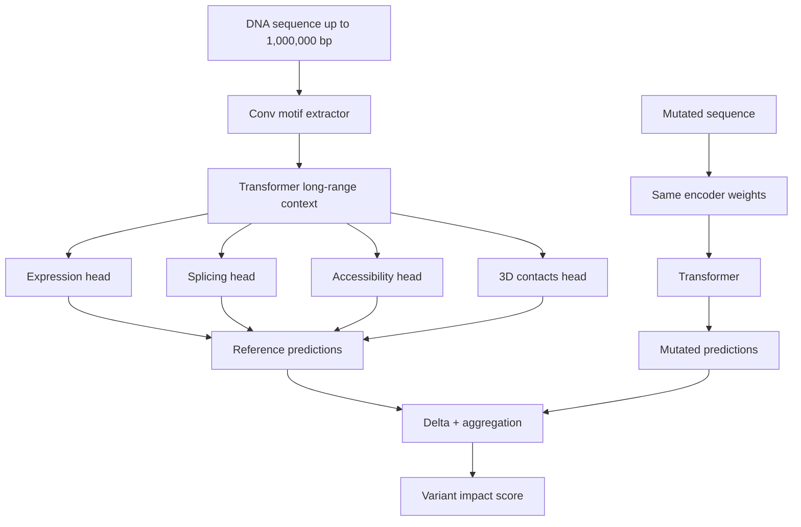

import AlgorithmBlock from "../../components/react/AlgorithmBlock";
import ExpandableMath from "../../components/react/ExpandableMath";

## AlphaGenome: AI for better understanding the genome

### Executive Summary
AlphaGenome is a DNA sequence model that ingests up to one million base pairs and predicts thousands of regulatory properties at base-level resolution. It unifies long-range context, multimodal outputs, and fast variant scoring, enabling a single model call to estimate how a mutation affects expression, splicing, accessibility, and 3D chromatin contacts across diverse tissues. The system builds on Enformer and complements AlphaMissense, and was trained using large public consortia datasets (ENCODE, GTEx, 4D Nucleome, FANTOM5). It is released for non-commercial research via an API, with strong performance across benchmark suites.

### The Problem
Most genome models struggle to see both far and fine. Long-range regulatory elements can lie hundreds of thousands of bases away from a gene, while regulatory signals (motifs, splice junctions) require base-level precision. Previous models typically traded off sequence length for resolution, limiting either context or detail and forcing researchers to stitch together multiple task-specific models.

### The Solution / Concept
AlphaGenome combines three key ideas:

1. **Long-context input**: up to $10^6$ DNA bases, capturing distal regulation.
2. **Base-resolution output**: predictions at single-base resolution, essential for splicing and motif-level inference.
3. **Multimodal heads**: joint prediction of expression, splicing, accessibility, protein binding, and 3D contacts from one shared encoder.

The model uses convolutional layers to detect short motifs, transformers to propagate information across the full sequence, and modality-specific heads to emit predictions. Variant scoring is computed by contrasting predictions between the reference and mutated sequences, and aggregating the deltas.

#### Complexity intuition
<ExpandableMath
  client:only="react"
  equation="\text{tokens} = \frac{L}{r}, \quad \text{attention cost} \propto \left(\frac{L}{r}\right)^2"
  explanation="Increasing the sequence length $L$ or improving resolution $r$ (smaller base pairs per token) both grow the token count, and transformer attention scales quadratically with tokens."
  example={{
    description: "Comparing a 1M bp sequence at 1 bp resolution:",
    values: { "L": "1,000,000", "r": "1" },
    result: "tokens = 1,000,000, attention cost \propto 10^{12}"
  }}
  terms={[
    { symbol: "L", name: "Sequence length", meaning: "Number of DNA base pairs in the input" },
    { symbol: "r", name: "Resolution", meaning: "Base pairs per token" }
  ]}
/>

### Visuals


### Algorithm: Variant Scoring in a Unified Model
<AlgorithmBlock
  client:only="react"
  title="Algorithm: AlphaGenome Variant Scoring"
  inputs={["reference sequence $S_{ref}$", "mutated sequence $S_{mut}$"]}
  outputs={["per-modality deltas $\Delta y$", "aggregate score $s$"]}
  steps={[
    "Predict properties for $S_{ref}$",
    "Predict properties for $S_{mut}$ using the same encoder",
    "Compute $\Delta y = y_{mut} - y_{ref}$ and summarize"
  ]}
  executor="alphagenome-variant-score"
  initialState={{
    ref_props: [0.42, 0.57, 0.31, 0.62],
    variant_effect: [0.06, -0.04, 0.02, 0.05]
  }}
/>

### Implementation (Minimal Python Sketch)
```python
from typing import Dict, List
import numpy as np

Modalities = ["expression", "splicing", "accessibility", "contacts"]


def encode_sequence(seq: str) -> np.ndarray:
    """One-hot encode DNA sequence."""
    mapping = {"A": 0, "C": 1, "G": 2, "T": 3}
    one_hot = np.zeros((len(seq), 4))
    for i, base in enumerate(seq):
        one_hot[i, mapping[base]] = 1
    return one_hot


def predict_properties(seq: str) -> Dict[str, np.ndarray]:
    """Placeholder: conv + transformer + multi-head prediction."""
    x = encode_sequence(seq)
    # conv_features = conv_stack(x)
    # context = transformer(conv_features)
    # heads = {m: head(context) for m in Modalities}
    # return heads
    return {m: np.random.rand(len(seq)) for m in Modalities}


def score_variant(ref_seq: str, mut_seq: str) -> Dict[str, float]:
    ref = predict_properties(ref_seq)
    mut = predict_properties(mut_seq)
    deltas = {m: float(np.mean(np.abs(mut[m] - ref[m]))) for m in Modalities}
    score = float(np.mean(list(deltas.values())))
    return {"delta_by_modality": deltas, "aggregate_score": score}
```

### Feasibility / Analysis
- **Accuracy**: AlphaGenome matches or exceeds specialist baselines on most benchmark evaluations, while predicting all modalities in a single model.
- **Efficiency**: Despite the large context, the system reports lower training compute than Enformer due to architectural optimizations and multi-TPU training.
- **Limitations**: Very long-range regulatory effects (>$10^5$ bases), cell-type specificity, and clinical-grade personal genome prediction remain open challenges.
- **Access**: The model is available for non-commercial research through the AlphaGenome API. Predictions are not validated for clinical use.

### What to try in the simulation
1. Increase sequence length to observe the quadratic attention cost growth.
2. Set resolution to 1 bp to maximize detail and compare compute impact.
3. Increase the variant impact scale to see the delta score rise across modalities.

### Sources
- DeepMind blog: https://deepmind.google/blog/alphagenome-ai-for-better-understanding-the-genome/
- AlphaGenome preprint PDF: https://storage.googleapis.com/deepmind-media/papers/alphagenome.pdf
- AlphaGenome API: https://github.com/google-deepmind/alphagenome
