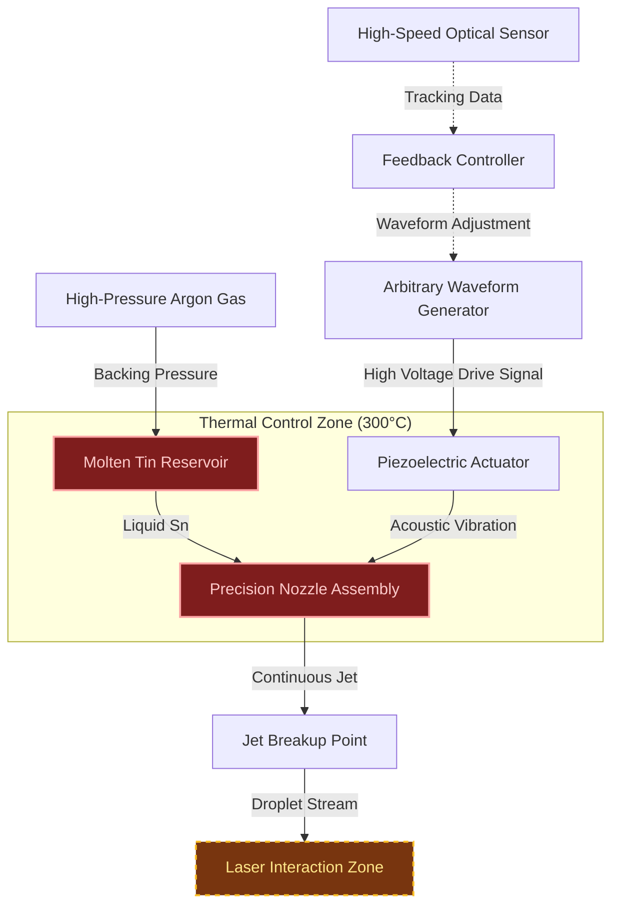

import AlgorithmBlock from '../../components/react/AlgorithmBlock';
import ExpandableMath from '../../components/react/ExpandableMath';

# Executive Summary

At the heart of modern semiconductor manufacturing lies an incredibly violent yet precise process: Extreme Ultraviolet (EUV) lithography. To generate the specific wavelength of light needed to print features just nanometers wide, high-power lasers blast microscopic droplets of molten tin into plasma.

The catch? This needs to happen 50,000 times every second. Furthermore, every single droplet must be identical in mass, perfectly spherical, and arrive at the exact target zone with nanosecond timing precision.

This article explores the engineering marvel behind this requirement: the high-frequency, uniform droplet generator. The process bypasses natural fluid chaos using acoustic physics and active feedback loops to engineer a perfect stream of liquid metal.

---

# The Problem: Taming Fluid Chaos

If you open a kitchen faucet slightly, you'll see a smooth cylinder of water exit the nozzle, but inches down, it breaks up into irregular drips. This is nature at work.

This phenomenon is known as the **Rayleigh-Plateau instability**. A cylindrical column of liquid is inherently unstable because surface tension constantly tries to minimize surface area. The cylinder naturally develops tiny, random perturbations along its surface. Some wavelengths of these perturbations grow exponentially until they "pinch off" the column into discrete droplets.

Left uncontrolled, this process is chaotic. The resulting droplets vary widely in:
1.  **Size**: Large main droplets are interspersed with tiny "satellite" droplets.
2.  **Velocity**: Different sizes suffer different aerodynamic drag, leading to spacing jitter.
3.  **Timing**: There is no predictable rhythm to their arrival.

For EUV lithography, this natural chaos is unacceptable. If a laser pulses and hits a tiny satellite droplet instead of a main droplet, the resulting plasma is too weak, ruining the exposure for that chip layer. Absolute uniformity is critical.

---

# The Solution: Active Acoustic Breakup

 To create uniform droplets, the breakup process cannot be left to chance. Natural instability must be overpowered with engineered precision.
 
 The solution is **Active Jet Breakup**. Instead of allowing random environmental noise to determine where the jet breaks, the system deliberately introduces a single, dominating frequency into the fluid.
 
 This is achieved using a **piezoelectric (PZT) transducer** attached to the nozzle. By vibrating the nozzle at a specific high frequency (e.g., 50 kHz), a standing acoustic wave is induced along the surface of the exiting liquid jet.

If the frequency is chosen correctly based on the jet's diameter and velocity, this artificial perturbation grows much faster than natural noise. The jet breaks up exactly in rhythm with the vibration, creating perfectly spaced droplets of identical volume.

<ExpandableMath
  client:only="react"
  equation="f_{opt} = \frac{v_{jet}}{4.508 \cdot d_{nozzle}}"
  explanation="To achieve a uniform stream, the acoustic drive frequency must match the natural instability wavelength of the liquid column."
  example={{
    description: "Calculate optimal drive frequency for a standard EUV source:",
    values: {
      "v_{jet}": "100 \\text{ m/s}",
      "d_{nozzle}": "20 \\mu\\text{m} = 2.0 \\times 10^{-5} \\text{ m}"
    },
    result: "f_{opt} = \\frac{100}{4.508 \\times 2.0 \\times 10^{-5}} \\approx 1,109,000 \\text{ Hz} = 1.1 \\text{ MHz}"
  }}
  terms={[
    { symbol: "f_{opt}", name: "Optimal Frequency", meaning: "The frequency that produces the most uniform droplets" },
    { symbol: "v_{jet}", name: "Jet Velocity", meaning: "Speed of the molten tin exiting the nozzle" },
    { symbol: "4.508", name: "Rayleigh Factor", meaning: "Ideally \\( \\lambda \\approx 4.508d \\) for max instability growth" },
    { symbol: "d_{nozzle}", name: "Nozzle Diameter", meaning: "Diameter of the orifice (approx equal to jet diameter)" }
  ]}
/>

## The Hardware Architecture

Generating droplets of molten tin at 300°C requires robust hardware designed for extreme environments.



### Key Components:

1. **High-Pressure Gas System**: Inert Argon gas provides a highly stable backing pressure (often >100 bar) to push the molten tin through the nozzle at high velocities (up to 100 m/s).
2. **Thermal Management**: The entire tin path must be kept heated above 232°C (tin's melting point), usually around 300°C. Even slight temperature changes alter viscosity, affecting droplet size.
3. **PZT Actuator**: The heart of the system. It converts electrical signals into mechanical vibrations, "seeding" the breakup frequency.

---

# Deep Dive: The Algorithm of Perfect Uniformity

Simply vibrating the nozzle with a sine wave isn't enough. Natural non-linearities in fluid dynamics still tend to create tiny satellite droplets between the main drops.

To ensure a "clean" stream where every satellite merges into a main droplet, engineers use **Arbitrary Waveform Modulation**. Instead of a simple sine tone, the PZT is driven with complex, custom-shaped electrical pulses designed to manipulate the fluid dynamics during pinch-off.

Furthermore, to maintain synchronization with the pulsed laser over hours of operation, the system requires a real-time closed-loop controller.

Below is the algorithmic process for maintaining a stable, satellite-free droplet stream locked to a target frequency.

<AlgorithmBlock
client:only="react"
title="Algorithm: Closed-Loop Droplet Stabilization"
inputs={[
"Target Frequency  (e.g., 50kHz)",
"Optical Sensor Data  (positions/velocities)"
]}
outputs={[
"Corrected Drive Signal "
]}
steps={[
"Measure: Analyze  to find current droplet spacing  and phase offset .",
"Detect Satellites: Image processing checks for small objects between main droplets.",
"Adjust Frequency: If spacing  drifts, tweak drive frequency  to match .",
"Modulate Waveform: If satellites detected, adjust the harmonic content (shape) of the drive pulse to force merger.",
"Phase Lock: Adjust signal timing so droplets arrive at the target zone exactly when the laser trigger is ready.",
"Apply: Send new complex waveform  to high-voltage amplifier driving the piezo."
]}
/>

By continuously adjusting the *shape* of the vibration wave, not just its frequency, the controller forces the fluid mechanics to combine any incipient satellite droplets into the main drop immediately after breakup.

---

# Implementation Concept

In a real-world scenario, this control logic runs on high-speed FPGAs or real-time operating systems. Below is a simplified Python simulation of how a controller might adjust the waveform generator based on sensor feedback.

```python
import numpy as np

class DropletController:
    def __init__(self, target_freq_hz=50000):
        self.target_freq = target_freq_hz
        # Initial simple sine wave parameters
        self.drive_freq = target_freq_hz
        self.amplitude = 1.0
        # Harmonics used to shape the wave to kill satellites
        self.harmonic_balances = {2: 0.0, 3: 0.0} 
        self.phase_offset = 0.0

    def generate_waveform(self, time_points):
        """Generates the complex drive signal for the piezo."""
        Fundamental = self.amplitude * np.sin(
            2 * np.pi * self.drive_freq * time_points + self.phase_offset
        )
        # Add harmonics to shape the wave (satellite suppression)
        Harmonic2 = self.harmonic_balances[2] * np.sin(
            2 * np.pi * (2 * self.drive_freq) * time_points
        )
        Harmonic3 = self.harmonic_balances[3] * np.sin(
            2 * np.pi * (3 * self.drive_freq) * time_points
        )
        return Fundamental + Harmonic2 + Harmonic3

    def control_loop_step(self, sensor_data):
        """
        Simplified feedback logic based on optical sensor measurements.
        sensor_data holds 'satellite_count' and 'arrival_time_error'.
        """
        # 1. Satellite Suppression Logic
        if sensor_data['satellite_count'] > 0:
            # Inject 2nd harmonic to alter pinch-off dynamics
            print("Satellites detected. Adjusting waveform shape.")
            self.harmonic_balances[2] += 0.05
            # Clamp max harmonic injection
            self.harmonic_balances[2] = min(self.harmonic_balances[2], 0.4)

        # 2. Timing Synchronization Logic (Phase Locking)
        # If droplets arrive too early/late relative to laser clock
        time_error = sensor_data['arrival_time_error']
        if abs(time_error) > 1e-9: # If off by more than 1 nanosecond
            # Nudge phase to re-align
            gain = 0.1
            self.phase_offset -= time_error * gain
            print(f"Timing drift {time_error*1e9:.2f}ns. Adjusting phase.")

# --- Simulation Usage ---
controller = DropletController(target_freq_hz=50000)
t = np.linspace(0, 1e-4, 1000) # 100 microseconds

# Simulating a sensor reading after some time
mock_sensor_data = {
    'satellite_count': 5,       # System detects messy breakup
    'arrival_time_error': 15e-9 # Droplets arriving 15ns late
}

print(f"Initial 2nd Harmonic: {controller.harmonic_balances[2]}")
# Run control step
controller.control_loop_step(mock_sensor_data)
print(f"Adjusted 2nd Harmonic: {controller.harmonic_balances[2]}")

# Generate new corrected waveform
new_signal = controller.generate_waveform(t)

```

---

# Feasibility and Engineering Challenges

While the physics is sound, implementing this in an industrial EUV source is incredibly difficult.

1. **Material Aggression**: Molten tin is highly corrosive and readily reacts with many standard engineering materials. The nozzle orifice, often only 20-30 microns wide (thinner than a human hair), must be made of specialized durable materials like diamond or specific ceramics to avoid eroding away in hours.
2. **Nozzle Clogging**: At 30,000 microns, even the tiniest impurity in the tin supply can clog the nozzle, shutting down a multi-million dollar manufacturing line. Filtration systems must be immaculate.
3. **Thermal Stability**: A temperature shift of just 1°C changes the viscosity of tin enough to alter the jet velocity, desynchronizing it from the laser. The heating zones require precision PID control.
4. **Extreme Frequency**: The piezo actuator must run continuously at ~50kHz for weeks at a time without failing due to fatigue or overheating in the vacuum environment.

Despite these challenges, this technology is currently running in fabs worldwide, providing the literal rhythm of advanced semiconductor manufacturing. The ability to turn a chaotic liquid jet into a perfectly ordered stream of targets is a triumph of modern control engineering.
