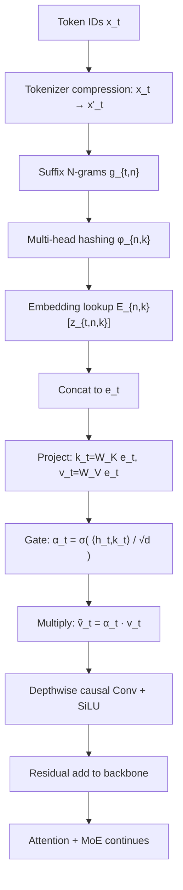
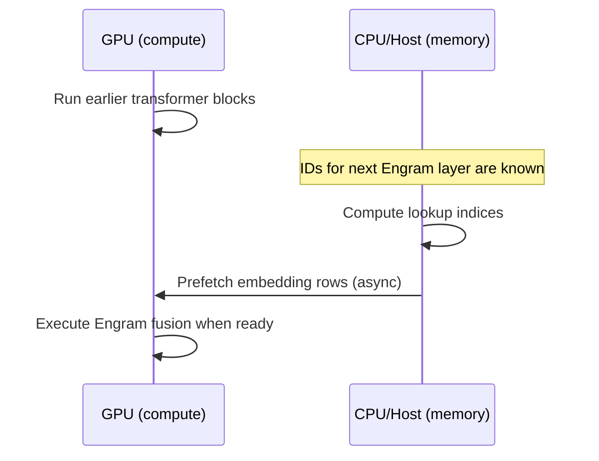

# Engram: Conditional Memory via Scalable Lookup
## A new axis of sparsity for large language models

## Executive Summary

Mixture-of-Experts (MoE) makes model capacity cheap by using **conditional computation**: activate only a small subset of experts per token.

Engram introduces a complementary idea: **conditional memory**.

- Instead of spending multiple early layers “reconstructing” common phrases/entities through attention+MLPs, Engram performs a deterministic $O(1)$ lookup from large embedding tables.
- The lookup is based on **suffix $N$-grams** (typically $n\in\{2,3\}$), using **tokenizer compression** + **multi-head hashing** to keep the table size manageable.
- The retrieved memory is filtered by a **context-aware gate** so hash collisions and polysemy can be suppressed.

Two results from the paper capture why this matters:

- **Sparsity Allocation (U-shaped law):** under iso-parameter and iso-FLOPs constraints, allocating roughly **20–25%** of the “free” sparse budget to Engram (i.e., $\rho\approx 0.75\text{–}0.80$ to MoE) improves validation loss (example reported: **1.7248 → 1.7109** near $\rho\approx 0.8$).
- **Long-context retrieval:** on RULER, Multi-Query Needle-in-a-Haystack accuracy improves (example reported: **84.2 → 97.0** in an iso-loss setting).

Engram is also **systems-friendly**: because IDs are deterministic from the token sequence, the system can prefetch memory from host DRAM and overlap transfers with GPU compute; a 100B-parameter table offloaded to CPU memory is reported to incur a peak throughput penalty of **~2.8%** in their benchmark.

## The Problem

Transformers don’t have a native “lookup” instruction.

But a lot of language is **local and stereotyped**:

- Named entities (e.g., “Diana, Princess of Wales”)
- Idioms and multi-token collocations (e.g., “By the way”)
- Frequent $N$-grams that follow a Zipfian distribution

In a standard Transformer, these patterns are repeatedly re-derived through multiple layers of attention and feed-forward computation. That consumes depth and bandwidth that could instead go to:

- long-range reasoning
- global context management
- multi-hop retrieval

MoE helps by making MLP capacity sparse, but it still doesn’t add a **first-class retrieval primitive**.

## The Solution / Concept

Engram adds a retrieval-and-fusion block at selected layers.

### 1) Sparse retrieval via hashed suffix $N$-grams

At token position $t$, form compressed token IDs $x'_t$ and suffix $N$-grams:

$$g_{t,n} = (x'_{t-n+1}, \ldots, x'_t)$$

To avoid the combinatorial explosion of all possible $N$-grams, Engram uses $K$ hash heads per $n$ and looks up into prime-sized tables:

$$z_{t,n,k} \triangleq \varphi_{n,k}(g_{t,n}), \quad e_{t,n,k} = E_{n,k}[z_{t,n,k}]$$

Concatenate to a single memory vector:

$$e_t \triangleq \Vert_{n=2}^{N} \Vert_{k=1}^{K} e_{t,n,k}$$

**Tokenizer compression matters.** The paper normalizes token text (NFKC, lowercasing, etc.) and projects raw IDs to canonical IDs, reporting ~**23%** effective vocabulary reduction for a 128k tokenizer.

### 2) Context-aware gating to suppress noise

Because lookups are static, they can be wrong due to hash collisions or context mismatch. Engram uses the hidden state $h_t$ (the “Query”) to gate the retrieved memory:

$$k_t = W_K e_t, \quad v_t = W_V e_t$$

$$\alpha_t = \sigma\left(\frac{\text{RMSNorm}(h_t)^\top \text{RMSNorm}(k_t)}{\sqrt{d}}\right)$$

$$\tilde{v}_t = \alpha_t \cdot v_t$$

If the memory disagrees with the current context, the gate can push $\alpha_t\to 0$.

Finally, a lightweight depthwise causal convolution adds short-range mixing and nonlinearity:

$$Y = \text{SiLU}(\text{Conv1D}(\text{RMSNorm}(\tilde{V}))) + \tilde{V}$$

and is added residually to the backbone.

### 3) Systems: deterministic addressing enables prefetch

MoE routing depends on runtime hidden states; Engram’s lookup IDs depend only on the token sequence.

That enables:

- ahead-of-time computation of indices
- host-memory offload for huge tables
- overlap of PCIe transfers with earlier layer compute

The paper reports negligible overhead even when offloading a 100B-parameter Engram table to host DRAM (peak throughput penalty ~2.8% in their setup).

### 4) Scaling law: Sparsity Allocation is U-shaped

Define:

- $P_{\text{tot}}$: total parameters (excluding token embed / LM head)
- $P_{\text{act}}$: activated parameters per token (drives FLOPs)
- $P_{\text{sparse}} \triangleq P_{\text{tot}} - P_{\text{act}}$: the “free” sparse budget

Allocation ratio $\rho\in[0,1]$:

$$P^{\text{sparse}}_{\text{MoE}} = \rho\,P_{\text{sparse}}, \quad P_{\text{Engram}} = (1-\rho)\,P_{\text{sparse}}$$

Empirically, validation loss vs. $\rho$ forms a U-shape, with best performance around $\rho\approx 0.75\text{–}0.80$.

## Visuals

### Architecture flow



### Prefetch-and-overlap intuition



## Implementation

Below is minimal, implementation-oriented pseudocode showing the core mechanics (hash lookup + gating). The real system needs fused kernels and a distributed/sharded table, but the math is the same.

### Pseudocode: multi-head hashing + lookup

```python
from dataclasses import dataclass
from typing import Dict, List, Tuple

import torch
import torch.nn as nn


def simple_hash_ngram(ngram: torch.Tensor, seed: int, table_size: int) -> torch.Tensor:
    """Toy hash for n-grams.

    Args:
        ngram: int64 tensor [..., n] holding canonical token IDs.
        seed: per-head seed.
        table_size: number of slots M.

    Returns:
        int64 tensor [...] with indices in [0, M).
    """
    x = ngram.to(torch.int64)
    # A lightweight mix; replace with the paper's multiplicative-XOR style in real code.
    h = (x.sum(dim=-1) ^ (seed * 0x9E3779B97F4A7C15)) & 0xFFFFFFFFFFFFFFFF
    return (h % table_size).to(torch.int64)


@dataclass
class EngramConfig:
    ngram_orders: Tuple[int, ...] = (2, 3)
    num_heads: int = 8
    dim_head: int = 128  # per-head embedding dim
    table_size: int = 131071  # prime-ish


class ToyEngram(nn.Module):
    def __init__(self, cfg: EngramConfig, d_model: int):
        super().__init__()
        self.cfg = cfg

        # One table per (n, head). Real Engram shards these across devices.
        self.tables = nn.ParameterDict({})
        for n in cfg.ngram_orders:
            for k in range(cfg.num_heads):
                key = f"n{n}_h{k}"
                self.tables[key] = nn.Parameter(
                    torch.empty(cfg.table_size, cfg.dim_head).normal_(mean=0.0, std=0.02)
                )

        d_mem = len(cfg.ngram_orders) * cfg.num_heads * cfg.dim_head
        self.WK = nn.Linear(d_mem, d_model, bias=False)
        self.WV = nn.Linear(d_mem, d_model, bias=False)
        self.rms = nn.RMSNorm(d_model)

    def forward(self, h: torch.Tensor, x_prime: torch.Tensor) -> torch.Tensor:
        """Forward.

        Args:
            h: [B, T, d_model] hidden states at a chosen layer.
            x_prime: [B, T] canonical token IDs.
        """
        B, T, _ = h.shape
        parts: List[torch.Tensor] = []

        for n in self.cfg.ngram_orders:
            # suffix n-gram ending at t (pad left with zeros for simplicity)
            pad = torch.zeros(B, n - 1, device=x_prime.device, dtype=x_prime.dtype)
            xp = torch.cat([pad, x_prime], dim=1)  # [B, T+n-1]
            ngrams = torch.stack([xp[:, i : i + T] for i in range(n)], dim=-1)  # [B, T, n]

            for k in range(self.cfg.num_heads):
                idx = simple_hash_ngram(ngrams, seed=1337 + 97 * k + 1000 * n, table_size=self.cfg.table_size)
                E = self.tables[f"n{n}_h{k}"]  # [M, dim_head]
                e = E[idx]  # [B, T, dim_head]
                parts.append(e)

        e_t = torch.cat(parts, dim=-1)  # [B, T, d_mem]
        k_t = self.WK(e_t)
        v_t = self.WV(e_t)

        # scalar gate per token
        q = self.rms(h)
        k = self.rms(k_t)
        alpha = torch.sigmoid((q * k).sum(dim=-1, keepdim=True) / (h.shape[-1] ** 0.5))

        return h + alpha * v_t
```

## Feasibility / Analysis

- **Where it helps:** frequent local patterns (entities/idioms), and long-context setups where freeing attention bandwidth for global context matters.
- **Main trade-off:** memory placement (early layers help “offload” early composition, but later layers have more contextual signal for gating).
- **Systems reality:** Engram’s deterministic addressing is the key enabler for host-memory offload and overlap; with caching (Zipf locality), the effective overhead should be even smaller than a “always-from-DRAM” baseline.