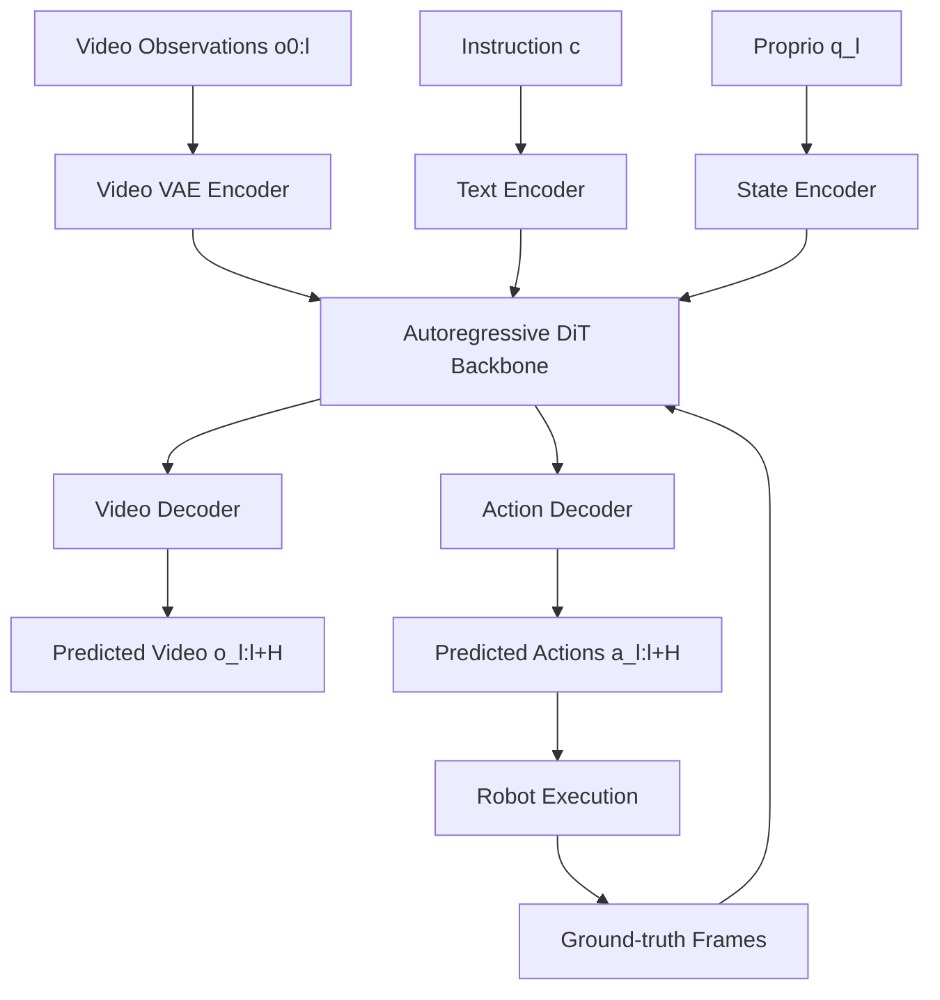

import AlgorithmBlock from '../../components/react/AlgorithmBlock';
import ExpandableMath from '../../components/react/ExpandableMath';

# DreamZero: World Action Models are Zero-shot Policies

## Executive Summary
DreamZero introduces **World Action Models (WAMs)** that jointly predict future video and actions from language and observations. The key idea is that *high-quality world prediction becomes a policy*: by aligning action outputs with video futures, the model learns physical dynamics directly from dense visual supervision. The paper reports a **14B autoregressive video diffusion policy**, **2×+ generalization gains** over state-of-the-art VLAs on unseen tasks/environments, and **real-time control at ~7Hz** via a 38× inference speedup. It also demonstrates **cross-embodiment transfer** using only video data and **few-shot embodiment adaptation** in 30 minutes.

## The Problem
Vision-Language-Action (VLA) models generalize well over semantics (what to do) but struggle with **physical motion generalization** (how to do it). They typically require repeated demonstrations per task and degrade quickly in unseen environments. This makes rare or open-world skills (e.g., “untie a shoelace”) difficult to acquire without costly robot data.

## The Solution / Concept
DreamZero reframes policy learning as **joint world-and-action prediction**:
- Use a pretrained **image-to-video diffusion backbone** to inherit spatiotemporal priors.
- Train a single model to **denoise video and action latents together**, improving modality alignment.
- Run **autoregressive chunks** so each chunk can be executed, then **replace predicted frames with real observations** in the KV cache to prevent error accumulation.

This approach makes video generation quality the main lever for policy performance and enables generalization with heterogeneous, non-repetitive data.

### Core Objective (Flow Matching)
DreamZero uses flow-matching with teacher forcing on chunked sequences. The diffusion time $t$ interpolates between clean latents and noise for both video and action:

<ExpandableMath
  client:only="react"
  equation="z_t = t z_1 + (1 - t) z_0, \quad a_t = t a_1 + (1 - t) a_0"
  explanation="Video and action latents are mixed with Gaussian noise using the same time step $t$, so the model learns a shared denoising direction." 
  example={{
    description: "A chunk at $t=0.7$ mixes 70% clean signal with 30% noise:",
    values: { "t": "0.7", "z_1": "clean video", "z_0": "noise" },
    result: "z_t = 0.7 z_1 + 0.3 z_0"
  }}
  terms={[
    { symbol: "z_t", name: "Noisy video latent", meaning: "Video latent at diffusion time t" },
    { symbol: "a_t", name: "Noisy action latent", meaning: "Action latent at diffusion time t" },
    { symbol: "t", name: "Flow time", meaning: "Interpolation scalar between noise and clean data" }
  ]}
/>

## Visuals

*Caption: DreamZero conditions on video, language, and proprioception to jointly denoise future video and action, then feeds back real observations to keep the autoregressive rollout aligned.*

## Algorithm: Joint Video–Action Denoising
The following interactive block illustrates DreamZero’s joint denoising loop for a single chunk. Video and action latents share a denoising velocity to keep their futures aligned.

<AlgorithmBlock
  client:only="react"
  title="DreamZero: Joint Flow-Matching Denoising"
  inputs={["clean video latent $z_1$", "clean action latent $a_1$", "flow time $t$", "step size $\eta$"]}
  outputs={["denoised video latent", "aligned action chunk"]}
  steps={[
    "Mix clean latents with noise: $z_t, a_t$",
    "Predict denoising velocity: $v_z, v_a$",
    "Euler update: $z_{t+1} = z_t + \eta v_z$, $a_{t+1} = a_t + \eta v_a$",
    "Check alignment and emit action chunk"
  ]}
  executor="dreamzero-flow-matching"
  initialState={{
    z_clean: [0.6, -0.2, 0.1, 0.4],
    a_clean: [0.2, -0.1, 0.3],
    t: 0.6,
    eta: 0.35
  }}
/>

## Implementation (Simplified)
Below is a minimal sketch of chunk-wise inference with KV-cache replacement.

```python
from typing import Tuple
import torch

@torch.no_grad()
def dreamzero_step(model, obs_frames, lang_tokens, proprio, chunk_len: int):
    """Generate the next action chunk and predicted video chunk."""
    video_latents = model.encode_video(obs_frames)
    context = model.encode_context(video_latents, lang_tokens, proprio)

    pred_video_latents, pred_action = model.denoise_chunk(context, chunk_len)
    pred_video = model.decode_video(pred_video_latents)

    return pred_video, pred_action

@torch.no_grad()
def closed_loop_control(model, env, horizon=4):
    obs = env.reset()
    while True:
        pred_video, pred_action = dreamzero_step(
            model, obs.frames, obs.lang, obs.proprio, chunk_len=horizon
        )
        obs = env.step(pred_action)
        # Replace predicted frames with real frames in KV cache
        model.cache.update_video(obs.frames)
```

## Feasibility / Analysis
- **Data efficiency:** The paper reports strong gains using heterogeneous, non-repetitive robot data, suggesting that diversity outweighs repetition for generalization.
- **Real-time control:** A 38× speedup (algorithmic + system optimizations) allows a 14B model to control at ~7Hz.
- **Cross-embodiment transfer:** Video-only demonstrations from other robots or humans improve unseen-task performance by **42%+**, and **30 minutes** of play data enables adaptation to a new embodiment without losing zero-shot generalization.

## What to Try in the Simulation [Robotic Precognition Unit]

1.  **Factory Mode (Clean)**: Start in the **FACTORY (CLEAN)** environment. Drag the rotation slider left and right. 
    -   Observe how the robotic arm moves freely.
    -   Both the **Standard Model** (Left) and **DreamZero** (Right) predict normal operation because the environment matches their training data.

2.  **Lab Mode (Cluttered)**: Switch the environment to **LAB (CLUTTERED)**. 
    -   Notice a red "Unknown Obstacle" (e.g., a fragile vase or new barrier) appears on the left side. This is an Out-of-Distribution object the robot hasn't been explicitly trained on.

3.  **The Collision Test**: 
    -   Rotate the arm to the **Left (Negative Angles)**, towards the red obstacle.
    -   **Standard Model Failure**: The left screen shows the arm "ghosting" right through the obstacle. It assumes the space is empty because it doesn't understand the physics of the new object. If executed, the robot would smash the object.
    -   **DreamZero Success**: The right screen flashes **"COLLISION"**. The predicted ghost arm stops at the point of impact. The World Action Model has successfully "dreamt" the crash and alerted the controller *before* taking the action.

4.  **Why This Matters**: Standard policies need to be retrained for every new obstacle. DreamZero uses its internal physics engine (trained on massive video data) to generalize zero-shot: it knows "solid things stop movement" even if it's never seen *this specific red box* before.

## Related

[EchoWM: Enterable Omnimodal World Models with Unified Camera Intent](/idea/echowm-omnimodal-world-model/) covers a closely related mechanism.
