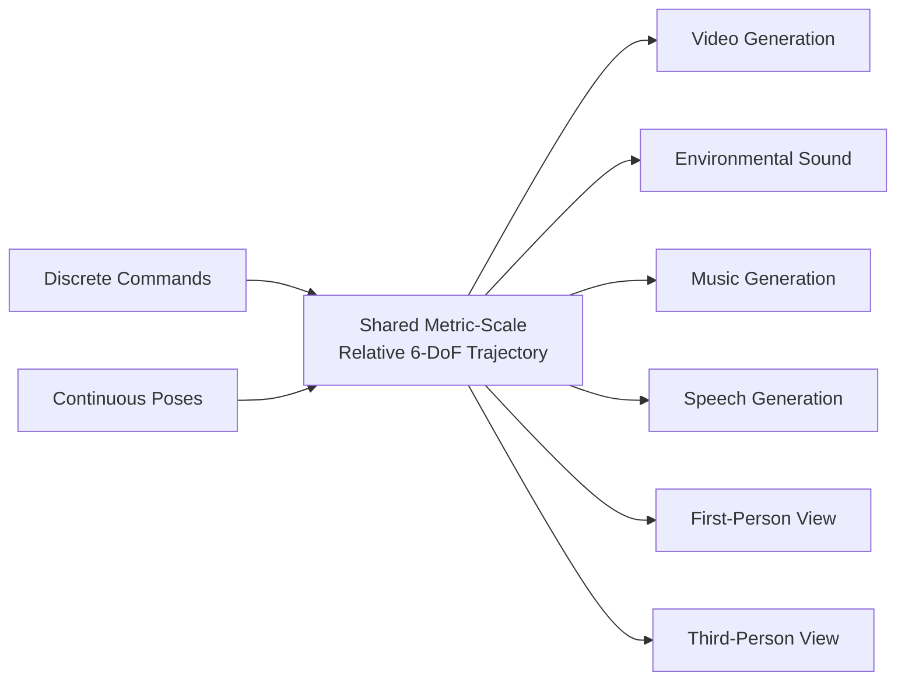
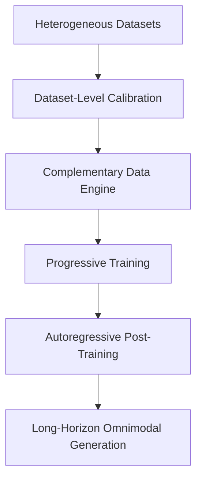

## Executive Summary

EchoWM is an omnimodal world model — a system that generates synchronized 720p video, environmental sound, music, and speech simultaneously while responding to continuous user navigation. The central design choice is **camera intent**: a unified interface that maps both discrete commands ("move forward") and continuous poses to a single shared metric-scale relative 6-DoF (six degrees of freedom) trajectory. This trajectory drives all modalities at once, so a user navigating through a generated scene sees and hears the world update in concert.

The system handles both first-person scenes — where camera intent specifies observer motion — and third-person scenes, where camera–character dynamics are learned directly from data without requiring separate, view-specific controllers. A dataset-level calibration step preserves motion magnitude across heterogeneous training sources, ensuring that a "step forward" means the same distance regardless of which dataset contributed the example.

### What Is an Enterable Omnimodal World Model?

A **world model** is a learned simulator that predicts how an environment evolves over time. Traditional video generation models produce pixels; a world model is expected to produce a *controllable* environment that responds to actions.

**Omnimodal** means the model does not stop at video. EchoWM jointly generates:

- **720p video** of the scene
- **Environmental sound** (ambient audio matching the visual context)
- **Music**
- **Speech**

**Enterable** means the generated media is not a passive video to watch but a space to navigate. A user issues navigation commands, and the world responds in real time, generating the next frame of video and the next segment of audio as the observer moves.

### Why the Old Approach Failed

Prior world models typically handled one modality at a time — video-only generation, or audio conditioned on video — and required separate controllers for different camera viewpoints. A first-person driving simulator and a third-person character animation system would each need their own control logic, their own training data format, and their own trajectory representation.

This fragmentation creates three problems:

1. **Control inconsistency.** A "move forward" command means different things in different datasets — five centimeters in one, five meters in another — making it hard to train a single model on heterogeneous data.
2. **Modality desync.** When video and audio are generated by separate models, they drift out of synchronization over long horizons.
3. **View-specific engineering.** Each camera perspective (first-person, third-person, overhead) requires hand-designed controllers, limiting scalability.

### Camera Intent: A Unified Trajectory Interface

The core mechanism of EchoWM is the **camera intent** abstraction. Instead of treating different input types as fundamentally different, EchoWM maps everything to a shared representation: a **metric-scale relative 6-DoF trajectory**.

A 6-DoF trajectory specifies position (x, y, z) and orientation (roll, pitch, yaw) relative to the previous state. The key insight is that both discrete commands and continuous poses can be converted into this format:



#### Dataset-Level Calibration

Different datasets use different motion scales. A motion-capture dataset might record movements in millimeters, while a driving dataset uses meters. Without calibration, a model trained on both would learn inconsistent motion magnitudes.

EchoWM applies **dataset-level calibration** to normalize all trajectories to a common metric scale. For each dataset $d$, a scaling factor $s_d$ is applied:

$$\mathbf{t}_{\text{calibrated}} = s_d \cdot \mathbf{t}_{\text{raw}}$$

where $\mathbf{t}_{\text{raw}}$ is the raw relative trajectory from dataset $d$ and $s_d$ is chosen so that motion magnitude is consistent across all datasets. This preserves the *relative* nature of the trajectory — what matters is the shape of the path, not its absolute scale — while ensuring that the model interprets a unit of motion consistently.

#### First-Person vs. Third-Person Without View-Specific Controllers

In **first-person scenes**, camera intent directly specifies observer motion: the trajectory is where the camera goes.

In **third-person scenes**, the camera follows a character. Rather than building a separate controller, EchoWM learns the camera–character relationship from data. The same 6-DoF trajectory representation is used, but the model learns how camera motion relates to character motion through the training distribution. No view-specific controllers are hand-engineered.

### Training Pipeline

EchoWM is trained in two phases:

1. **Progressive training.** The model is trained on increasingly complex data, building up from short, simple sequences to longer, more varied ones. A **complementary data engine** constructs training pairs that jointly teach audio-visual generation and trajectory control.

2. **Autoregressive post-training.** After the progressive phase, the model undergoes autoregressive post-training for **long-horizon generation** — the ability to generate coherent video and audio over extended sequences without drifting or collapsing.



### What It Costs

The abstract does not report training cost, parameter count, or inference latency. What is known is that the model generates 720p video — a resolution that implies substantial compute for both training and inference. Jointly generating four modalities (video, environmental sound, music, speech) from a single forward pass means the model's output space is large, and the autoregressive post-training phase adds sequential generation overhead.

The dataset-level calibration step is lightweight: it is a per-dataset scalar that normalizes trajectories before training, adding negligible cost.

### Whether It Works at Scale

The abstract reports that EchoWM achieves **strong trajectory following** and **high visual quality** on public world-model benchmarks, supporting both first- and third-person interaction across varied subjects. It also maintains **synchronized environmental sound and speech** over long-horizon generation. No specific benchmark names or numerical scores are provided in the abstract.

### Implementation Sketch

The following pseudocode illustrates the core trajectory-mapping and calibration logic:

```python
from dataclasses import dataclass
from typing import Literal
import numpy as np

@dataclass
class TrajectoryStep:
    """A single 6-DoF relative trajectory step.
    
    Attributes:
        translation: (x, y, z) displacement in meters.
        rotation: (roll, pitch, yaw) rotation in radians.
    """
    translation: np.ndarray  # shape (3,)
    rotation: np.ndarray     # shape (3,)

def calibrate_trajectory(
    raw_trajectory: list[TrajectoryStep],
    dataset_scale: float
) -> list[TrajectoryStep]:
    """Apply dataset-level calibration to normalize motion magnitude.
    
    Args:
        raw_trajectory: Trajectory steps from a specific dataset.
        dataset_scale: Per-dataset scaling factor s_d that maps
            raw units to a shared metric scale.
    
    Returns:
        Calibrated trajectory with consistent motion magnitude.
    """
    calibrated = []
    for step in raw_trajectory:
        calibrated.append(TrajectoryStep(
            translation=step.translation * dataset_scale,
            rotation=step.rotation  # rotation is scale-invariant
        ))
    return calibrated

def discrete_command_to_trajectory(
    command: Literal["forward", "backward", "left", "right", "up", "down"],
    magnitude: float = 1.0
) -> TrajectoryStep:
    """Map a discrete navigation command to a 6-DoF trajectory step.
    
    Args:
        command: One of six directional commands.
        magnitude: Distance in meters for the step.
    
    Returns:
        A TrajectoryStep with translation and zero rotation.
    """
    mapping = {
        "forward":  np.array([0, 0, -magnitude]),
        "backward": np.array([0, 0,  magnitude]),
        "left":     np.array([-magnitude, 0, 0]),
        "right":    np.array([ magnitude, 0, 0]),
        "up":       np.array([0,  magnitude, 0]),
        "down":     np.array([0, -magnitude, 0]),
    }
    return TrajectoryStep(
        translation=mapping[command],
        rotation=np.zeros(3)
    )

def continuous_pose_to_trajectory(
    current_pose: np.ndarray,   # (4, 4) homogeneous matrix
    previous_pose: np.ndarray   # (4, 4) homogeneous matrix
) -> TrajectoryStep:
    """Convert a continuous pose to a relative 6-DoF trajectory step.
    
    Args:
        current_pose: Current camera pose as a 4x4 homogeneous matrix.
        previous_pose: Previous camera pose as a 4x4 homogeneous matrix.
    
    Returns:
        Relative TrajectoryStep (translation + rotation) between poses.
    """
    relative = np.linalg.inv(previous_pose) @ current_pose
    translation = relative[:3, 3]
    # Extract rotation as roll, pitch, yaw from the rotation matrix
    rot_matrix = relative[:3, :3]
    # Simplified: in practice use proper rotation decomposition
    pitch = np.arctan2(rot_matrix[2, 0], np.sqrt(
        rot_matrix[2, 1]**2 + rot_matrix[2, 2]**2
    ))
    yaw = np.arctan2(rot_matrix[1, 0], rot_matrix[0, 0])
    roll = np.arctan2(rot_matrix[2, 1], rot_matrix[2, 2])
    return TrajectoryStep(
        translation=translation,
        rotation=np.array([roll, pitch, yaw])
    )
```

### How It Relates to Existing Work

EchoWM extends the world-model paradigm explored in entries like /idea/dreamzero-world-action-models/ and /idea/jepa-world-models/, but with a distinct focus: rather than learning a latent dynamics model for control or prediction, EchoWM targets **enterable media generation** — the output is meant to be experienced by a human navigating through it. The camera intent abstraction shares conceptual ground with the control-theoretic perspective discussed in /idea/control-theoretic-imperative/, where a world model must be steerable to be useful.

The distinction is that EchoWM unifies the control interface across modalities and viewpoints, while prior work typically addresses one modality or one viewpoint at a time.

### Summary Table

| Aspect | EchoWM |
|---|---|
| **Modalities** | Video (720p), environmental sound, music, speech |
| **Control interface** | Shared metric-scale relative 6-DoF trajectory |
| **Input types** | Discrete commands, continuous poses |
| **Viewpoints** | First-person and third-person (learned, no view-specific controllers) |
| **Calibration** | Dataset-level scaling factor per dataset |
| **Training** | Progressive training + autoregressive post-training |
| **Long-horizon** | Supported via autoregressive post-training |
| **Benchmark results** | Strong trajectory following, high visual quality (qualitative) |
