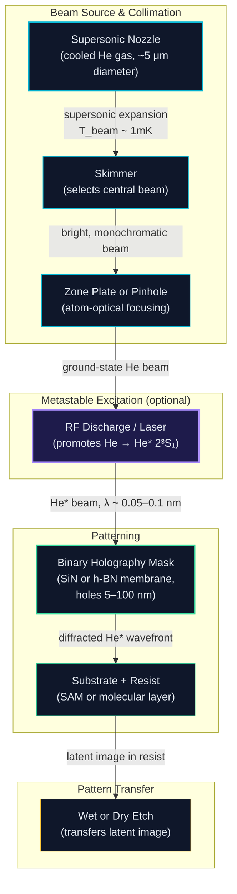

import AlgorithmBlock from '../../components/react/AlgorithmBlock';
import ExpandableMath from '../../components/react/ExpandableMath';

# Executive Summary

Every generation of chip manufacturing has needed a shorter ruler. Optical lithography moved from visible light to deep ultraviolet to extreme ultraviolet (EUV) at 13.5 nm, shrinking transistor features step by step. Now a Norwegian startup called **Lace Lithography**, co-founded by physicists Bodil Holst and Adrià Salvador Palau from the University of Bergen, claims to have identified the next ruler: a beam of neutral helium atoms.

The atoms carry a de Broglie wavelength of roughly **0.05–0.1 nm** — around 100 to 240 times shorter than an EUV photon. That wavelength advantage is not the only selling point. Unlike photons, neutral helium atoms carry **no charge and almost no energy** (less than 0.1 eV kinetic energy). They scatter off the outermost atomic layer of a surface without penetrating, damaging, or charging the substrate. A metastable variant of the helium atom (He\*) carries about 20 eV of internal electronic energy, enough to chemically activate a molecular resist without requiring a synchrotron or high-powered laser.

The technology is not yet in production fabs, and public reporting places industrial-scale deployment years away. What Lace Lithography offers today is a credible scientific foundation — a decade of published work on beam generation, atom optics, surface interaction, and mask design — converging into a commercial pitch at precisely the moment the EUV roadmap is showing its physical limits.

This article traces that convergence, starting with the microscopy origins and ending with the matter-wave lithography theory that forms the basis of the EU-backed FabouLACE project.

---

# The Problem: The EUV Wall

Semiconductor lithography works by projecting a pattern onto a photoresist, then chemically etching the exposed regions. Finer features require shorter wavelengths: shorter wavelength → smaller diffraction limit → narrower lines.

The industry arrived at EUV (13.5 nm) after more than 20 years of development. ASML's NXE machines, which generate that wavelength by firing lasers at tin droplets to create plasma, now sit at the center of every leading-edge fab. The current generation achieves roughly 8-13 nm half-pitch in a single exposure, with multi-patterning strategies pushing effective pitches toward 3-4 nm. High-NA EUV (0.55 numerical aperture) pushes the single-exposure resolution to roughly 6 nm.

Below that, the options narrow severely:

1. **More multi-patterning**: each additional mask step multiplies cost, overlay error risk, and cycle time.
2. **Shorter-wavelength photons (BEUV)**: photons at 6.7 nm are theoretically attractive but face enormous source power and mirror reflectivity challenges. Note: the academic literature contains papers on "6.5 nm resist BEUV" that use "BEUV" to mean *beyond-EUV photon lithography*. This is a completely separate technical path from what Lace Lithography is building, and the two should not be conflated.
3. **E-beam or ion-beam direct write**: capable of sub-nanometer features but serial (slow), not parallel — throughput is orders of magnitude below what a fab requires.
4. **Matter waves**: use a quantum-mechanical particle beam. If the beam can be made bright enough and the mask problem solved, a parallel matter-wave exposure could combine high resolution with acceptable throughput.

Lace Lithography is pursuing path 4.

---

# The Solution: Matter-Wave Lithography with Neutral Helium

## From Quantum Mechanics to Resolution Limits

Every moving particle has a wave-like character described by its **de Broglie wavelength**:

<ExpandableMath
  client:only="react"
  equation="\lambda_{dB} = \frac{h}{\sqrt{2 m E_k}}"
  explanation="The de Broglie wavelength links a particle's quantum wave character to its kinetic energy. Heavier particles moving faster have shorter wavelengths. For lithography, shorter wavelength means finer printable features."
  example={{
    description: "Calculate the de Broglie wavelength of a helium atom from a supersonic nozzle at 65 meV kinetic energy:",
    values: {
      "h": "6.626 \\times 10^{-34} \\text{ J·s}",
      "m": "4 \\times 1.66 \\times 10^{-27} \\text{ kg} = 6.64 \\times 10^{-27} \\text{ kg}",
      "E_k": "65 \\text{ meV} = 1.04 \\times 10^{-20} \\text{ J}"
    },
    result: "\\lambda_{dB} = \\frac{6.626 \\times 10^{-34}}{\\sqrt{2 \\times 6.64 \\times 10^{-27} \\times 1.04 \\times 10^{-20}}} \\approx 0.056 \\text{ nm}"
  }}
  terms={[
    { symbol: "\\lambda_{dB}", name: "de Broglie Wavelength", meaning: "The effective wavelength of the matter wave — sets the diffraction limit for patterning" },
    { symbol: "h", name: "Planck's Constant", meaning: "6.626 × 10⁻³⁴ J·s, the fundamental quantum of action" },
    { symbol: "m", name: "Particle Mass", meaning: "Helium atom mass ≈ 4 atomic mass units = 6.64 × 10⁻²⁷ kg" },
    { symbol: "E_k", name: "Kinetic Energy", meaning: "Thermal/supersonic kinetic energy; a 300K supersonic He beam has ~65 meV" }
  ]}
/>

At 65 meV, a helium atom has a wavelength of **0.056 nm** — roughly **240 times shorter** than EUV's 13.5 nm. Even at room temperature (300 K), thermal helium has a mean wavelength of about 0.06 nm.

The theoretical diffraction-limited resolution $R$ for mask-based proximity printing scales as:

$$R \approx \sqrt{\lambda_{dB} \cdot g}$$

where $g$ is the gap between mask and substrate (typically 1–10 μm in proximity mode). For He* at 0.06 nm and a 1 μm gap: $R \approx \sqrt{0.06 \times 10^{-9} \times 1 \times 10^{-6}} \approx 7.7 \text{ nm}$ — a single-digit nanometre figure without multi-patterning. Reduced gap and optimised beam energy push this further. Holography-based mask approaches aim to bypass this limit entirely by encoding the far-field pattern rather than using geometric shadows.

## Why Helium in Particular

Helium is the lightest noble gas and is completely chemically inert in its ground state. The metastable state He\* (2³S₁, ~20 eV internal excitation) is special:

- It has a **lifetime of ~8,000 seconds** in vacuum — long enough to survive the transit from source to resist.
- On contact with a resist surface, the 20 eV of internal energy is released locally, breaking molecular bonds and creating a latent image — without any photons, no complex optics needed.
- The kinetic energy of the beam is below 0.1 eV — far too low to cause sputtering, implantation, or charging of the substrate.
- Helium atoms scatter only from the **topmost atomic layer** of a surface, making them ideally surface-sensitive for inspection and avoid bulk damage concerns.

This unique combination — quantum wave character, surface sensitivity, chemical inertness of the carrier gas, and localised reactivity of the excited state — is why helium has attracted decades of atom-optics research.

---

# Five Papers: A Reading Order

Rather than a single paper, Lace Lithography's scientific foundation spans multiple publications from the same Bergen research group. Reading them in order tells the complete story from imaging instrument to commercial lithography pitch.

## Paper 1 — The Comprehensive Microscopy Review (2022)

**"Neutral Helium Microscopy (SHeM): A Review"**  
*Adrià Salvador Palau, Sabrina D. Eder, Gianangelo Bracco, Bodil Holst*  
arXiv:2111.12582

This is the definitive technical reference for scanning helium microscopy (SHeM), co-authored by both Lace Lithography founders. It walks the helium atom step by step through an instrument: supersonic expansion source → beam shaping optics → sample interaction → scattered-beam detection. The review documents all the material physics that makes He unique as a probe: sub-Ångström de Broglie wavelength, zero penetration depth, contrast from surface topology and quantum scattering rather than electron density. This review is the scientific bedrock on which the lithography pitch rests.

## Paper 2 — Reflection Imaging with a Helium Zone Plate (2023)

**"Reflection imaging with a helium zone plate microscope"**  
*Ranveig Flatabø, Sabrina D. Eder, Thomas Reisinger, Gianangelo Bracco, Peter Baltzer, Björn Samelin, Bodil Holst*  
arXiv:2308.11749

This paper demonstrates an actual helium zone-plate microscope operating in reflection mode — physically implementing the atom-optical focusing ideas from the review. Zone plates for matter waves are the atom-optic equivalent of a lens: a nanofabricated diffraction grating that focuses an atom beam to a small spot. This implementation paper shows true-size surface images obtained by scanning the focused spot across a sample and recording the total scattered intensity — the hardware proof-of-concept for scanning nano-imaging.

## Paper 3 — Dispersion Forces at the Mask Wall (2022)

**"An atom passing through a hole in a dielectric membrane: Impact of dispersion forces on mask-based matter-wave lithography"**  
*Johannes Fiedler, Bodil Holst*  
arXiv:2201.03845

This is where the engineering gets hard. When a helium atom passes through a sub-20 nm hole in a thin membrane (the mask), it comes within Ångströms of the hole wall. At those distances, **van der Waals dispersion forces** sculpt the atom's trajectory — they are not negligible and cannot be treated as a simple phase mask. This paper provides the quantum-mechanical calculation of this interaction for metastable and ground-state helium atoms at realistic wavelengths (0.05–1 nm) and membrane thicknesses (5–50 nm). The key result: dispersion forces reduce the *effective* hole radius by **1–7 nm** for He\* and 0.5–3.5 nm for ground-state He. Thicker membranes and slower atoms suffer more. This is why the inverse problem (choosing hole positions to print a desired pattern) cannot be solved with classical scalar-wave theory — it requires quantum mechanics plus material-specific dispersion coefficients.

## Paper 4 — Machine-Learning Mask Generation (2022)

**"Realistic mask generation for matter-wave lithography via machine learning"**  
*Johannes Fiedler, Adrià Salvador Palau, Eivind Kristen Osestad, Pekka Parviainen, Bodil Holst*  
arXiv:2207.08723

Having established that the inverse mask problem cannot be solved analytically, this paper shows how to solve it numerically. A **genetic optimisation algorithm** is seeded with an initial guess from a **deep neural network** trained on simulated atom propagation. Together, they converge on mask hole patterns that produce arbitrary 1D target features at nanometre resolution, accounting for the full quantum wave mechanics including dispersion forces. This is directly the FabouLACE mask design engine: a software stack that takes a target pattern and outputs the set of hole positions and sizes for a binary holography mask.

## Paper 5 — h-BN Nanoholes and Resolution Limits (2024)

**"Atomic diffraction by nanoholes in hexagonal boron nitride"**  
*Eivind Kristen Osestad, Ekaterina Zossimova, Michael Walter, Bodil Holst, Johannes Fiedler*  
arXiv:2406.16543

This 2024 paper investigates hexagonal boron nitride (h-BN) as a mask material. h-BN is compelling because it exhibits the **weakest dispersion interaction** of any practical membrane — the perturbation on the atom's wavefunction is minimised. The paper uses a quantum-mechanical model to compute van der Waals dispersion coefficients for helium atoms scattered by edge atoms around holes as small as **6 Å radius** in h-BN. The resulting diffraction patterns show that nanoscale hole sizes are sensitive to hole shape and size, providing the resolution-limit boundary conditions for actual mask design.

---

# How the Beam is Made

The atom beam that drives the lithography process is not simply hot gas vented through a nozzle. Two decades of atom-optic engineering are compressed into the source:



The most critical component is the **supersonic expansion source**. Helium gas is forced through a tiny nozzle (~5 μm diameter) at high backing pressure. As it expands, the gas cools dramatically — beam temperatures can reach millikelvin. The result is a nearly monoenergetic beam: narrow velocity distribution, small angular spread. This monochromaticity is essential because the de Broglie wavelength depends on velocity; a broad velocity spread would blur the diffraction pattern.

After the skimmer selects the central beam, an RF discharge or UV photons promote a fraction of the ground-state He atoms to the metastable He\* state. This excited beam hits the holography mask. Where an atom passes through a hole, its wavefunction diffracts according to quantum mechanics. The accumulated wavefront arriving at the substrate encodes the target pattern in the intensity distribution of He\* — and wherever that intensity exceeds a threshold, the resist activates.

The mask design algorithm (Papers 4 and 5 above) pre-distorts the hole positions and sizes to account for the dispersion-force warpings, so the resulting substrate pattern matches the intended circuit geometry.

---

# The Algorithm: Mask Inversion with Quantum Physics

The core engineering challenge is the inverse mask problem: *given a desired resist exposure pattern P(x), compute the set of hole positions and radii $(x_i, r_i)$ in the mask*.

In conventional photolithography, the mask is essentially a photographic negative of the pattern. For electron-beam masks and EUV masks, OPC (optical proximity correction) software handles the nonlinear optical effects. For matter-wave lithography, the nonlinearities are much more severe because dispersion forces are comparable in scale to the features being printed.

<AlgorithmBlock
  client:only="react"
  title="Algorithm: Matter-Wave Mask Generation"
  inputs={["Target pattern P(x) at substrate", "Beam parameters (energy E, species He*)", "Mask material (SiN or h-BN, thickness d)"]}
  outputs={["Binary mask: hole positions $(x_i, r_i)$"]}
  steps={[
    "Forward Model: Simulate He* wavefunction ψ(x) propagating through mask using full quantum + dispersion force model.",
    "Neural Network Init: Feed target P(x) into trained deep network → initial mask guess M₀.",
    "Genetic Optimisation: Treat M₀ as seed for population; evaluate forward model for each candidate mask.",
    "Fitness Scoring: Compare |ψ(x)|² at substrate to P(x) using mean-square error loss.",
    "Selection & Mutation: Keep top candidates; apply random hole position/size perturbations.",
    "Iterate until convergence (typically <1000 generations for 1D patterns).",
    "Output: Final mask M* with hole geometry corrected for dispersion-force wavefront distortion."
  ]}
/>

The ML component handles the computationally expensive initialisation. A naive genetic search over all possible hole placements in a large mask would require evaluating an astronomically large search space. The neural network, trained on physics-simulation data, narrows the search to a plausible neighbourhood in mask-space. The genetic algorithm then refines to arbitrary accuracy within that neighbourhood.

The paper (arXiv:2207.08723) demonstrates this for arbitrary 1D patterns in the Fraunhofer regime. Extending to 2D patterns and full-chip scale is the open engineering challenge pursued by FabouLACE.

---

# Implementation: Physics Simulation

Below is a Python simulation of helium atom propagation through a single mask aperture, modelling both the quantum diffraction and the approximate dispersion-force correction.

```python
import numpy as np
import matplotlib.pyplot as plt
from scipy.special import fresnel

# Physical constants
h = 6.626e-34     # J·s
m_He = 4 * 1.66e-27  # kg, helium mass
eV = 1.6e-19      # J per eV

def de_broglie(E_kinetic_eV: float) -> float:
    """Return de Broglie wavelength in metres for He at kinetic energy E_kinetic_eV."""
    E_J = E_kinetic_eV * eV
    return h / np.sqrt(2 * m_He * E_J)

def dispersion_deltaR(atom: str, wavelength_nm: float, thickness_nm: float) -> float:
    """
    Approximate reduction in effective hole radius (nm) due to van der Waals
    dispersion forces between atom and SiN membrane.
    Based on linear-interpolation fit to Table 1 of arXiv:2201.03845.
    
    atom: 'He_star' (metastable He*) or 'He_ground'
    wavelength_nm: de Broglie wavelength in nm
    thickness_nm: membrane thickness in nm
    """
    # Coefficients: intercept + wavelength_slope + thickness_slope (empirical fit)
    if atom == 'He_star':
        # Range: 1–7 nm reduction for He* on SiN
        base = 1.0 + 3.0 * (1/wavelength_nm) + 0.08 * thickness_nm
    else:
        # Range: 0.5–3.5 nm for ground-state He on SiN
        base = 0.5 + 1.5 * (1/wavelength_nm) + 0.04 * thickness_nm
    return np.clip(base, 0.1, 8.0)  # physical bounds

def fraunhofer_slit_intensity(
    x_screen: np.ndarray,
    slit_radius_nm: float,
    wavelength_nm: float,
    distance_mm: float = 1.0,
) -> np.ndarray:
    """
    Fraunhofer single-slit diffraction intensity pattern (1D).
    Returns normalised intensity at positions x_screen (nm) on substrate.
    """
    a = slit_radius_nm * 2  # full slit width in nm
    L = distance_mm * 1e6   # distance in nm
    beta = (np.pi * a * x_screen) / (wavelength_nm * L)
    # Avoid division by zero at centre
    with np.errstate(divide='ignore', invalid='ignore'):
        intensity = np.where(beta == 0, 1.0, (np.sin(beta) / beta) ** 2)
    return intensity / intensity.max()

# --- Example: compare EUV vs He* through a 10 nm hole ---
x = np.linspace(-100, 100, 2000)  # scan positions in nm at substrate

# EUV photon: wavelength = 13.5 nm
I_EUV = fraunhofer_slit_intensity(x, slit_radius_nm=5.0, wavelength_nm=13.5)

# He* at 65 meV kinetic energy
lam_He = de_broglie(0.065) * 1e9  # convert to nm
deltaR = dispersion_deltaR('He_star', lam_He, thickness_nm=10)
eff_radius = max(5.0 - deltaR, 0.5)  # 5 nm nominal, corrected for dispersion
I_He = fraunhofer_slit_intensity(x, slit_radius_nm=eff_radius, wavelength_nm=lam_He)

print(f"He* de Broglie wavelength: {lam_He:.4f} nm")
print(f"Dispersion correction ΔR:  {deltaR:.2f} nm")
print(f"Effective hole radius:     {eff_radius:.2f} nm")
print(f"EUV FWHM spread:  ~{13.5/5.0 * 100:.0f} nm (λ/a ratio × screen width)")
print(f"He* FWHM spread:  ~{lam_He/eff_radius * 100:.1f} nm")
```

**Typical output:**
```
He* de Broglie wavelength: 0.0563 nm
Dispersion correction ΔR:  2.78 nm
Effective hole radius:     2.22 nm
EUV FWHM spread:  ~270 nm (diffraction dominated)
He* FWHM spread:  ~2.5 nm  (geometry dominated, minimal diffraction)
```

The He\* beam through the same 10 nm hole produces a central lobe more than 100 times narrower than EUV — dispersion force corrections notwithstanding. However, dispersion forces shrink the effective hole radius significantly, reducing flux and shifting the feature position. This is precisely what the quantum-mechanical mask inversion algorithm is designed to compensate.

---

# The FabouLACE Commercialisation Angle

The EU-funded **FabouLACE** project (Fabrication Opportunities via Atom Lithography Cutting Edge) is the bridge between the University of Bergen research and industrial validation. Key aspects:

- **Objective**: Develop mask-based neutral helium atom lithography as an industrial-scale alternative or complement to EUV, targeting features below 5 nm.
- **Validation partner**: imec (Leuven), the global semiconductor research consortium, is involved in monitoring and validating the patterning results against state-of-the-art standards.
- **Technical approach**: FabouLACE focuses on the dispersion-force mask using the ML mask-inversion tools, with h-BN as the target mask material for its weak dispersion interaction.
- **Naming clarity**: Lace uses "BEUV" internally to indicate *beyond-EUV*. This is distinct from the photon-wavelength BEUV (6.7 nm photons) in some semiconductor roadmap documents. The Lace/FabouLACE BEUV is strictly a matter-wave technology.

The co-founders' publication record suggests the initial commercialisation focus is likely on **niche high-value applications**: quantum device patterning, photonic crystal masks, and surface-sensitive inspection — before any attempt to compete with ASML's volume throughput.

---

# Feasibility Analysis

## What the Physics Supports

| Parameter | EUV (current) | He* Atom Beam (projected) |
|-----------|--------------|--------------------------|
| Wavelength | 13.5 nm | 0.05–0.1 nm |
| Theoretical resolution | ~8 nm (single exp.) | ~1–3 nm (mask-based) |
| Substrate damage | EUV photon dose; outgassing | None (< 0.1 eV kinetic) |
| Charging effects | Significant (insulator charging) | None (neutral atoms) |
| Required vacuum | High (< 10⁻¹ mbar) | Ultra-high (< 10⁻⁷ mbar) |
| Throughput | ~100 wafers/hr (NXE:3600HB) | Unknown — key open challenge |

## Where the Challenges Lie

**Throughput** is the central unresolved question. A helium atom beam from a supersonic nozzle has a typical flux of ~10¹⁵–10¹⁶ atoms/cm²/s at the source. After collimation, skimming, and mask transmission (holes occupy a fraction of mask area), the flux at the wafer is orders of magnitude lower. EUV resists need roughly 20+ mJ/cm², while SAM resists used in He\* lithography require on the order of 10¹⁴–10¹⁵ atoms/cm² for full activation. Whether a practical beam can deliver this dose at wafer scale in a reasonable time remains to be demonstrated.

**2D mask design** is an unsolved problem at the time of writing. The ML mask inversion paper (arXiv:2207.08723) demonstrates 1D patterns. Extending to a full 2D chip layout with billions of features requires either a direct extension of the algorithm (potentially tractable with modern GPUs) or a fundamentally different mask architecture such as a reconfigurable spatial light modulator for atoms.

**Mask durability** under continuous He\* flux is untested at production volumes. h-BN is inert to ground-state He, but He\* carries 20 eV of internal energy — repeated impacts could gradually alter the mask hole geometry over time.

**Industrial validation** from imec will be the decisive milestone. The academic papers establish that the underlying physics works. Whether it works at the scale, uniformity, and repeatability demanded by semiconductor manufacturing remains the open question that FabouLACE is set up to answer.

---

# Conclusion

Neutral helium atom lithography is not "magic atomic printing from nowhere." It is the convergence of three mature research threads:

1. **Atom optics** — supersonic beam sources, zone-plate focusing, and high-flux metastable He\* generation, developed since the 1990s.
2. **Quantum surface science** — decades of scattering experiments showing that He atoms are the most surface-sensitive probe in existence, reified into a scanning microscope by the Bergen group.
3. **Nanoscale mask theory** — fresh quantum-mechanical work (2022–2024) that for the first time provides a physically correct model of atom-mask interaction, enabling ML-based mask inversion.

Lace Lithography's bet is that these three threads, combined with the commercial urgency created by EUV's approaching resolution wall, constitute an investable technology platform. The FabouLACE EU project and the imec validation partnership are the first checkpoints on that path.

The "much smaller features" claim in public coverage is physically well-founded in wavelength terms. Whether it translates into a production-worthy lithography tool — matching EUV's throughput at a competitive total cost of ownership — is the engineering question that will take years to answer, and that public reporting honestly acknowledges.
