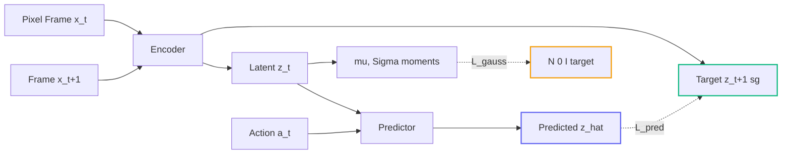

# Executive Summary

Joint-Embedding Predictive Architectures (JEPAs) are the dominant proposal for building world models that an agent can *plan inside* — a System-2 loop that simulates the future in a compact latent space rather than in pixels. The problem nobody has cleanly solved until now is that end-to-end JEPA training is unstable. The trivial solution — encode every observation to the same constant vector — drives the prediction loss to zero. Real systems prevent this with elaborate scaffolding: an exponential moving average target encoder, a three-term VICReg loss, pre-trained vision backbones, auxiliary supervision. Each addition is another knob to tune and another mode of failure.

**LeWorldModel** (Maes, Le Lidec, Scieur, LeCun, Balestriero, arXiv:2603.19312) reduces the recipe to two terms: a next-embedding prediction loss and a Gaussian regularizer on the empirical latent moments. No EMA. No pre-trained encoder. No auxiliary heads. A 15M-parameter model trained on a single GPU in hours plans **up to 48× faster** than foundation-model-based world models and matches them on 2D and 3D control benchmarks. This is the cleanest evidence yet that representation collapse is a solved problem when the regularizer's geometry is right.

# The Generative Trap, Recap

Our [JEPA primer](/idea/jepa-world-models/) makes the case for predicting in representation space instead of pixel space. The short version: generative world models waste capacity hallucinating texture and lighting that don't affect the outcome of the action the agent cares about. JEPAs sidestep this by predicting an abstract latent $z_{t+1}$ from $z_t$, leaving the unpredictable details outside the loss.

The price of that abstraction is well known. Once the latent target $z_{t+1}$ comes from the *same network* you are training, the network can trivially make $z_t = z_{t+1} = 0$ everywhere and declare victory. The literature has accumulated a sequence of defences against this.

# What Previous Fixes Cost

- **EMA target encoders** (DINO, I-JEPA, V-JEPA). The target network is a slow-moving average of the online network, so $z_{t+1}$ cannot be driven to zero on the same backward pass. Adds a decay hyperparameter and a duplicate set of weights.
- **VICReg-style multi-term losses**. A variance term keeps per-coordinate activations spread, an invariance term enforces matching across views, a covariance term decorrelates dimensions. Three terms, three weights, plus the prediction loss — six hyperparameters in total.
- **Pre-trained encoders**. Freeze a vision backbone and only train the predictor. Works, but inherits the backbone's biases and rules out true end-to-end learning from pixels.

Each defence works on its benchmark; none transfer cleanly. The combinatorial explosion of hyperparameters is a real engineering tax on every downstream paper.

# The LeWorldModel Recipe

LeWM keeps two things and throws away the rest:

$$
L \;=\; \underbrace{\bigl\| p(z_t,\, a_t) - \operatorname{sg}(z_{t+1}) \bigr\|^2}_{L_{\text{pred}}} \;+\; \lambda \cdot \underbrace{\bigl(\, \lVert \mu \rVert^2 + \lVert \Sigma - I \rVert_F^2 \,\bigr)}_{L_{\text{gauss}}}
$$

where $\mu = \frac{1}{N}\sum_i z_i$ and $\Sigma = \frac{1}{N}\sum_i (z_i - \mu)(z_i - \mu)^\top$ are the empirical mean and covariance of the latents in a batch, and $\operatorname{sg}(\cdot)$ is the stop-gradient operator. There is no EMA: the target encoder and the online encoder are the same weights; the stop-gradient on $z_{t+1}$ is what prevents the trivial gradient from short-circuiting the loss.

The geometric content of the regularizer is the entire trick. It does not say *make the activations non-zero* (variance term in VICReg) nor *decorrelate them* (covariance term in VICReg) as separate objectives. It says *the batch of latents should look like a unit Gaussian* — one statement that pins down all the moments at once. Collapse is impossible because $\Sigma = 0$ has Frobenius distance $\sqrt{d}$ from $\Sigma = I$. The regularizer is also a single scalar hyperparameter $\lambda$, instead of three.

# Pipeline



The interactive simulation below makes the collapse failure mode visible: train the encoder/predictor naively and the latent scatter visibly shrinks to a point over a few hundred steps. Turn on the Gaussian regularizer and the same network stays informative — the scatter relaxes onto the unit-variance reference ellipse and the predictor continues to learn meaningful dynamics.

# Reference Implementation

A minimal PyTorch sketch of the LeWM training step:

```python
import torch
import torch.nn.functional as F

def lewm_step(enc, pred, x_t, x_tp1, action, lam=1.0):
    """
    enc: encoder network (pixels -> latent)
    pred: predictor network (latent + action -> next latent)
    x_t, x_tp1: paired pixel frames [B, C, H, W]
    action: action embedding [B, A]
    lam: Gaussian regularizer weight
    """
    z_t   = enc(x_t)                       # [B, D]
    z_tp1 = enc(x_tp1).detach()            # stop-gradient on target
    z_hat = pred(z_t, action)              # predicted next latent
    L_pred = F.mse_loss(z_hat, z_tp1)

    # --- Gaussian moment matching on the batch of z_t ---
    mu    = z_t.mean(dim=0)                # [D]
    z_c   = z_t - mu                       # centered
    sigma = (z_c.T @ z_c) / z_t.size(0)    # [D, D]
    I     = torch.eye(sigma.size(0), device=sigma.device)
    L_gauss = mu.pow(2).sum() + (sigma - I).pow(2).sum()

    return L_pred + lam * L_gauss
```

Two losses, one hyperparameter. No target network copy, no per-term weights to balance, no warm-up schedule. The entire stability story is in the seven lines computing `L_gauss`.

# Why It Matters

The MPC-style planning loop sketched in our [Control-Theoretic Imperative](https://paperlens.io/idea/control-theoretic-imperative/) post needs a world model that is (a) accurate, (b) cheap per simulated step, and (c) robust to long-horizon rollouts. Foundation-model-based world models — Sora-class video models, DINO-WM, GAIA — score well on (a) but pay a steep price on (b) and tend to drift on (c). A 15M-parameter LeWM trained from scratch is roughly two orders of magnitude smaller than the encoders those systems are built on, and the paper's planning experiments show competitive accuracy with up to 48× lower wall-clock per planning step.

The wider implication ties to the [DreamZero](https://paperlens.io/idea/dreamzero-world-action-models/) thesis: a world model is more useful as a *cheap simulator inside a planner* than as a high-fidelity pixel generator. LeWM is the first paper to show that the cheap simulator can also be *easy to train*. If the JEPA training recipe stays this simple as the architectures scale up, the path to agent-grade world models gets noticeably shorter.

The remaining open question is whether the Gaussian assumption holds at scale. For natural-image latents at the dimensionality this paper studies, the empirical moments do appear to settle into something Gaussian-like; whether that continues to work at 1024-dim latents on internet-scale video is the next experiment. The simulation below is designed to make the failure mode (collapse) and the fix (Gaussian moment matching) visible enough that you can build intuition for where the assumption might break first.
