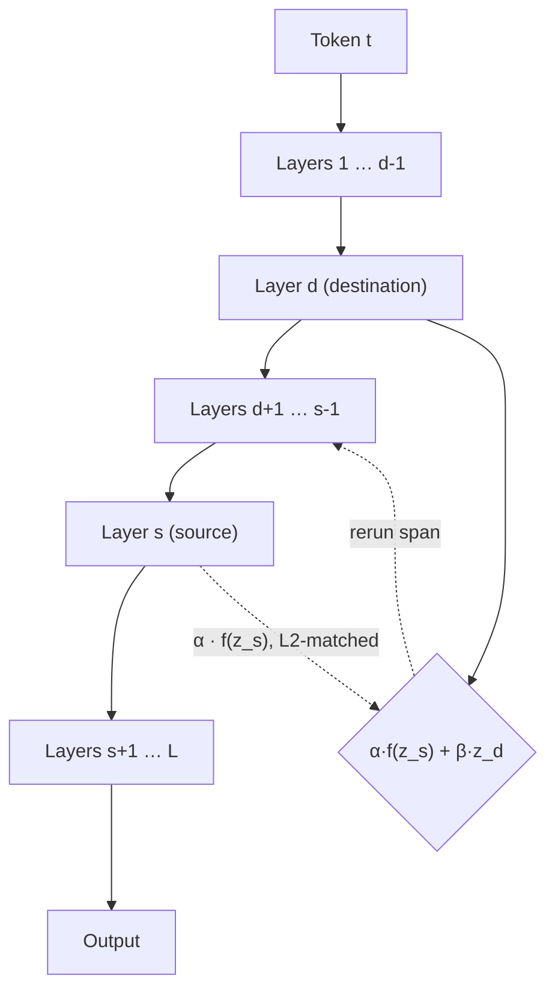

# Executive Summary

A feedforward transformer gets exactly one pass through its layers to decide what a token means. If the evidence that settles an ambiguity only arrives in the deep layers, the shallow layers have already done their work on a guess — and everything above them is built on that guess.

**Recirculation** (Mozer, Siddiqui, Sawyer, Sanyal & Liu, Google DeepMind, [arXiv:2608.17981](https://arxiv.org/abs/2608.17981)) is a one-line change to inference that fixes this without touching a single weight. After a forward pass, take a fraction of the activation at a deep layer, mix it back into a shallow layer, and rerun that span of the network. The model gets to reconsider its early commitments in light of what it later worked out.

The numbers are unusually good for something this cheap. On Gemma 3 the adaptive variant delivers a **23.0% reduction in perplexity** (against 8.5% for the basic version) and a **20.9% error reduction on GSM8k at pass@128**. Generation latency is unchanged. The model weights are frozen throughout.

# The Problem: Depth Is a Budget for Changing Your Mind

The paper's framing is the part worth internalising: **state updates in a feedforward transformer are bounded by model depth.**

A transformer processing a token has $L$ layers, and each one gets a single opportunity to revise that token's representation. That is the entire budget. There is no mechanism for the network to notice at layer 30 that its layer-4 interpretation was wrong and go back.

Consider the sentence *"he went to the bank to withdraw…"*. At layer 4, the word **bank** is overwhelmingly the river kind — that is what the frequency prior says, and the disambiguating word has not been integrated yet. By the time the surrounding context is properly folded in, somewhere past the middle of the stack, two things have gone wrong at once:

1. Every layer in between has been computing on the wrong sense.
2. The remaining layers are in *refinement* mode. Later layers make small adjustments; they do not transform representations wholesale. This is the same non-uniform contribution across depth that [Tapered Language Models](https://arxiv.org/abs/2606.23670) exploits from the other direction — and that our entry on [Deep Delta Learning](/idea/deepmind-deep-delta/) probes at the level of the residual connection itself.

The result is what the authors call *"a race in which the model's response generation can outpace the model's internal semantic convergence."* The model starts answering before it has finished understanding.

Chain-of-thought is the usual escape hatch: spend output tokens to give the model more serial computation. Recirculation asks a sharper question — why should more serial computation require more *tokens*?

# The Mechanism

After the ordinary forward pass, the activation at a deep **source** layer $s$ is mixed into a shallow **destination** layer $d$:

$$
z_{t+1,\,t,\,d} \;=\; \alpha \cdot f\!\left(z_{t,\,t,\,s} \mid d, t\right) \;+\; \beta \cdot z_{t,\,t,\,d}, \qquad \alpha + \beta = 1
$$

Three things are doing work here.

**$f(\cdot)$ matches L2 norms.** A layer-35 activation and a layer-16 activation live at very different scales. Before mixing, the source is rescaled to the norm of the destination, so the injection changes *direction* without blowing up magnitude. Skip this and the shallow layer is simply overwritten.

**$\alpha$ is small.** The paper's standard value is $\alpha = 0.15$, with sweeps over $\{0.04, 0.07, 0.10, 0.16\}$. This is a *leak*, not a copy. The destination layer keeps most of what it computed; it just gets nudged by a conclusion from higher up.

**$\alpha + \beta = 1$.** The mixture is convex, so the representation stays inside the manifold the frozen network already knows how to process. Nothing downstream needs retraining to cope with what arrives.

Then layers $d+1 \ldots L$ run again. Every experiment reported in the paper uses **one** additional iteration; two-iteration variants exist in the appendix but were not the focus.



## Which Layers Talk to Each Other

The source/destination pair is the one thing that has to be chosen per model. The pairs the paper reports:

| Model | Layers | Source $s$ | Destination $d$ |
|---|---|---|---|
| Gemma 3 1B | 26 | 11 | 4 |
| Gemma 3 4B | 34 | 18 | 9 |
| Gemma 3 12B | 48 | 35 | 16 |

The pattern is consistent: the source sits around two-thirds of the way up — deep enough to have integrated context, not so deep that it has already collapsed into output logits — and the destination sits near the first quarter, while step sizes are still large enough for the injection to matter.

## Adaptive Recirculation

The fixed-$\alpha$ version leaves value on the table, because not every token needs the same amount of reconsideration. The adaptive variant trains a small MLP that maps token-specific source and destination embeddings to **vector-valued** $\alpha$ and $\beta$ — per-dimension, per-token mixing coefficients. The base model stays frozen; only this MLP is trained.

The gap is large: **23.0% perplexity reduction versus 8.5%** for basic recirculation on the 1B model. Learning *when* to recirculate matters more than recirculating.

# What It Costs

This is where the proposal gets interesting, and where the honest caveat lives.

**Generation is free.** During decoding, the two stacks run in parallel, and the paper notes that running two stacks concurrently *"is nearly as efficient with modern hardware as one stack"*. Throughput is essentially unchanged.

**Prefill goes serial.** This is the real price. Recirculation requires rerunning part of the network before the token's representation is final, so prefill becomes token-by-token instead of the fully parallel operation it normally is. For short prompts this is noise. For long-context prefill it is a genuine bottleneck — and it lands on exactly the workload that KV-cache work like [Multi-Head Latent Attention](/idea/multi-head-latent-attention/) and [TurboQuant](/idea/turboquant-polarquant/) has been trying to make cheap.

So the trade is: **buy better state tracking on long inputs by making the front of the pipeline serial.** Whether that is worth it depends entirely on your prefill-to-decode ratio.

# Results

| Setting | Result |
|---|---|
| Gemma 3 1B / 4B perplexity (BookSum) | up to **15.95%** reduction |
| Gemma 3 12B perplexity (PG19) | up to **35.40%** reduction |
| Adaptive, 1B | **23.0%** reduction (vs 8.5% basic) |
| GSM8k, adaptive, pass@1 | **8.8%** error reduction |
| GSM8k, adaptive, pass@128 | **20.9%** error reduction |
| Single-token tasks (MMLU, ARC-Easy, PiQA, BoolQ, HellaSwag, Lambada) | modest gains on 6 of 8 |

The method was validated beyond Gemma: **Ministral 3, Pythia, Qwen 3 and Phi-2** at roughly 1B scale all show the effect, which is the check that matters — this is a property of depth-bounded stacks, not a quirk of one model family.

Note the shape of the GSM8k result. The gain more than doubles from pass@1 to pass@128, which is what you would expect if recirculation is improving the *quality of the distribution* rather than nudging a single greedy path.

## Which Tokens Actually Benefit

A nice piece of analysis: the effect concentrates on **adverbs, adjectives and verbs**, and is smallest on **numerals, determiners and pronouns**.

That is exactly the signature the theory predicts. Open-class words carry meaning that depends on context and can be revised; a determiner is a determiner no matter what follows it. If the mechanism were doing something generic — smoothing, regularisation, extra compute for its own sake — the benefit would not sort itself along the open/closed-class boundary like this.

# Implementation Sketch

```python
def recirculated_forward(model, hidden, s: int, d: int, alpha: float = 0.15):
    """One extra iteration over layers d..L, with a leak from layer s to layer d.

    Args:
        model:  a frozen transformer exposing .layers
        hidden: [batch, seq, d_model] embeddings for the current token
        s, d:   source (deep) and destination (shallow) layer indices, s > d
        alpha:  leak fraction; beta = 1 - alpha
    Returns:
        final hidden states after the rerun span
    """
    # --- pass one: the ordinary forward pass, recording the two taps ---
    z_d = z_s = None
    h = hidden
    for i, layer in enumerate(model.layers, start=1):
        h = layer(h)
        if i == d:
            z_d = h
        if i == s:
            z_s = h
            break                       # nothing above s is needed for the mix

    # --- f(): match the destination's L2 norm before mixing ---
    scale = z_d.norm(dim=-1, keepdim=True) / z_s.norm(dim=-1, keepdim=True).clamp_min(1e-6)
    mixed = alpha * (z_s * scale) + (1.0 - alpha) * z_d

    # --- pass two: rerun the span above the destination ---
    h = mixed
    for layer in model.layers[d:]:
        h = layer(h)
    return h
```

The adaptive variant replaces the scalar `alpha` with `alpha, beta = mlp(embed(s), embed(d), token)`, producing a vector per token. That MLP is the only thing that is ever trained.

# Where This Sits

Recirculation belongs to a family of ideas that all attack the same limit — a single forward pass is not enough serial computation — but each buys the extra computation somewhere different:

- [Test-Time Training](/idea/test-time-training-long-context/) buys it with **weight updates**: the context becomes training data and the model's parameters move during inference.
- [Kona 1](/idea/kona-1/) buys it with **energy minimisation**: an implicit chain of thought that iterates in latent space until an energy function settles.
- [SEAL](/idea/seal-self-adapting-lms/) buys it with **self-generated finetuning data**, rewriting weights between episodes.
- [BrainMimetic / Titans](/idea/brain-mimetic/) buys it with **test-time plasticity** in a dedicated memory module.
- Recirculation buys it with **nothing at all** — no new parameters in the base model, no weight updates, no extra output tokens. Just the existing layers, run again on a slightly perturbed input.

That last point is what makes it worth paying attention to. Every other approach on that list asks you to change the model. This one asks you to change the loop you run it in.

The obvious neighbour is [Steering Recurrent Reasoners with Readout Feedback](https://arxiv.org/abs/2608.24136), published a week later, which injects intermediate predictions back into latent dynamics as coupling forces — the same instinct, applied to models that are already recurrent.

# What Is Still Open

- **Choosing $(s, d)$ without a sweep.** The three reported pairs are suggestive but were found empirically. There is no principled selection rule yet.
- **More than one iteration.** Everything reported uses a single extra pass. The appendix shows two-iteration variants exist; nothing establishes where the returns stop.
- **The prefill bottleneck.** Serial prefill is the one thing standing between this and a free lunch. A variant that recovers parallelism — even partially, even only for tokens the adaptive controller flags — would change the cost story completely.
- **Interaction with reasoning models.** Every result here is on base and instruction-tuned models. What recirculation does to a model already trained to produce long chains of thought is unstudied, and it is the question with the most riding on it.
