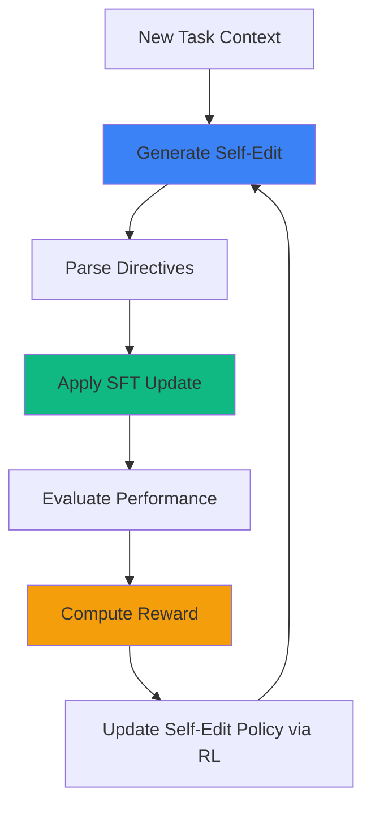
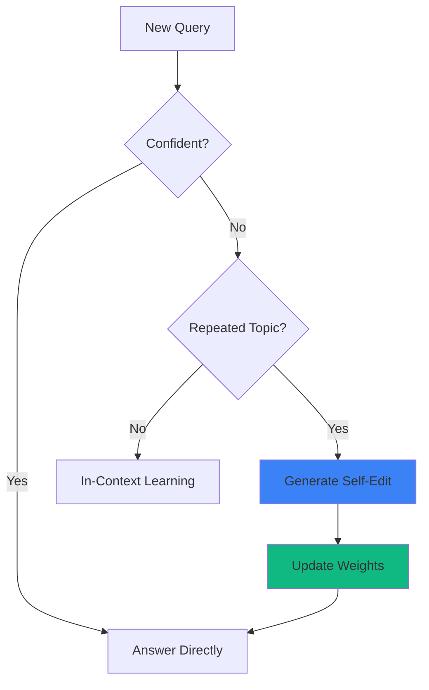

import AlgorithmBlock from '../../components/react/AlgorithmBlock';
import ExpandableMath from '../../components/react/ExpandableMath';

# SEAL: Self-Adapting Language Models

## Executive Summary

Large language models are frozen in time—their weights remain static after pretraining, unable to adapt to new knowledge or tasks without expensive retraining. **SEAL** (Self-Adapting LLMs) introduces a radical paradigm: models that generate their own finetuning instructions and persistently update their weights through reinforcement learning. Instead of relying on external systems or separate adaptation modules, SEAL uses the model's own text generation to specify exactly how it should be updated—whether through synthetic data generation, hyperparameter selection, or optimization directives.

Developed by researchers at MIT, SEAL achieves **47.0% accuracy** on knowledge incorporation tasks (vs. 32.7% without adaptation) and **72.5% success** on few-shot ARC reasoning (vs. 0% for in-context learning). The system learns to produce effective "self-edits" through a reinforcement learning loop where downstream task performance serves as the reward signal.

## The Problem: Static Models in a Dynamic World

Modern LLMs face three fundamental limitations:

1. **Knowledge Staleness**: Models cannot incorporate new factual information without expensive retraining on massive datasets.

2. **Task-Specific Rigidity**: When faced with novel tasks (e.g., abstract reasoning puzzles), models cannot adapt their internal representations—they're limited to in-context learning, which doesn't create persistent improvements.

3. **External Dependency**: Current adaptation methods require separate systems (retrieval augmentation, auxiliary networks, meta-learned optimizers) rather than leveraging the model's own capabilities.

The core challenge: **How can a language model learn to improve itself using only its text generation abilities?**

## The Solution: Self-Edits as Weight Update Directives

SEAL introduces **self-edits**—structured text outputs that specify how the model should update its own weights. A self-edit might:

- **Generate synthetic training data** (e.g., logical implications from a factual passage)
- **Specify optimization hyperparameters** (learning rate, number of epochs)
- **Invoke data augmentation strategies** (rotation, reflection for visual reasoning)
- **Define training configurations** (batch size, loss function)

The key insight: By framing adaptation as a generation task, we can use reinforcement learning to teach the model which self-edits lead to performance improvements.

### Architecture Overview



## The SEAL Training Loop

The system operates in two nested loops:

**Outer Loop (RL Policy Improvement):**
1. Sample task context from distribution
2. Generate candidate self-edits using current policy
3. Apply each self-edit via supervised finetuning
4. Measure downstream task performance
5. Use ReST-EM to reinforce high-reward edits

**Inner Loop (Weight Application):**
1. Parse self-edit into training data and hyperparameters
2. Run gradient descent on specified data
3. Commit weight updates to model

<AlgorithmBlock
  client:only="react"
  title="Algorithm: SEAL Training with ReST-EM"
  inputs={[
    "Base model $\\theta_0$",
    "Task distribution $\\mathcal{T}$",
    "Self-edit policy $\\pi_{\\phi}$"
  ]}
  outputs={[
    "Optimized policy $\\pi_{\\phi^*}$",
    "Adapted model weights $\\theta^*$"
  ]}
  steps={[
    "Sample task $t \\sim \\mathcal{T}$ with context $c_t$",
    "Generate $N$ self-edits: $\\{e_i\\} \\sim \\pi_{\\phi}(\\cdot | c_t)$",
    "Apply each edit: $\\theta_i \\leftarrow \\text{SFT}(\\theta_0, e_i)$",
    "Evaluate: $r_i = \\text{Accuracy}(\\theta_i, \\text{test}(t))$",
    "Select top-$k$ edits by reward (rejection sampling)",
    "Update policy: $\\phi \\leftarrow \\phi + \\nabla_{\\phi} \\mathbb{E}_{e \\sim \\text{top-}k}[\\log \\pi_{\\phi}(e | c_t)]$",
    "Return to step 1 until convergence"
  ]}
  executor="seal-rest-em"
  initialState={{
    num_tasks: 5,
    num_edits: 8,
    top_k: 3,
    iteration: 0
  }}
/>

### Knowledge Incorporation: Learning from Text

For factual knowledge, SEAL generates **logical implications** as synthetic training data. Given a passage about a historical event, the model might produce:

**Input Passage:**
> "The Treaty of Westphalia was signed in 1648, ending the Thirty Years' War."

**Self-Edit (Generated):**
```json
{
  "synthetic_data": [
    "Q: When did the Thirty Years' War end? A: 1648",
    "Q: What treaty ended the Thirty Years' War? A: Treaty of Westphalia",
    "The year 1648 marked the conclusion of the Thirty Years' War via the Treaty of Westphalia."
  ],
  "hyperparameters": {
    "learning_rate": 5e-5,
    "epochs": 3,
    "batch_size": 4
  }
}
```

The model then finetunes itself on this synthetic data, embedding the knowledge into its weights.

<ExpandableMath
  client:only="react"
  equation="\theta_{t+1} = \theta_t - \eta \nabla_\theta \mathcal{L}_{\text{SFT}}(\theta; D_{\text{synthetic}})"
  explanation="The updated model weights equal the current weights minus a gradient step computed on the self-generated synthetic dataset."
  example={{
    description: "Single-step weight update from one self-edit:",
    values: {
      "\\theta_t": "\\text{[current weights]}",
      "\\eta": "5 \\times 10^{-5}",
      "D_{\\text{synthetic}}": "\\text{[3 Q/A pairs]}"
    },
    result: "\\theta_{t+1} = \\text{weights with embedded knowledge}"
  }}
  terms={[
    { symbol: "\\theta_t", name: "Current Weights", meaning: "Model parameters before adaptation" },
    { symbol: "\\eta", name: "Learning Rate", meaning: "Step size for weight updates (self-specified)" },
    { symbol: "\\mathcal{L}_{\\text{SFT}}", name: "SFT Loss", meaning: "Cross-entropy loss on synthetic data" },
    { symbol: "D_{\\text{synthetic}}", name: "Synthetic Dataset", meaning: "Self-generated training examples" }
  ]}
/>

### Few-Shot Learning: Configuring Augmentations

For abstract reasoning tasks (ARC benchmark), SEAL learns to select data augmentations and training strategies. Given a few input-output grid examples, the model generates:

**Self-Edit for ARC Task:**
```json
{
  "augmentations": ["rotate_90", "reflect_vertical", "color_permute"],
  "hyperparameters": {
    "learning_rate": 1e-4,
    "epochs": 10,
    "augmentation_probability": 0.6
  },
  "training_mode": "supervised"
}
```

The RL loop discovers which augmentation combinations lead to better generalization on held-out test grids.

## Experimental Results

### Knowledge Incorporation (Single Passage)

| Method | QA Accuracy |
|--------|-------------|
| No Adaptation (ICL) | 32.7% |
| Finetune on Raw Passage | 38.5% |
| GPT-4.1 Synthetic Data | 42.1% |
| **SEAL (2 RL rounds)** | **47.0%** |

SEAL outperforms both raw finetuning and synthetic data generated by a much larger model (GPT-4.1).

### Continued Pretraining (200 Passages)

| Method | QA Accuracy |
|--------|-------------|
| No Adaptation | 28.3% |
| Finetune on Raw Passages | 39.2% |
| **SEAL Policy Transfer** | **43.8%** |

Remarkably, the self-edit policy learned on single passages **transfers** to the multi-passage setting without additional RL training.

### Few-Shot ARC Reasoning

| Method | Success Rate |
|--------|--------------|
| In-Context Learning | 0% |
| Test-Time Training (random edits) | 20% |
| **SEAL (learned policy)** | **72.5%** |

SEAL discovers effective augmentation strategies that enable robust generalization from just 3-5 demonstrations.

## Implementation: Core Components

### Self-Edit Generation

```python
def generate_self_edit(model, context: str, task_type: str) -> dict:
    """
    Generate a self-edit directive given task context.
    
    Args:
        model: Language model with self-edit policy
        context: Task description or data passage
        task_type: "knowledge" or "few_shot"
    
    Returns:
        Structured self-edit with data and hyperparameters
    """
    prompt = f"""Given the following context, generate a self-edit 
to adapt the model for this task.

Context: {context}
Task Type: {task_type}

Self-Edit (JSON):"""
    
    response = model.generate(prompt, max_tokens=512)
    edit = json.loads(response)
    
    return {
        'synthetic_data': edit.get('synthetic_data', []),
        'hyperparams': edit.get('hyperparameters', {}),
        'augmentations': edit.get('augmentations', [])
    }
```

### Weight Update Application

```python
def apply_self_edit(base_model, edit: dict) -> nn.Module:
    """
    Apply a self-edit to create an adapted model.
    
    Args:
        base_model: Starting model checkpoint
        edit: Self-edit with training directives
    
    Returns:
        Model with updated weights
    """
    # Parse hyperparameters
    lr = edit['hyperparams'].get('learning_rate', 5e-5)
    epochs = edit['hyperparams'].get('epochs', 3)
    
    # Prepare synthetic dataset
    dataset = prepare_dataset(edit['synthetic_data'], 
                             edit['augmentations'])
    
    # Run supervised finetuning
    optimizer = torch.optim.AdamW(base_model.parameters(), lr=lr)
    
    for epoch in range(epochs):
        for batch in dataset:
            loss = base_model(**batch).loss
            loss.backward()
            optimizer.step()
            optimizer.zero_grad()
    
    return base_model
```

### ReST-EM Training Loop

```python
def train_seal_policy(
    base_model,
    task_distribution,
    num_iterations: int = 10,
    num_edits_per_task: int = 8,
    top_k: int = 3
):
    """
    Train self-edit policy using ReST-EM reinforcement learning.
    
    The algorithm iteratively:
    1. Generates candidate self-edits
    2. Evaluates their downstream performance
    3. Reinforces top-performing edits via SFT
    """
    policy_model = base_model.copy()
    
    for iteration in range(num_iterations):
        # Sample tasks
        tasks = task_distribution.sample(batch_size=16)
        edits_and_rewards = []
        
        for task in tasks:
            # Generate candidate edits
            edits = [generate_self_edit(policy_model, task.context, 
                                       task.type) 
                    for _ in range(num_edits_per_task)]
            
            # Apply and evaluate
            for edit in edits:
                adapted = apply_self_edit(base_model.copy(), edit)
                reward = evaluate_on_task(adapted, task)
                edits_and_rewards.append((edit, reward, task.context))
        
        # Rejection sampling: keep top-k per task
        high_quality_edits = select_top_k_per_task(
            edits_and_rewards, k=top_k
        )
        
        # Finetune policy on high-reward edits
        finetune_dataset = [
            (context, edit_json)
            for edit, reward, context in high_quality_edits
        ]
        policy_model = sft_update(policy_model, finetune_dataset)
        
        print(f"Iteration {iteration}: Avg Reward = "
              f"{np.mean([r for _, r, _ in high_quality_edits]):.3f}")
    
    return policy_model
```

## Challenges and Limitations

### Catastrophic Forgetting

Repeated self-edits can overwrite prior knowledge. In continual learning experiments, performance on earlier tasks degraded by **15-20%** after 5+ sequential adaptations. Potential solutions:

- **Elastic Weight Consolidation**: Constrain updates to preserve important parameters
- **Replay Buffers**: Interleave old task data during new adaptations
- **Modular Decomposition**: Allocate separate parameter subspaces per task

### Computational Cost

Each RL iteration requires:
1. Generating $N$ candidate edits per task
2. Running full SFT for each candidate
3. Evaluating on test sets

For a single RL round with 16 tasks and 8 edits/task, this requires **128 finetuning runs**. Using LoRA and quantization reduces cost by ~4x.

### Self-Edit Quality Variance

Early in training, models generate malformed JSON or nonsensical hyperparameters (e.g., learning rate of 1000). Solutions:

- **Constrained Decoding**: Force valid JSON schema
- **Curriculum Learning**: Start with simpler tasks
- **Prompt Engineering**: Provide few-shot examples of good edits

## Feasibility Assessment

### Hardware Requirements

**Training (RL Loop):**
- Base Model: LLaMA-7B or similar
- Memory: 40GB GPU (A100)
- Time: 12-24 hours for 10 ReST-EM iterations
- Cost: ~$50-100 on cloud GPUs

**Inference (Single Adaptation):**
- Generate edit: 0.5s
- Apply SFT: 2-5 minutes (depending on epochs)
- Total: ~5 minutes per task

### Real-World Applications

1. **Personalized Assistants**: Adapt to user-specific knowledge (company docs, personal preferences) without manual data curation

2. **Domain Adaptation**: Medical or legal models that update as new regulations or research emerge

3. **Continual Curriculum Learning**: Educational systems that adapt to student performance patterns

4. **Autonomous Research Agents**: Models that read papers and integrate findings into their knowledge base

## Future Directions

### Sparse Self-Edits

Current SEAL updates all parameters. Future work could generate **sparse updates**—modifying only specific layers or attention heads relevant to the task:

```python
# Hypothetical sparse self-edit
{
  "target_layers": [12, 18, 24],  # Only update late layers
  "target_params": ["attention.q_proj", "attention.k_proj"],
  "learning_rate": 1e-4
}
```

### Meta-Reasoning About Adaptation

Models could decide **when to adapt** vs. when to use in-context learning:



### Iterative Distillation

Chain-of-thought reasoning could be distilled into weights through self-edits:

1. Model generates detailed reasoning trace
2. Self-edit converts trace into simplified synthetic examples
3. Finetuning compresses reasoning into faster parameter patterns

This would enable models to "practice" complex reasoning until it becomes automatic.

## Conclusion

SEAL represents a paradigm shift from static to **self-modifying** language models. By leveraging the model's own generation capabilities to specify weight updates, SEAL demonstrates that adaptation can be framed as a learnable skill rather than a hardcoded procedure.

The key innovations:
- **Self-edits as a generation task** (not external tools)
- **RL-driven optimization** of adaptation strategies
- **Persistent weight updates** (not ephemeral context)

While challenges remain—particularly catastrophic forgetting and computational cost—SEAL opens a path toward truly autonomous learning systems that improve continuously through interaction with the world.

As models grow more capable, the ability to self-reflect and self-improve may become as important as raw scale. SEAL provides an early proof-of-concept for this vision.

---

**Key Takeaways:**
- Language models can learn to generate their own finetuning instructions
- Reinforcement learning with downstream task performance as reward discovers effective self-edits
- SEAL achieves 47% accuracy on knowledge incorporation (vs. 32.7% baseline)
- The learned policy transfers across different task scales (1 → 200 passages)
- Future work: sparse updates, meta-reasoning about when to adapt, and continual learning without forgetting
