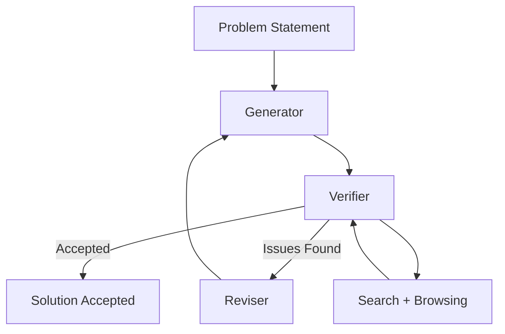

import AlgorithmBlock from '../../components/react/AlgorithmBlock';
import ExpandableMath from '../../components/react/ExpandableMath';

# Towards Autonomous Mathematics Research

## Executive Summary

The paper introduces **Aletheia**, a mathematics research agent that iteratively **generates**, **verifies**, and **revises** solutions in natural language. It pairs a strong reasoning model (Gemini Deep Think) with a verification harness and heavy tool use. The system is evaluated from Olympiad problems to PhD-level exercises and is used to produce or assist multiple research results. The authors also propose a taxonomy that separates **autonomy level** from **mathematical significance** to prevent misleading claims.

Key reported facts:
- **95.1%** accuracy on IMO-ProofBench Advanced (Olympiad-level) with Aletheia.
- Inference-time compute scaling yields large gains, then plateaus on PhD-level tasks.
- Tool use reduces citation hallucinations; Python tooling yields only marginal extra gains.
- In a 700-problem Erdős case study, **63** solutions were technically correct and **13** were meaningfully correct (~**6.5%**).

## The Problem

Competition problems are self-contained; research problems are not. Research requires:
- Long-horizon reasoning with verification loops.
- Accurate citation and literature synthesis.
- Robustness against hallucinations and misinterpretations.

Pure inference scaling helps, but it saturates on research-level tasks. A separate **verification harness** plus **tooling** is needed to keep the system honest while it explores unfamiliar territory.

## The Solution/Concept

Aletheia is an **agentic harness** built around three subagents:

1. **Generator** proposes candidate proofs or sketches.
2. **Verifier** checks logic and citation validity.
3. **Reviser** updates the draft based on verifier feedback.

This loop runs until acceptance or a preset attempt limit. Tool use (search + browsing) reduces spurious citations and helps ground the model in real literature.

### Inference-Time Scaling Law

Aletheia relies on aggressive inference-time compute to explore more solution paths. The effect is similar to a saturating curve: large early gains, then diminishing returns.

<ExpandableMath
  client:only="react"
  equation="A(c) = A_{\max}(1 - e^{-k c})"
  explanation="Accuracy improves quickly as compute $c$ increases, but the gains eventually saturate near $A_{\max}$. This captures why scaling helps Olympiad tasks yet plateaus on research-level problems."
  example={{
    description: "Compute scaling with $A_{\max}=0.98$ and $k=0.05$:",
    values: { "c": "40", "A_{\max}": "0.98", "k": "0.05" },
    result: "A(40) \approx 0.98(1 - e^{-2}) \approx 0.85"
  }}
  terms={[
    { symbol: "A(c)", name: "Accuracy", meaning: "Expected score at compute scale $c$" },
    { symbol: "A_{\max}", name: "Saturation", meaning: "Upper bound on accuracy" },
    { symbol: "k", name: "Scaling rate", meaning: "How quickly gains saturate" }
  ]}
/>

## Visuals



*Figure: Aletheia’s generator–verifier–reviser loop with tool grounding.*

## Algorithm: Aletheia Loop

<AlgorithmBlock
  client:only="react"
  title="Algorithm: Aletheia Generator–Verifier–Reviser"
  inputs={["problem $P$", "compute scale $c$", "tool access $\tau$", "verifier strictness $s$"]}
  outputs={["accepted proof sketch", "verifier report"]}
  steps={[
    "Generate a candidate solution with scale $c$",
    "Verify logic + citations (tool access $\tau$)",
    "Revise based on verifier feedback",
    "Accept if quality and verification pass thresholds"
  ]}
  executor="aletheia-loop"
  initialState={{
    attempt: 1,
    computeScale: 60,
    toolUse: 0.7,
    verifierStrictness: 0.8
  }}
/>

## Implementation (Conceptual Python)

```python
from dataclasses import dataclass
from typing import Optional

@dataclass
class Draft:
    text: str
    quality: float
    citations_ok: bool

class AletheiaAgent:
    def __init__(self, model, tools, verifier):
        self.model = model
        self.tools = tools
        self.verifier = verifier

    def solve(self, problem: str, max_iters: int = 8) -> Optional[Draft]:
        draft = None
        for _ in range(max_iters):
            draft = self.model.generate(problem, tools=self.tools)
            report = self.verifier.check(draft, tools=self.tools)
            if report.accepted:
                return draft
            problem = self._revise_prompt(problem, report)
        return None

    def _revise_prompt(self, problem: str, report) -> str:
        return f"{problem}\n\nFix the following issues:\n{report.notes}"
```

## Feasibility / Analysis

**Strengths reported in the paper:**
- Verification loops boost reliability and reduce “confidently wrong” answers.
- Tooling sharply cuts **fabricated citations**, shifting errors to subtler misquotations.
- Aletheia outperforms the base reasoning model at comparable compute on multiple benchmarks.

**Observed limitations:**
- Inference-time scaling **saturates** on PhD-level tasks.
- Even with verification, hallucinations and misinterpretations persist.
- Success cases are rare; most research prompts still fail.

**Autonomy taxonomy (proposed):**

| Autonomy Level | Description |
| --- | --- |
| H | Primarily human; AI is auxiliary. |
| C | Human–AI collaboration; both essential. |
| A | Essentially autonomous; AI produces core results. |

This separation helps communicate **how novel** a result is versus **how autonomous** the AI was in producing it.

## What to Try (Simulation)

1. Increase **Tool Use Intensity** and watch hallucination risk drop.
2. Raise **Inference Compute Scale** past 70 to see diminishing returns.
3. Lower **Verifier Strictness** to increase acceptance speed but risk false positives.

## Conclusion

Aletheia demonstrates a practical recipe for pushing math agents beyond Olympiad-style problems: combine strong base reasoning with **verification loops** and **tool grounding**. The results are real but narrow. Progress is clear, yet the system remains far from fully reliable research autonomy. The paper’s taxonomy offers a useful framework for discussing future breakthroughs without conflating publicity with scientific significance.
