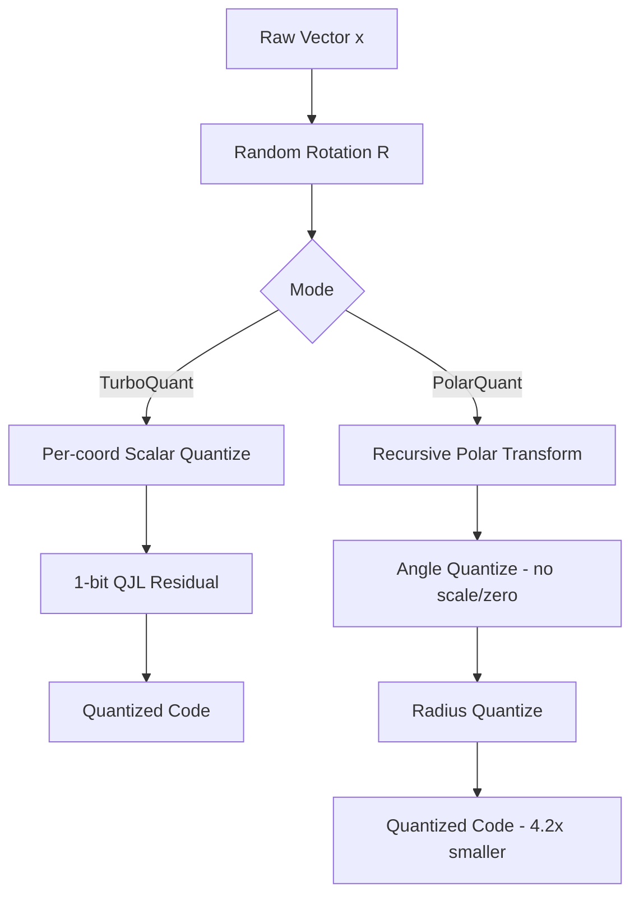

## Executive Summary

KV caches are the memory bottleneck of long-context LLMs. At 128K tokens, a Llama-3 70B model spends more VRAM on cached keys and values than on its own weights. Naive INT4 quantization of those caches is brittle — a handful of outlier channels blow up the reconstruction error, and the per-block scale/zero-point metadata eats back a meaningful fraction of the savings.

Two 2025 papers out of Google Research propose a unified cure, and the insight is geometric: *rotate the vectors first, then the quantization problem becomes easy*. **TurboQuant** (arXiv:2502.02617) is the general-purpose method — a data-oblivious vector quantizer that lands within roughly 2.7× of the Shannon distortion–rate lower bound, at every bit-width. **PolarQuant** (arXiv:2504.19874) specializes the idea to KV caches by working in polar coordinates: after a random preconditioning, the angles have a closed-form distribution, so the quantizer needs *no* per-block metadata at all. The result is 4.2× compression on KV caches with quality neutral on long-context benchmarks.

## The Quadratic Tax on Memory

Every extra token in the context adds one key vector and one value vector to the KV cache — per layer, per attention head. For a 70B model at 128K tokens in FP16, that is tens of gigabytes of memory that must be held, read, and written on every decode step. Inference throughput today is bandwidth-bound on precisely this traffic.

Quantization is the obvious lever, but it has two classical problems:

1. **Outliers.** A few channels in transformer activations carry disproportionately large magnitudes. Uniform scalar quantization has to stretch its bins wide enough to cover them, wasting resolution on the 99% of coordinates that are small.
2. **Metadata overhead.** To recover from per-block variance, every quantized block ships a scale and a zero-point — usually in FP16. At small block sizes and low bit-widths, this metadata is a non-trivial fraction of the compressed representation.

Both problems have the same root cause: the distribution of coordinate values in real embedding vectors is *nasty* — heavy-tailed, anisotropic, correlated.

## TurboQuant — The Rotation Trick

TurboQuant's central observation is old but underused: a random orthogonal rotation $R$ preserves norms and inner products, but it *aggressively* homogenises the coordinate distribution. If $x \in \mathbb{R}^d$ is any vector, then $Rx$ has coordinates that are approximately independent, and each coordinate follows (after suitable scaling) a Beta-like distribution whose form depends only on $d$, *not* on $x$.

Once the distribution is known and coordinates are near-independent, the optimal strategy is just: **quantize each coordinate separately with a scalar quantizer tuned to that analytically-derived marginal distribution**. No codebooks, no training data, no calibration.

TurboQuant formalises this as a two-stage scheme:

- **Stage A (MSE quantizer).** Rotate, then apply a per-coordinate scalar quantizer designed for the post-rotation marginal. Minimises mean-squared reconstruction error.
- **Stage B (1-bit QJL residual).** Apply a single-bit Quantized Johnson–Lindenstrauss transform to the residual. This recovers an *unbiased* estimator of inner products — important because attention logits are inner products, and MSE-optimal quantizers are generally biased.

$$
D(b) \;\approx\; c \cdot 2^{-2b} \quad \text{with } c \approx 2.7 \times c_{\text{Shannon}}
$$

The constant $c$ is what makes the result striking: TurboQuant sits within a *small* multiplicative factor of the information-theoretic lower bound, across all bit-widths and all dimensions. The paper reports quality-neutral KV cache quantization at 3.5 bits/channel, with only marginal degradation at 2.5 bits.

## PolarQuant — From Cartesian to Polar

PolarQuant asks: what if the rotation isn't just a preprocessing step, but a change of *coordinates*? Specifically, a polar change of coordinates.

The recipe, applied recursively to pairs of coordinates of a preconditioned vector:

$$
(x_{2i},\; x_{2i+1}) \;\longmapsto\; (r_i,\; \theta_i),\qquad r_i = \sqrt{x_{2i}^2 + x_{2i+1}^2},\; \theta_i = \operatorname{atan2}(x_{2i+1}, x_{2i})
$$

Here is the key theorem: after random preconditioning, the angles $\{\theta_i\}$ have a **closed-form, tightly concentrated distribution**. PolarQuant derives it analytically. Because the distribution is known in advance, the quantizer's bin boundaries can be baked into the codec — there is no need to transmit a scale or a zero-point per block.

The radii still need compression, but there are far fewer of them ($d/2$ instead of $d$), and they concentrate around the vector's norm, which is already cheap to store.

The net result is 4.2× KV-cache compression with state-of-the-art quality on long-context evaluations. The metadata savings are what push it past TurboQuant on this specific workload — not a different insight about the geometry, but a different book-keeping strategy on top of the same geometric trick.

## Pipeline



## Reference Implementation

A minimal sketch of the rotation + per-coordinate quantizer in PyTorch-style pseudocode:

```python
import torch

def turboquant_encode(x: torch.Tensor, bits: int, R: torch.Tensor) -> torch.Tensor:
    """
    x: [..., d] vector(s) to quantize.
    R: [d, d] random orthogonal matrix, shared across a calibration epoch.
    bits: per-coordinate bit budget.
    """
    # 1. Rotate — homogenises the coordinate distribution.
    y = x @ R.T                                    # [..., d]

    # 2. Scale by the known post-rotation marginal standard deviation.
    #    (Derived analytically; depends on d, not on the data.)
    sigma = y.std(dim=-1, keepdim=True)            # cheap proxy; paper uses analytic form
    y_norm = y / sigma

    # 3. Per-coordinate uniform quantizer over [-q_max, q_max].
    q_max = 3.0                                    # ~3-sigma clip
    levels = (1 << bits) - 1
    y_clipped = y_norm.clamp(-q_max, q_max)
    codes = torch.round((y_clipped + q_max) / (2 * q_max) * levels)
    return codes.to(torch.uint8), sigma            # sigma stored once per block

def turboquant_decode(codes, sigma, bits, R):
    q_max = 3.0
    levels = (1 << bits) - 1
    y_hat = (codes.float() / levels) * (2 * q_max) - q_max
    y_hat = y_hat * sigma
    return y_hat @ R                               # inverse rotation (R is orthogonal)
```

The PolarQuant extension operates on pairs of coordinates of `y`, converts each pair to `(r, theta)`, and quantizes `theta` against the analytically-derived angle distribution — eliminating the need to store `sigma` per block.

## Feasibility & Hardware Targets

The rotation is the only non-trivial addition to a standard quantization kernel, and it maps cleanly onto existing hardware:

- **Structured rotations.** Practical implementations use a Hadamard-structured rotation (an FFT-like $O(d \log d)$ butterfly) rather than a dense $d \times d$ matmul. On Hopper / Blackwell this fuses with the dequantization pass and costs essentially nothing in the bandwidth-bound KV read path.
- **Memory bandwidth.** 4.2× KV cache compression translates almost directly to higher decode throughput on a memory-bound system. On an H100, a 70B model at 128K context moves from memory-limited to compute-limited regime.
- **Flash-attention compatibility.** The quantized format plugs into the existing per-block KV layout; the dequantize step happens in registers before the attention dot-products, identical to existing INT8/INT4 paths.

## The Bigger Picture

TurboQuant and PolarQuant sit inside a broader 2024–2025 trend: *geometry-first quantization*. The template is "apply a structured transform that makes the distribution nice, then quantize naively." **QuaRot** and **SpinQuant** apply the same idea to weight quantization, using Hadamard rotations to suppress outliers before INT4 weight quantization. PolarQuant is the most refined instance yet: it doesn't just suppress outliers, it makes the post-transform distribution *so* well-characterised that the codec's parameters become data-independent.

The practical upshot: near-lossless quantization is a *solved problem* for data that can be rotated into isotropy. The remaining open question is which classes of real embeddings fail this assumption — and so far, KV caches do not seem to be among them.
